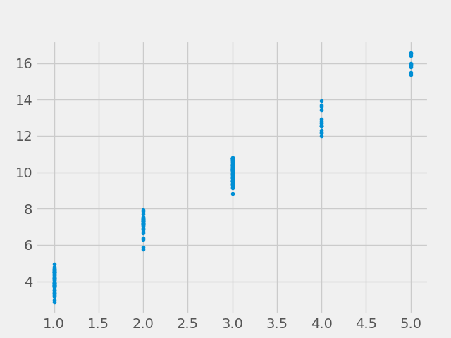

# Symbolic Regression for the Sciences

## Regression Analysis

\justifying

\notebox{ a method that allows researchers to summarize how predictions or average values of
an outcome vary across individuals defined by a set of predictors. }
-- *Regression and other stories, Aki Vehtari, Andrew Gelman, and Jennifer Hill*

\notebox{a set of statistical processes for estimating the relationships between a dependent variable ... and one or more independent variables ...}
-- *Wikipedia*

## Regression Analysis
\justifying

**Regression:**

- Estimated relationship between a set of predictors and an outcome;
- Summarization of the expected outcome and its variation accross individual measurements;

## Regression Analysis
\justifying

Regression Analysis extracts important information from data. Main tasks:

- **Prediction:** forecasting future data.
- **Association:** measuring the strength of association between variables.
- **Extrapolation:** given a limited data, extrapolate the summarization to the whole population.
- **Causal inference:** how a treatment affects the outcome.

## Symbolic Regression 
\justifying

\notebox{The problem of symbolic function identification (symbolic
regression) requires developing a composition of terminals
and functions that can return the correct value of the function after seeing a finite sampling of combinations of the
independent variable associated with the correct value of
the dependent variable.}
-- *Genetic Programming: On the Programming of Computers by Means of Natural Selection, John R. Koza*

## Symbolic Regression 
\justifying

\notebox{Symbolic regression (SR) is an approach to machine learning (ML) in which both the parameters
and structure of an analytical model are optimized.}
-- *Contemporary Symbolic Regression Methods and their Relative Performance, William La Cava et al.*

\notebox{Symbolic regression (SR) is a type of regression analysis that searches the space of mathematical expressions to find the model that best fits a given dataset, both in terms of accuracy and simplicity.}
-- *Wikipedia*

## Recommended books
\justifying

Regression analysis:

- Gelman, Andrew, Jennifer Hill, and Aki Vehtari. Regression and other stories. Cambridge University Press, 2020.

- Harrell, Frank E. Regression modeling strategies: with applications to linear models, logistic regression, and survival analysis. Vol. 608. New York: springer, 2001.

- Gelman, Andrew, and Jennifer Hill. Data analysis using regression and multilevel/hierarchical models. Cambridge university press, 2006.

## Recommended books
\justifying

Nonlinear models:

- Bates, Douglas. "Nonlinear regression analysis and its applications." Wiley Series in Probability and Statistics (1988).

- Nocedal, Jorge, and Stephen J. Wright, eds. Numerical optimization. New York, NY: Springer New York, 1999.

## Recommended books 
\justifying

Statistics:

- Meeker, William Q., Gerald J. Hahn, and Luis A. Escobar. Statistical intervals: a guide for practitioners and researchers. Vol. 541. John Wiley & Sons, 2017.

## Recommended books 
\justifying

Symbolic Regression:

- Gabriel Kronberger, Bogdan Burlacu, Michael Kommenda, Stephan M. Winkler, and Michael Affenzeller. Symbolic Regression. tbd.

## Errors
\justifying

\begin{importantblock}
If you find any error in this material, please send an e-mail to folivetti@ufabc.edu.br with the subject:

\hfill \break

"[ERROR] - Symbolic Regression Slides" 

\hfill \break

with the corrections pointing out to the lecture and slide numbers. I'll update the slides as soon as possible and insert the appropriate acknowledges in the final slide.
\end{importantblock}

## Once upon a data
\justifying

Imagine that we are collecting data about the students from different courses. We collect the following from each day of every course:

\footnotesize
:::::::::::::: {.columns}
::: {.column width="50%"}
- Course: enrolled course
- Date: date in YYYY-MM-DD format
- hasAttended: whether the student has attended the class in this particular date
- Week: week of the course, starting from 1
- Sunny: whether it was sunny that day
- Rainy: whether it was rainy that day
- ETA: estimated time of arrival from their origin to the university at that date
::: 
::: {.column width="50%"}
- mmRain: mm of rain
- hasExam: if there is an exam that day
- numAttendance: number of attendances so far
- hoursWork: estimated hours of work outside university that day
- finalGrade: the final grade (NA except on final day)
- isSingle: whether they are single
- numChildren: number of children
- age: person's age
- enrollmentTime: how long it has been enrolled
::: 
::::::::::::::

## Answer me!
\justifying
We can use this data to extract answers from different questions:

- How many students will attend the class at an specific date?
- Will a given student attend class today?
- What is the expected final grade of a certain student?

## Answer me!
\justifying

A regression model will answer these questions through a function $f(x; \theta)$ where $x$ is called the **independent variables, predictors, covarites, features** and $\theta$ is the **model parameter**.

In practice, this function is crafted in the light of a hypothesis you want to test. 

## Answer me!
\justifying

For example, we can create a regression model to predict the expected attendance with the function:

\begin{empheq}[box=\mybox]{equation*}
f(x; \theta) = -0.5 \operatorname{mmRain} - 0.1 \operatorname{avgETA} + 40
\end{empheq}

where $x = \{\operatorname{mmRain}, \operatorname{avgETA}\}$ and $\theta = \{40, -0.5, -0.1\}$.

In this model we can say that if there is no rain and the average ETA is $0$ hours, we will have full attendance, on average. But, every two mm of rain will reduce the expected attendance by $1$ student.
Likewise, every $1.25$ hours in the ETA will reduce the attendancce in the same rate.

## Answer me!
\justifying

\tipbox{Not only this model will predict the expected attendance but it also shows the association between variables and the outcome.}

## How to choose a regression model?
\justifying

To choose a regression model we take into consideration:

- The question we want to answer
- The distribution of our data
- Accuracy x Interpretability tradeoff 
- Any prior knowledge we have about our data

## Linear Regression
\justifying

In many situation the researcher assumes linearity of the relationship and settles with a linear model:

\begin{empheq}[box=\mybox]{equation*}
f(x; \theta) = \theta_0 + \theta_1 x_1 + \ldots + \theta_d x_d + \epsilon
\end{empheq}

with $\epsilon$ being a term associated with **uncertainties**.

## Linear Regression 
\justifying

The values of $\theta$ can be **adjusted** or **estimated** using an optimization method with the objective of minimizing the prediction error.

To calculate the prediction error we use a set of measurements, called **samples**, **examples** or **dataset**, with the information about the input ($x$) and (hopefully) correct output ($y$).

## Dataset
\justifying

Back to our example, after collecting data from the students attendance, we will have a set of $N$ points 
$(x^{(i)}, y^{(i)})_{i=1}^{N}$ where the superscript in parenthesis represents the index of the sample.

We have that  $x^{(i)} \in \mathbb{R}^d$ and $y^{(i)} \in \mathbb{R}$, with $d$ being the number of variables.

## Loss Function
\justifying

With this dataset we can now define a **loss** (aka, **error**, **cost**) function that maps a choice of function $f$ and parameters $\theta$ to a value representing how far away the model is to accurately describe the data. When adjusting the parameters, the goal is to minimize the loss function.

One example is the Sum-of-Square Errors (SSE):

\begin{empheq}[box=\mybox]{equation*}
\mathcal{L}(f; \theta; x; y) = \sum_{i=1}^{N}{\left(y^{(i)} - f(x^{(i)}; \theta)\right)^2}
\end{empheq}

The optimum value of $\theta$ for a linear model $f$ can be obtained using a closed formula as we will see in the next lectures.

## Polynomial Regression
\justifying

In **Polynomial Regression** we add nonlinearity by fitting a polynomial of degree $k$. For example, with a single input variable and $k=2$ we have:

\begin{empheq}[box=\mybox]{equation*}
f(x; \theta) = \theta_0 + \theta_1 x + \theta_2 x^2
\end{empheq}

This model describes a nonlinear function but it is still linear in the parameters, since we can rewrite it as:

\begin{empheq}[box=\mybox]{equation*}
f(z; \theta) = \theta_0 + \theta_1 z_1 + \theta_2 z_2
\end{empheq}
with $z_1 = x; z_2 = x^2$.

## Nonlinear regression
\justifying

In some situations this may not be enough and then we have to resort to a nonlinear model.
Returning to our example, let us say that we find that a better function for our data is:

\begin{empheq}[box=\mybox]{equation*}
f(x; \theta) = \theta_1\operatorname{mmRain} - \frac{\theta_2}{1\ + \exp\left(\theta_3 \operatorname{avgETA}\right)} + \theta_0
\end{empheq}

Now, the parameter $\theta_3$ is nonlinear and, thus, this function cannot be minimized with the same traditional methods that we use in linear regression.

## Nonlinear model
\justifying

Assuming the function with the adjusted parameters is:

\begin{empheq}[box=\mybox]{equation*}
f(x; \theta) = -0.5\operatorname{mmRain} - \frac{15}{1\ +\ \exp\left(-0.8 \operatorname{avgETA}\right)} + 32.5
\end{empheq}

In the base case ($\operatorname{mmRain} = \operatorname{avgETA} = 0$) we will still have full attendance. The same conclusion as before can be drawn from the $\operatorname{mmRain}$ variable.

## Nonlinear model
\justifying

\begin{empheq}[box=\mybox]{equation*}
f(x; \theta) = -0.5\operatorname{mmRain} - \frac{15}{1\ +\ \exp\left(-0.8 \operatorname{avgETA}\right)} + 32.5
\end{empheq}

Now, with $2$ hours of ETA we estimate $5$ absences, after $4$ hours it will peak to $7$ absences and remain that way for longer time of arrivals.

This happens because we are measuring the average ETAs, it may be the case that most of the students are located close to the university and will not have absurdly long ETAs, while these $7$ students live farther away and may think twice whether it is worth watching the lecture on a heavy traffic day.

## Nonlinear models 
\justifying

This example model seems to have been pulled out of the hat to fit our expectations. 

In practice, finding the appropriate function is a time consuming task that requires a lot of data analysis, preprocessing, treatment, tinkering, and thinking.

## Common models 
\justifying

In the literature we can find a set of different regression models commonly used in practice to overcome the limitations of linear regression, e.g.:

:::::::::::::: {.columns}
::: {.column width="50%"}
- Lasso regression
- Ridge regression 
- ElasticNet
- Polynomial regression
- Quantile regression 
- Generalized Linear Models 
:::
::: {.column width="50%"}
- Generalized Additive Models
- Gaussian regression
- Neural Networks
- Regression Trees
- Random Forest
- XGBoost
:::
::::::::::::::

## Flexibility
\justifying

The main advantage of some of these models is that they use functions that allows an increased flexibility when adjusting the parameters, making it easier to fit the data given enough parameters:

- With a high degree, polynomial regression can fit your data almost exactly
- With many layers and/or many neurons in each hidden layer, a feedforward neural network can approximate any function up to an error term as per the [universal approximation theorem](https://en.wikipedia.org/wiki/Universal_approximation_theorem).

## Flexibility x Interpretability tradeoff 
\justifying

This extra flexibility comes with the expense of interpretability. While understanding the linear models was straightforward, dealing with too many interactions and nonlinearity hinders the readability of the model.

:::::::::::::: {.columns}
::: {.column width="30%"}
The parameters summarizes the data through the model, what if there are too many parameters?

:::
::: {.column width="70%"}
\begin{figure}[t!]
    \centering
    \begin{tikzpicture}\begin{axis}[domain=-5:5,legend pos=south east, width=0.7\textwidth, xlabel={temperature}, ylabel={crop yield}]
      \addplot [red, thick, mark=+] {0.3*x};
      \addplot [green, thick, mark=+] {0.1*x^3/(15+x)};
      \addplot [blue, thick, mark=+] {x - x^3/6 + x^5/120 - x^7/5040};
    \end{axis}
\end{tikzpicture}
\end{figure}
:::
::::::::::::::

## Regression in Science
\justifying

The regression models are widespread in different sciences such as physics, astronomy, chemistry, among others. Such function can describe a law of nature in such a way that we can fit it to multiple datasets of the same phenomena and use the parameters to understand the peculiarities of each one of them.

:::::::::::::: {.columns}
::: {.column width="30%"}
\begin{empheq}[box=\mybox]{equation*}
f(\mathbf{x, \theta}) = \frac{ \tikzmarknode{t1}{\highlight{red}{$\theta_{1}$}} x^3 }{ \tikzmarknode{t2}{\highlight{red}{$\theta_{2}$}} + x } + \highlight{red}{$\theta_{3}$}
\end{empheq}

:::
::: {.column width="70%"}
\begin{figure}[t!]
    \centering
    \begin{tikzpicture}\begin{axis}[domain=-10:35,legend pos=north west, width=0.7\textwidth, xlabel={temperature}, ylabel={crop yield}]
      \addplot [red, thick, mark=+] {50 - 0.3*x^3/(300+x)};
      \addplot [green, thick, mark=+] {20 + 0.1*x^3/(15+x)};
      \legend{spinach, tomato}
    \end{axis}
\end{tikzpicture}
\end{figure}
:::
::::::::::::::

We will see regression models in more details in lectures 2 and 3.

## Symbolic Regression
\justifying

Symbolic Regression can help us find a custom function that can serves as a regression model to our data such that:

- Fits the data accurately
- Has the smallest number of parameters as possible

:::columns

:::: {.column width="20%"}
\begin{forest}
    rounded/.style={circle, minimum size=20pt, font=\footnotesize, thick, edge={thick}, draw},
    chosen/.style={circle, minimum size=20pt, font=\footnotesize, thick, edge={thick}, fill=gray!40, draw}
    [{$+$}, for tree=rounded
      [{$*$} 
        [{$x$}] 
        [{$2$}]
      ]
      [{$exp$}
        [{$*$}
          [{$x$}]
          [{$x$}]
        ]
      ]
    ]
\end{forest}
::::

:::: {.column width="80%"}
\begin{figure}[t!]
    \centering
    \begin{tikzpicture}\begin{axis}[domain=-1:1,legend pos=north west, width=0.7\textwidth]
      \addplot [green, only marks] {2*x + exp(x^2) + 0.9*rand};
      \addplot [blue, thick, mark=+] {0.5*x+1.9*x^2 + 0.9};
      \addplot [red, thick, mark=+] {2*x + exp(x^2)};
      \legend{data, poly, sym reg}
    \end{axis}
\end{tikzpicture}
\end{figure}
::::

:::

## Symbolic Regression 
\justifying

The algorithm now searches for a function $f(x; \theta)$ and the values of $\theta$ that minimizes the loss function $\mathcal{L}(f; \theta; x; y)$.

State-of-the-art: combination of Genetic Programming (lecture 5) with nonlinear optimization (lectures 11 and 12).

There are also other approaches based on enummeration, neural networks, etc. (lecture 6).

## How to use them 
\justifying

We currently have a large set of tools available that implements state-of-the-art SR algorithms, we will see how to install and use some of them in lecture 7.

## Visualization
\justifying

Another important tool of regression analysis is the visualization of the model.

\includegraphics[width=150pt]{figs/pdp.png}

The visualization allows us to inspect and understand the model behavior. We will see some examples in lecture 8.

## Data distribution 

In linear regression we assume the conditional distribution of the data is Gaussian.

:::columns

:::: {.column width="30%"}
This means that the density function $f_{Y \mid X; \Theta}(y \mid x; \theta)$ is Gaussian.

::::

:::: {.column width="70%"}

::::

:::

## Data distribution 
\justifying

There are other distributions commonly observed in real world data that are related to the different answers we want:

- How many students will attend the class at an specific date? Poisson
- Will a given student attend class today? Bernoulli
- What is the expected final grade of a certain student? Gaussian

We will learn how to deal with these distributions in lecture 9 and 10.

## Nonlinear optimization 
\justifying

When dealing with nonlinear regression models and different distributions, we must resort to nonlinear optimization methods to adjust the model parameters to the data.

We will see some well known methods in lectures 11 and 12.

## Validating and Selecting the model 
\justifying

With the automatic search for a regression model through Symbolic Regression we may generate many different alternative models:

- Running the SR algorithm multiple times 
- Using multi-objective and returning the Pareto front 
- Running different SR algorithms 
- Using different settings or different splits of the data 

It is important to choose among these different alternatives and validate the choice. We will see how to do that in lectures 13 and 14.

## Overparametrization
\justifying

Being a populational search, Genetic Programming may favor more flexible models (i.e., with more parameters) since they are easier to fit the data.

This can be alleviated with a stimulus to favor smaller expressions and with the use of algebraic simplification techniques, such as Equality Saturation (lecture 15).

## Prior Knowledge 
\justifying

When working with data from different sciences we sometimes have a prior knowledge of how the regression model should behave or rather we want to enforce certain behavior:

- We observe that the output increases with the increase of a certain variable (monotonically increasing).
- We want the output to always increase with the increase of a certain variable. 

We can integrate such knowledge into the search process enforcing that the algorithm returns only models with the desired behavior. 
This will be covered in lecture 16.

## Model Interpretation
\justifying

As in the illustrative examples, we often want to extract additional knowledge from our model. 
While SR models are said to be more interpretable than black box model, they still require some supporting tools to such task, we will cover some of them in lecture 17.

## Uncertainties 
\justifying

Finally, one important aspect of prediction models is that a point prediction (i.e., returning a single value as a prediction) may be useless.

In practice we want a confidence interval of the parameters and a prediction interval. Instead of predicting that $30$ students are attending the lecture today, it is more useful if I can ensure that between $28$ and $32$ students are attending or between $10$ to $40$ students.

## Uncertainties 
\justifying

The high variability of the prediction may be an indication that any small event today may cause a mass absence and, thus, I should plan ahead to minimize the impact.

These concepts and how to calculate such intervals with SR will be covered in lectures 18 and 19.

% ## Course evaluation criteria

%See the website:

%\includegraphics[width=150pt]{figs/qrsite.png}

%[https://folivetti.github.io/teaching/2024-summer-teaching-2](https://folivetti.github.io/teaching/2024-summer-teaching-2)

%## Bonus points!

%Bonus points if a majority (80\%) of the students answer the anonymous form:

%\includegraphics[width=150pt]{figs/qrform.png}

%[https://forms.gle/xaHtCL4EGN99o6G36](https://forms.gle/xaHtCL4EGN99o6G36)

# Closing

## Terminology learned today
\justifying

- **regression:** relationship between predictors and outcome 
- **independent variables, predictors, covariates, features:** $x$
- **model parameters:** $\theta$ 
- **outcome, dependent variable, target:** $y$ 
- **samples, examples, dataset:** $(x^{(i)}, y^{(i)})_{i=1}^{N}$
- **j-th variable of the i-th example:** $x_{j}^{(i)}$
- **loss, error, cost function:** $\mathcal{L}(f; \theta; x; y)$

## Further reading
\justifying

Chapter 1 of:

- Gelman, Andrew, Jennifer Hill, and Aki Vehtari. Regression and other stories. Cambridge University Press, 2020.

- Harrell, Frank E. Regression modeling strategies: with applications to linear models, logistic regression, and survival analysis. Vol. 608. New York: springer, 2001.

## Next lecture {.standout}

\begin{block}{}
  \begin{itemize}
    \item Introduction to Regression Analysis
    \item Basic concepts of data collection and treatment
    \item Basic concepts of statistics
\end{itemize}

\hfill

\includegraphics[width=100pt]{figs/tobecontinued.png}
\end{block}

## Acknowledgments

- Thiago Ferreira Covões
