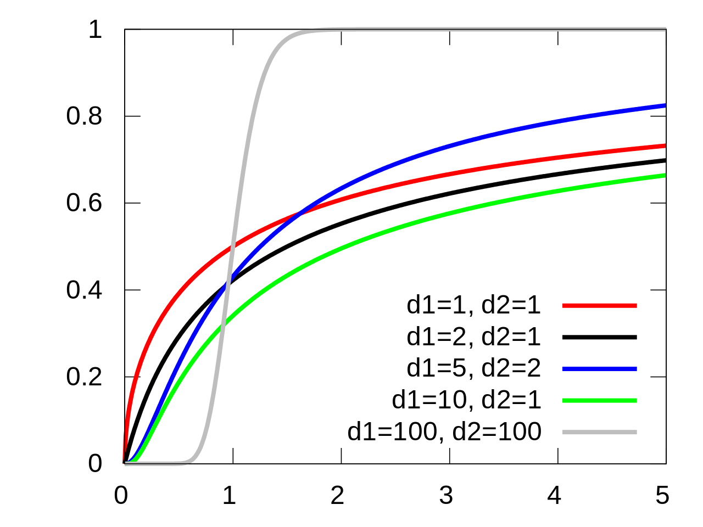

# Regression

## Regression

\justifying

\notebox{ \textbf{Regression:} a return to a previous and less advanced or worse state, condition, or way of behaving. }

## Regression to the mean
\justifying

Francis Galton observed that extreme traits in parents are not completely passed to their offsprings.

A child from tall parents is taller than average but not as tall as their parents.

Likewise, a child from short parents is shorter than average but not as short as their parents.

## Regression to the mean
\justifying

They both regressed towards the mean!

[](https://en.wikipedia.org/wiki/File:Galton_box.webm)


## Regression to the mean
\justifying

:::: {.columns align=center}
:::column
{ width=150px }
:::
:::column
We can fit this data with

\begin{empheq}[box=\mybox]{equation*}
y = 30 + 0.54 x
\end{empheq}

where $y$ is the height of the daughter and $x$ is the height of the mother, in inches.
:::
::::

## Regression to the mean
\justifying

For a better interpretation, we can rewritte it as:

\begin{empheq}[box=\mybox]{equation*}
y = 63.9 + 0.54 (x - 62.5)
\end{empheq}

When a mother has an average height ($62.5$), her daughter is predicted to have $63.9$ in her adulthood.

## Regression to the mean
\justifying

\begin{empheq}[box=\mybox]{equation*}
y = 63.9 + 0.54 ((x + 1) - 62.5) = 63.9 + 0.54 (x - 62.5) + 0.54
\end{empheq}

For every inch above average, the daughter is expected to be half an inch taller.

## Regression to the mean
\justifying

\begin{empheq}[box=\mybox]{equation*}
y = 63.9 + 0.54 ((x - 1) - 62.5) = 63.9 + 0.54 (x - 62.5) - 0.54
\end{empheq}

For every inch below average, the daughter is expected to be half an inch shorter.

## Regression to the mean
\justifying

So the height of the daughter depends on how much the mother's height deviates from the mean.


## Linear Regression
\justifying

Linear Regression returns estimates for the outcome using the model:

\begin{empheq}[box=\mybox]{equation*}
y^{(i)} = \sum_{j=1}^{P}{\beta_j x_j^{(i)}} + \epsilon^{(i)}
\end{empheq}

where $\beta_j$ is the $j$-th parameter and $\epsilon^{(i)}$ is a measurement disturbance of the $i$-th example.

## Linear Regression
\justifying

This regression model is composed of a **deterministic** part, depending on $\beta, x$, and a stochastic part, depending on $\epsilon$.

## Linear Regression
\justifying

In matrix notation, we can write the model for $N$ cases and $P$ parameters as:

\begin{empheq}[box=\mybox]{equation*}
y = x\beta + \epsilon
\end{empheq}

where $y, \epsilon \in \mathbb{R}^{N \times 1}, \beta \in \mathbb{R}^{P \times 1}, x \in \mathbb{R}^{N \times P}$.

## Linear Regression
\justifying

We can assume a zero mean for $\epsilon$ which leads us to:

\begin{empheq}[box=\mybox]{align*}
E[y] &= E[X\beta + \epsilon] \\
E[\epsilon] &= 0 \\
E[y] &= E[x \beta]
\end{empheq}

$x \beta$ is also called the **expectation function** of the regression model.

## Normality
\justifying

It is a common assumption for linear regression that $\epsilon$ is normally distributed:

\begin{empheq}[box=\mybox]{align*}
Var[\epsilon] &= E[(\epsilon - E[\epsilon])(\epsilon - E[\epsilon])^T] \\
Var[\epsilon] &= E[\epsilon\epsilon^T] = \sigma^2 I
\end{empheq}

where the superscript $T$ means transpose, and $I$ is the identity matrix of size $N \times N$.

## Normality
\justifying

Remembering the probability density function:

\begin{empheq}[box=\mybox]{align*}
f(x \mid \mu, \sigma) &= \frac{1}{\sigma \sqrt{2 \pi}}e^{-\frac{1}{2}\left(\frac{x - \mu}{\sigma}\right)^2}
\end{empheq}

## Normality
\justifying

The joint probability function of our model $p(y \mid \beta, \sigma^2)$ can be calculated as:

\begin{empheq}[box=\mybox]{align*}
p(y \mid \beta, \sigma^2) &= \prod_{i=1}^{N}{f(y^{(i)} \mid \beta, \sigma^2)} \\
                          &= \frac{1}{(\sigma \sqrt{2 \pi})^N}e^{-\frac{1}{2}\left(\frac{(y - x\beta)(y - x\beta)^T}{\sigma}\right)^2} \\
                          &= (2\pi\sigma^2)^{-N/2}e^{-\frac{1}{2}\left(\frac{(y - x\beta)(y - x\beta)^T}{\sigma}\right)^2}
\end{empheq}

## Likelihood function
\justifying

The likelihood function $l(\beta, \sigma \mid y)$ is the probability of observing $y$ if $\beta, \sigma$ were the true values.

In functional form $l(\beta, \sigma \mid y) = p(y \mid \beta, \sigma^2)$.

## Likelihood function
\justifying

We want to find the values of $\beta$ that maximizes the likelihood function. As the most likely $\beta$ for the observed values of $y$.

This is the best fit for our data, given the assumptions made so far.

## Likelihood function
\justifying

We can transform the likelihood with the $\log$ function to make this optimization simpler. The **negative log-likelihood** (nll) can be written as:

\begin{empheq}[box=\mybox]{align*}
nll(\beta, \sigma \mid y) &= -\log{(l(\beta, \sigma \mid y))} \\
                          &= -\log{(\prod_{i=1}^{N}{f(y^{(i)} \mid \beta, \sigma^2)})} \\
                          &= -\log{\left((2\pi\sigma^2)^{-N/2}e^{-\frac{1}{2}\left(\frac{(y - x\beta)(y - x\beta)^T}{\sigma}\right)^2}\right)} \\
                          &= -\log{((2\pi\sigma^2)^{-N/2})} + \frac{1}{2}\left(\frac{(y - x\beta)(y - x\beta)^T}{\sigma}\right)^2 \\
                          &= \frac{N}{2}\log{((2\pi\sigma^2))} + \frac{1}{2\sigma^2}\left((y - x\beta)(y - x\beta)^T\right)^2
\end{empheq}

## Likelihood function
\justifying

Since we are interested in finding the optimal $\beta$, we can discard the constant terms and $\sigma$:

\begin{empheq}[box=\mybox]{align*}
nll(\beta, \sigma \mid y) &= \frac{1}{2}\left((y - x\beta)(y - x\beta)^T\right)^2
\end{empheq}

and minimize this function. We call $\hat{\beta}$ the **maximum likelihood estimate**.

## Likelihood function
\justifying

The maximum likelihood estimate for the linear regression is given by:

\begin{empheq}[box=\mybox]{align*}
\hat{\beta} &= (x^Tx)^{-1}x^Ty
\end{empheq}

This is called the **least squares estimate**.

## Least Squares
\justifying

The least squares is appropriate when:

- The expectation function is correct
- The response is the expectation plus a disturbance
- The disturbance is independent from the expectation
- The disturbance of a point is normally distributed with zero mean
- The disturbances are independetly distributed with equal variance

## Point Prediction
\justifying

With a $\hat{\beta}$ we can make a point estimate for the $i$-th data point as $\hat{y}^{(i)} = \hat{\beta} x^{(i)}$.

In the same way, $\hat{\beta}$ is the point estimation of the parameters.

## Is $x_i$ really important?

One part of regression analysis is concerned whether a predictor is important to the model.

For linear regression this is basically asking: is $\beta = 0$?

## Statistical test

For this purpose we can perform an statistical test. A common setting for statistical test for regression is to pose a **null hypothesis**:

\begin{empheq}[box=\mybox]{align*}
H_0: \beta_i = 0
\end{empheq}

## Statistical test

Similarly we define the alternative hypothesis:

\begin{empheq}[box=\mybox]{align*}
H_a: \beta_i \neq 0
\end{empheq}

## Statistical test

For this particular setting, since $\epsilon$ is normally distributed, and $Y$ is a linear function of $\epsilon$, it follows that $\beta$ is also normally distributed.

But when we work only with an esimate $\hat{\beta}$ and, thus, the variance is also estimated, we assume a $t$-distribution.

## Student's t Distribution
\justifying

Similar to a Normal distribution but with heavier tails. Allows us to compensate the uncertainties by the degrees-of-freedom.

\begin{align}
f(x \mid \nu, \mu, \sigma) = \frac{\Gamma\left(\frac{\nu+1}{2}\right)}{\Gamma\left(\frac{\nu}{2}\right)\sqrt{\pi \nu \sigma^2}}\left(1 + \frac{(x-\mu)^2}{\nu \sigma^2}\right)^{-\frac{\nu + 1}{2}},
\end{align}

## Student's t Distribution
\justifying

\begin{empheq}[box=\mybox]{align*}
E[f(x \mid \mu, \sigma)] &= \mu \\
Var[f(x \mid \mu, \sigma)] &= \frac{\nu}{\nu - 2}\sigma^2
\nu > 2
\end{empheq}

## Student's t Distribution
\justifying

$$\nu = 2, \mu = 0, \sigma = 0.2$$


## hypothesis test
\justifying

So, the hypothesis test is calculated from the $t$-Statistic:

\begin{empheq}[box=\mybox]{align*}
t = \frac{\text{estimated value} - \text{hypothesis}}{\text{standard error of estimate}}
\end{empheq}

## Properties of $\hat{\beta}$
\justifying

Since $\beta$ is normally distributed, we have:

\begin{empheq}[box=\mybox]{align*}
E[\hat{\beta}] &= \beta \\
Var[\hat{\beta}] &= E[\hat{\beta}^2] - E[\hat{\beta}]^2 \\
                 &= E[\left((x^Tx)^{-1}x^Ty\right)^2] - \beta^2 \\
                 &= E[\left((x^Tx)^{-1}x^T(x\beta + \epsilon)\right)^2] - \beta^2 \\
                 &= E[\left((x^Tx)^{-1}x^Tx\beta + (x^Tx)^{-1}x^T\epsilon\right)^2] - \beta^2 \\
                 &= E[\left(\beta + (x^Tx)^{-1}x^T\epsilon\right)^2] - \beta^2 \\
                 &= E[\beta^2] + 2(x^Tx)^{-1}x^T\beta E[\epsilon] + E[((x^Tx)^{-1}x^T\epsilon)^2] - \beta^2 \\
                 &= E[((x^Tx)^{-1}x^T\epsilon)^2] \\
\end{empheq}

## Properties of $\hat{\beta}$
\justifying

cont.

\begin{empheq}[box=\mybox]{align*}
                 &= ((x^Tx)^{-1}x^T)^2E[\epsilon^2] \\
                 &= (x^Tx)^{-1}x^T (x^Tx)^{-1}x^T \sigma^2 \\
                 &= (x^Tx)^{-1} I \sigma^2 \\
                 &= \sigma^2 (x^Tx)^{-1}
\end{empheq}

Note that $Var[\hat{\beta}]$ is a matrix where the diagonals are the individual variance of each estimate $\hat{\beta}_i$ and every element $i, j$ is the **covariance** of $\hat{\beta}_i$ and $\hat{\beta}_j$.

$E[\hat{\beta}]$ says that the estimation is unbiased, $Var[\hat{\beta}]$ says that the covariance of the estimates depends on the variance of $\epsilon$ and the data points matrix $x$.

## Standard error
\justifying

The standard error of $\hat{\beta}$ is:

\begin{empheq}[box=\mybox]{align*}
se(\hat{\beta}) &= \sqrt{s^2 \operatorname{diag}((x^Tx)^{-1})} \\
s^2(\hat{\beta}) &= \frac{1}{N - P}\left((y - x\beta)(y - x\beta)^T\right)^2
\end{empheq}

where $\operatorname{diag}$ is the diagonal of the matrix and $s^2$ is the estimated variance with $N - P$ degrees of freedom since we don't know the true $\sigma^2$.

## hypothesis test
\justifying

We then establish a rejection threshold for our hypothesis test. Let us use $\alpha = 0.05$.

\begin{empheq}[box=\mybox]{align*}
t = \frac{\hat{\beta}_i - 0}{\operatorname{se}(\hat{\beta}_i)}
\end{empheq}

From the $t$-Statistic we can calculate a $p$-value and, if the $p$-value is less than $\alpha$, we reject the hypothesis that $\beta_i = 0$.

## hypothesis test
\justifying

If we assume that $\beta_i = 0$ and we obtain $p = 0.05$ for our current sample, it means that if we take many different samples and repeat our experiment, we would observe the obtained value of $\hat{\beta}_i$ is $5\%$ of them due to random error.

As the chance of obtaining such value due to error is too small, we reject the hypothesis.

## Confidence Intervals
\justifying

So far we have been working with the point estimates of our predictions and parameters.


But since there are uncertainties involved as we are estimating the parameters with a sample of the whole population, it is more insightful if we have an interval of possible values for these parameters and for the predictions.

## Confidence Intervals
\justifying

The **confidence interval** (CI) is another way to view the hypothesis test.

We say that the $(1-\alpha)100\%$ of an estimate $\hat{\beta}$ is the range of values that would reject the null hypothesis when using $\alpha$.


## Marginal Confidence Interval
\justifying

We calculate the $(1-\alpha)100\%$ marginal confidence interval of $\hat{\beta}$ is:

\begin{empheq}[box=\mybox]{align*}
\frac{\hat{\beta}}{se(\hat{\beta})} \leq |t_{(\alpha/2, \nu)}| \\
\hat{\beta} \pm t_{(\alpha/2, \nu)}se(\hat{\beta})
\end{empheq}

where $\nu = N - P$ degrees of freedom, $s(\hat{\beta})$ is the standard error of $\beta$ and $t_{(\alpha/2, \nu)}$ is the quantile function at $\alpha/2$ for the Student's t distribution with $\nu$ degree of freedoms.

This is the CI for an individual $\hat{\beta}_i$.

## Interpreting the CI
\justifying

\notebox{A $(1-\alpha)100\%$ CI can be interpreted as the range of values in which contains the true parameter with $(1-\alpha)100\%$ certainty.}

## Joint Confidence Interval
\justifying

Alternatively, we may test the hypothesis that all of the parameters are equal to $0$. In this situation, we cannot simply calculate the individual hypothesis as the repeated test would increase the chance of type rejecting a valid null hypothesis.

The probability of making one error in $m$ tests is $1 - (1 - \alpha)^m$, for $m=5$ we reach approx. $23\%$ of chance!

## Joint Confidence Interval
\justifying

For multiple regression, we can use the Fisher's F distribution with $P$ and $N-P$ degrees of freedom.

## Fisher's F Distribution
\justifying

The F Distribution is the ratio of $\Chi^2$ distributions of two populations with distinct variances.

::::columns
:::column

:::
:::column

:::
::::

## Joint Confidence Interval
\justifying

We can calculate the joint confidence interval as the ellipsoid:

\begin{empheq}[box=\mybox]{align*}
(\beta - \hat{\beta})^Tx^Tx(\beta - \hat{\beta}) \leq P s^2 F(\alpha, P, N-P)
\end{empheq}

where $F(\alpha, P, N-P)$ is the quantile for the Fisher's F distribution with $P$ and $N-P$ degrees of freedom.


## Joint Confidence Interval
\justifying

The inequation of the joint distribution describes an ellipsoid, for example:

{width=200px}


## Confidence Interval of a Prediction

Likewise, we can calculate a confidence interval of an expected value at $x^{(i)}$:

\begin{empheq}[box=\mybox]{align*}
(x^{(i)})^T\hat{\beta} \pm s \sqrt{(x^{(i)})^T (x^Tx)^{-1} x^{(i)}} t(\alpha/2, N-P) \\
\end{empheq}

And a confidence band with:

\begin{empheq}[box=\mybox]{align*}
x^{T}\hat{\beta} \pm s \sqrt{x^T (x^Tx)^{-1} x} \sqrt{P F(\alpha, P, N-P)} \\
\end{empheq}

## Calculating the Least Squares estimate
\justifying

To calculate the least squares estimate, we have to find the inverse of $x^Tx$:

\begin{empheq}[box=\mybox]{align*}
\hat{\beta} &= (x^Tx)^{-1}x^TY
\end{empheq}

It is easier to calculate it using a matrix decomposition technique.

## Calculating the Least Squares estimate
\justifying

For example, we can use the QR decomposition that decomposes a matrix $x$ into

\begin{empheq}[box=\mybox]{align*}
x &= qr \\
q^Tq &= qq^T = I \\
r &= \begin{bmatrix}_1 \\ 0\end{bmatrix}
\end{empheq}

where $q$ is orthogonal and $r$ is zero below the main diagonal with the upper diagonal having size $P \times P$

## Calculating the Least Squares estimate
\justifying

The value of $\hat{\beta}$ can be calculated using the relation:

\begin{empheq}[box=\mybox]{align*}
r_1 \hat{\beta} = q_1^T y
\end{empheq}

where $q_1$ is the first $p$ columns of $q$ and, since $r_1$ is upper diagonal, we can find the estimates with back substitution.

## Some practical considerations
\justifying

It is common practice to have an additional column in the predictors with all elements equal to $1$ as an intercept to account for the average value when the predictors are all $0$.

\begin{tikzpicture}
\begin{axis}
\addplot [very thick,red,legend entry=$2x$] {2*x};
\addplot [very thick,blue,legend entry=$2x + 4$] {2*x + 4};
\end{axis}
\end{tikzpicture}

## Example: grades {.fragile}
\justifying

Let's create the model $y = \beta_1 + \beta_2 \operatorname{ETA\_mean}$.

```{.python frame=lines framerule=2pt linenos=true fontsize=\footnotesize baselinestretch=0.8}
df = pd.read_csv("grade.csv")
xcols = ['ETA_mean']

x, y = df[xcols].values, df.grade.values
x = np.vstack([np.ones(x.shape[0]), x[:,0]]).T
```
## Example: grades {.fragile}


```{.python frame=lines framerule=2pt linenos=true fontsize=\footnotesize baselinestretch=0.8}
n = y.shape[0]
p = x.shape[1]
dof = n - p
reg = LinearRegression(fit_intercept=False)
reg.fit(x, y)

y_hat = x @ betas_qr
s2 = np.sum((y - y_hat)**2)/dof
se = np.sqrt(s2 * np.diag(np.linalg.inv(x.T @ x)))

print("parameters: ", reg.coef_)
print("R^2 score: ", reg.score(x, y))
print("degree of freedom: ", dof, "\ns2: ", s2, "\nstandard errors: ", se)
```

## Example: grades {.fragile}

```
parameters:  [ 8.6992847  -3.74766658]
R^2 score:  0.1890555566476365
degree of freedom:  7998
s2:  3.3845582006552553
standard errors:  [0.06239017 0.08679028]
```
## Example: grades {.fragile}

```{.python frame=lines framerule=2pt linenos=true fontsize=\footnotesize baselinestretch=0.8}
# Let's try QR and Cholesky decomposition
p = x.shape[1]
q, r = sc.linalg.qr(x)
q1 = q[:,:p]
r1 = r[:p, :p]
betas_qr = sc.linalg.solve_triangular(r1, q1.T@y)

l = sc.linalg.cho_factor(x.T @ x)
inv = sc.linalg.cho_solve(l, np.identity(p))
betas_chol = inv @ x.T @ y

print("QR: ", betas_qr)
print("Cholesky: ", betas_chol)
print("scikit-learn: ", reg.coef_)
```

## Example: grades {.fragile}

```
QR:  [ 8.6992847  -3.74766658]
Cholesky:  [ 8.6992847  -3.74766658]
scikit-learn:  [ 8.6992847  -3.74766658]
```

## Example: grades {.fragile}

```{.python frame=lines framerule=2pt linenos=true fontsize=\footnotesize baselinestretch=0.8}
alpha = 0.05
marginal_betas = []
for i, coef in enumerate(betas_qr):
    v = np.abs(se[i]*t.ppf(1 - alpha/2, n-p))
    marginal_betas.append((coef - v, coef + v))
    print(f"{coef - v:0.2f} <= beta_{i} <= {coef + v:0.2}")
```

## Example: grades {.fragile}

```
8.58 <= beta_0 <= 8.8
-3.92 <= beta_1 <= -3.6
```

## Example: grades {.fragile}

```{.python frame=lines framerule=2pt linenos=true fontsize=\footnotesize baselinestretch=0.8}
# joint interval
omegas = np.pi*np.arange(0, 2.01, 0.01)
const = np.sqrt(p*s2*f.ppf(1-alpha, p, n-p))
            *np.linalg.inv(r1)
betapts = np.array([betas_qr + const
              @ np.array([np.cos(w), np.sin(w)])
                  for w in omegas])
```

## Example: grades {.fragile}

```{.python frame=lines framerule=2pt linenos=true fontsize=\footnotesize baselinestretch=0.8}
_,ax = plt.subplots()
ax.plot(betapts[:,0], betapts[:,1], color='black')
ax.plot(betas_qr[0], betas_qr[1], '+', color='black')
ax.axvline(x=marginal_betas[0][0], linestyle='--', color='black')
ax.axvline(x=marginal_betas[0][1], linestyle='--', color='black')
ax.axhline(y=marginal_betas[1][0], linestyle='--', color='black')
ax.axhline(y=marginal_betas[1][1], linestyle='--', color='black')

print(np.min(betapts[:,0]))
ax.set_xlabel(r"$\beta_1$")
ax.set_ylabel(r"$\beta_2$")
```

## Example: grades {.fragile}


## Example: grades {.fragile}

```{.python frame=lines framerule=2pt linenos=true fontsize=\footnotesize baselinestretch=0.8}
for i, y_i in enumerate(reg.predict(x)):
  c = np.abs(t.ppf(1 - alpha/2, dof))
  v = np.sqrt(s2 * (x[i,:].T @ np.linalg.inv(x.T @ x) @ x[i,:]))*c
  print(f"{y_i - v:0.2f} <= y_{i} <= {y_i + v:0.2f}")
  if i > 10:
    break
```

## Example: grades {.fragile}


```
6.41 <= y_0 <= 6.50
6.40 <= y_1 <= 6.48
5.50 <= y_2 <= 5.60
4.85 <= y_3 <= 4.98
5.26 <= y_4 <= 5.37
5.28 <= y_5 <= 5.39
5.73 <= y_6 <= 5.82
6.35 <= y_7 <= 6.43
6.29 <= y_8 <= 6.38
4.80 <= y_9 <= 4.94
4.46 <= y_10 <= 4.62
5.06 <= y_11 <= 5.18
```
## Example: grades {.fragile}

```{.python frame=lines framerule=2pt linenos=true fontsize=\footnotesize baselinestretch=0.8}
xi = np.arange(0.1, 0.8, 0.05)
xi = np.vstack([np.ones(xi.shape[0]), xi]).T
c = np.sqrt(s2*p * f.ppf(1-alpha, p, n-p))
xx = np.sqrt(xi @ np.linalg.inv(x.T @ x) @ xi.T)

yy = np.max(np.abs(xx * c), axis=1)
y_h = xi @ betas_qr
```

## Example: grades {.fragile}


```{.python frame=lines framerule=2pt linenos=true fontsize=\footnotesize baselinestretch=0.8}
_,ax = plt.subplots()
ax.plot(xi[:,1], y_h, '.', color='black', markersize=15)
ax.fill_between(xi[:,1], y_h - yy, y_h + yy, edgecolor='gray',
    facecolor='white', alpha=1,
    linewidth=4, linestyle='dashdot', antialiased=True)
ax.set_xlabel('x_1')
ax.set_ylabel(r'$\hat{y}$')
```
## Example: grades {.fragile}


## Example code {.fragile}

Cholesky decomposition of an array $x$ of size $m \times m$:

```{.python frame=lines framerule=2pt linenos=true fontsize=\footnotesize baselinestretch=0.8}
def chol(x):
  m = x.shape[0]
  chol = np.zeros((m, m))
  for j in range(m):
    for i in range(j,m):
      delta = x[i,j] - np.dot(chol[i,:j], chol[j,:j])
      chol[i,j] = np.sqrt(delta) if i==j
                                 else delta/chol[j,j]
  return chol
```

## Example code {.fragile}

Inversion of $x$ using Cholesky:

```{.python frame=lines framerule=2pt linenos=true fontsize=\footnotesize baselinestretch=0.8}
def inv(x):
  l = chol(x)
  tmp = l.copy()
  m = x.shape[0]
  for i in range(m):
    tmp[i,i] = 1/l[i,i]
    for j in range(i):
      tot = np.dot(tmp[i, j:i], tmp[j, j:i])
      tmp[j,i] = -np.dot(tmp[i, j:i], tmp[j, j:i])/l_ii
      tmp[i,j] = 0

```
## Example code {.fragile}
\justifying

cont.

```{.python frame=lines framerule=2pt linenos=true fontsize=\footnotesize baselinestretch=0.8}

  x_inv = np.zeros((m,m))
  for i in range(m):
    dii = np.dot(tmp[i,i:], tmp[i,i:])
    x_inv[i,i] = dii
    for j in range(i+1, m):
      dij = np.dot(tmp[i, j:], tmp[j, j:])
      x_inv[i,j] = dij
      x_inv[j,i] = dij
  return x_inv
```

## Assumptions
\justifying

\notebox{\textbf{The expectation function is correct:} the main goal, find a model that predicts the natural phenomena. It can be an iterative process as we update the model after post analysis of our current expectation. }

## Assumptions
\justifying

\notebox{\textbf{The response is expectation function plus disturbance:} this allows us to calculate the probability of the response by means of the probability of the disturbance.}

## Assumptions
\justifying

\notebox{\textbf{The disturbance is independent of the expectation function:} any important variables which are not included in the data are not systematically related to the response. }


## Assumptions
\justifying

\notebox{\textbf{Each disturbance has a normal distribution:} allows us to use least squares. Other distributions are possible as we will see later in this course.}

## Assumptions
\justifying


\notebox{\textbf{Each disturbance has zero mean:} this reduces the number of unknown parameters and implies no systematic bias in the disturbances caused by an unknown influential variable.}

## Assumptions
\justifying


\notebox{\textbf{The disturbance has equal variance:} it simplifies our analysis as the parameters can be estimated independently from $\sigma^2$.}

## Assumptions
\justifying

\notebox{\textbf{The disturbances are distributed independently:} this simplifies our join-likelihood function as the product of independent probabilities.}


## Plotting Residuals
\justifying

We can calculate the studentized residues as:

\begin{empheq}[box=\mybox]{align*}
\frac{y^{i} - \hat{y}^{(i)}}{s\sqrt{1 - h_{ii}}}
\end{empheq}

where $h_{ii}$ is the $i$-th diagonal of the matrix $h = x(x^Tx)^{-1}x^T = q_1 q_1^T$.

## Plotting Residuals
\justifying

We can plot these values against any quantity of interest such as the predictor variables, time of the experiment, or even $\hat{y}$.

{width=200px}


## Stabilizing Variance
\justifying

If there is a relationship in this plot, we can transform the outcomes with a power transformation, such as:

\begin{empheq}[box=\mybox]{align*}
y^(\lambda) = \begin{cases}
     \frac{y^\lambda - 1}{\lambda} & \lambda \neq 0 \\
     \ln y & \lambda = 0
     \end{cases}
\end{empheq}

## Evaluating Regression Models
\justifying

A straightforward evaluation criteria is to calculate the **Residual Sum of squares** (RSS):

\begin{empheq}[box=\mybox]{align*}
RSS = \sum_{i=1}^N{(y^{(i)} - f(x^{(i)}; \beta))^2}
\end{empheq}

## Evaluating Regression Models
\justifying

A better interpretation of the expected error can be achieved with the **Mean Squared Error** (MSE):

\begin{empheq}[box=\mybox]{align*}
MSE &= \mathcal{E}[(y - f(x; \beta))^2] \\
    &= \frac{1}{N}\sum_{i=1}^N{(y^{(i)} - f(x^{(i)}; \beta))^2} \\
\end{empheq}

## Evaluating Regression Models
\justifying

The MSE can be decomposed into two different terms, called the **variance** and the **bias**:

\begin{empheq}[box=\mybox]{align*}
MSE &= \mathcal{E}[(y - f(x; \beta))^2))^2] \\
    &= \operatorname{Var}[y - f(x; \beta)] + \left(\mathcal{E}[y - f(x; \beta)]^2 \right) \\
    &=  \operatorname{Var}[f(x; \beta)] + \operatorname{Bias}(y, f(x; \beta))^2 \\
\end{empheq}

## Bias-Variance tradeoff
\justifying

The variance of the estimator is connected to the sensitivity of the model to the variation in points of the sample.

When the model fits all the points in the data set, the variance will be high. This can indicate that it is also fitting the noise term in our model.

We call this situation **overfitting**.


## Bias-Variance tradeoff
\justifying

When the bias is high, it means that the regression model is returning a high prediction error, thus missing the relationship between predictors and dependent variable.

If this situation happens we say the model is **underfitting**.

It may be necessary to add new predictors.

## Coefficient of Determination ($R^2$)
\justifying

The **Coefficient of Determination** ($R^2$) measures the amount of variation in the dependent variable ($y$) that is captured by the independent variables ($x$).

## Coefficient of Determination ($R^2$)
\justifying

Given the residual sum of squares (RSS) and the total sum of squares (TSS):

\begin{empheq}[box=\mybox]{align*}
RSS &= \sum_{i=1}^{N}{(y^{(i)} - f(x^{(i)}; \beta))^2} \\
TSS &= \sum_{i=1}^{N}{(y^{(i)} - \mathcal{E}[y]))^2} \\
\end{empheq}

## Coefficient of Determination ($R^2$)
\justifying

The Coefficient of determination is calcualted as:

\begin{empheq}[box=\mybox]{align*}
R^2 = 1 - \frac{RSS}{TSS}
\end{empheq}

If the model perfectly predicts the samples, $R^2 = 1$. If the model always predicts the average value $\mathcal{E}[y]$ (called baseline model), $R^2 = 0$. If it is worse than the baseline, $R^2 < 0$.

## Coefficient of Determination ($R^2$)
\justifying

In linear regression, whenever we add a new predictor the $R^2 will either be the same or be increased. To compensate for an artificial inflation of the $R^2$ we can adjust the value as:

\begin{empheq}[box=\mybox]{align*}
\bar{R}^2 &= 1 - (1 - R^2)\frac{N - 1}{N - P - 1} \\
          &= 1 - (1 - 1 + \frac{RSS}{TSS})\frac{N - 1}{N - P - 1} \\
          &= 1 - \frac{(N-1)RSS}{(N-P-1)TSS} \\
\end{empheq}

## Regularization
\justifying

If we are not careful during our experiment design, we may add irrelevant features or correlated features.

For example, our variables **ETA** and **distance** are correlated as they are proportional.

We can also add variables that seem significant but contains random noise, those can help to overfit the data.

## Regularization
\justifying

The problem with correlated features is that it can inflate the coefficients. Let us take the following model as an example:

\begin{empheq}[box=\mybox]{align*}
f(x; \beta) = \beta_1 + \beta_2 x_1 + \beta_3 x_2
\end{empheq}

## Regularization
\justifying

If $x_1, x_2$ have exactly the same values, the solution making either $\beta_2$ or $\beta_3$ equal to $0$ would generate the same model. Assuming that for $\beta_2 = 0$ the least squares return $\beta_3 = c$.

\begin{empheq}[box=\mybox]{align*}
f(x; \beta) = \beta_1 + \beta_2 x_1 + \beta_3 x_2
\end{empheq}

As such, $\beta_2, \beta_3$ can assume any arbitrary value as long as $\beta_2 + \beta_3 = c$. This often leads to a large absolute value for both coefficients.

## Regularization
\justifying

One way to alleviate this problem is to change the least square objective-function adding a penalization factor.

The main regularizations are **Ridge ($l2$)** and **Lasso ($l1$)**.

## Ridge ($l2$)
\justifying

In Ridge regularization we add the following term to the least squares:

\begin{empheq}[box=\mybox]{align*}
(y - f(x; \beta))^2 + \mathbf{\lambda \sum_{j=1}^{P}{\beta_j^2}}
\end{empheq}

The penalization terms penalizes very high values for the parameters.


## Ridge ($l2$)
\justifying

We have a closed form solution for this regularization as:

\begin{empheq}[box=\mybox]{align*}
\hat{\beta} = (x^Tx + \lambda I)^{-1}x^T y
\end{empheq}


## Lasso ($l1$)

In Lasso we penalize the absolute value of the parameters:

\begin{empheq}[box=\mybox]{align*}
(y - f(x; \beta))^2 + \mathbf{\lambda \sum_{j=1}^{P}{|\beta_j|}}
\end{empheq}

This penalization does not have a closed-form solution requiring a different optimization algorithm.

It will try to force parameters to $0$, serving as a model selection.


## Terminology learned today
\justifying

- **regression analysis:** determining the impact of measurable variables on a phenomena
- **linear regression:** a regression model that tries to fit a linear relationship between independent and dependent variables
- **likelihood function:** a function that returns how likely it is to observe certain parameters values given an observation
- **least squares:** estimation of the linear parameters by minimizing the sum of square residues.
- **statistical test:** answers whether a variable is relevant to the model.
- **null hypothesis:** the hypothesis that a certain parameter is zero.
- **confidence interval:** the range of values of a parameter that rejects the null hypothesis at a certain level.

## Terminology learned today
\justifying

- *Residual Sum of squares** (RSS): sum of the squared residulas of the predictions.
- **Mean Squared Error** (MSE): estimator of the error, can be decomposed in variance and bias.
- **Overfitting:** when the variance is high and the model is fitting noise.
- **Underfitting:** when the bias is high and the model is not fitting the data.
- **Coefficient of Determination ($R^2$):**  measures the variation in the dependent variable that is captures by the dependent variables.
- **Regularization:** a penalization to the least squares that prevent overfitting, alleaviates the effect of correlated variables and remove irrelevant predictors.

## Further reading
\justifying

- Chapter 1 of Bates, Douglas. "Nonlinear regression analysis and its applications." Wiley Series in Probability and Statistics (1988).
- Chapters 6, 7, 8 of Gelman, Andrew, Jennifer Hill, and Aki Vehtari. Regression and other stories. Cambridge University Press, 2020.

## Next lecture {.standout}

\begin{block}{}
  \begin{itemize}
    \item Nonlinear regression
    \item Symbolic Regression
\end{itemize}

\hfill

\includegraphics[width=100pt]{figs/tobecontinued.png}
\end{block}

## Acknowledgments

- Thiago Ferreira Covões
