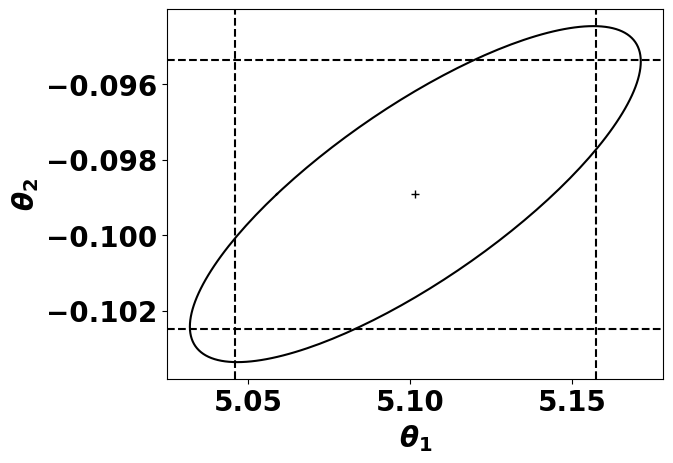
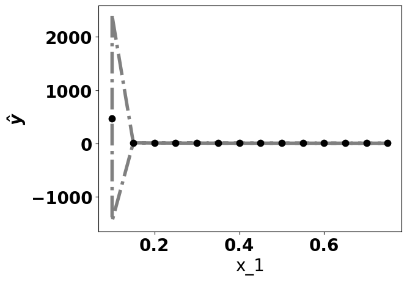
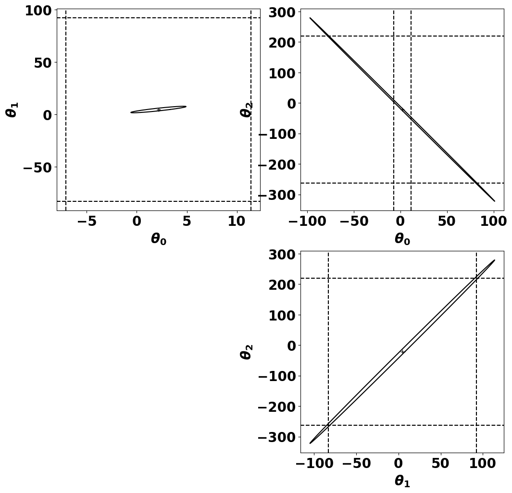

# Nonlinear Regression

## Definition
\justifying

We now turn our attention to a more generic regression model

\begin{empheq}[box=\mybox]{align*}
y^{(i)} = f(x^{(i)}; \theta) + \epsilon^{(i)}
\end{empheq}

As before, $x^{(i)}$ is the vector with the regressor variables, $\epsilon$ is a normally distributed disturbance, and $f$ is the expectation function of a parametereized family of functions specified by the parameters $\theta$.

## Definition
\justifying

We use $\theta$ for this function to differentiate from the linear models where the parameters were labeled $\beta$.

## Definition
\justifying

A **nonlinear regression** model is characterized by the function $f(x; \theta)$ where at least one of the derivatives of the expectation function wrt the parameters depends on at least one of the parameters.

## Example
\justifying

For example, the models:

\begin{empheq}[box=\mybox]{align*}
f(x; \theta) &= 60 + 70 e^{-\theta x} \\
f(x; \theta) &= \frac{\theta_1 x}{\theta_2 + x}
\end{empheq}

are both nonlinear.

## Example
\justifying

All of the partial derivatives depend on at least one parameter:

\begin{empheq}[box=\mybox]{align*}
\frac{\partial f(x; \theta)}{\partial \theta} &= -70x e^{-\theta x} \\
\frac{\partial f(x; \theta)}{\partial \theta_1} &= \frac{x}{\theta_2 + x} \\
\frac{\partial f(x; \theta)}{\partial \theta_2} &= \frac{-\theta_1 x}{(\theta_2 + x)^2}
\end{empheq}

## Nonlinear models
\justifying

Fitting nonlinear models requires nonlinear optimization methods that do not guarantee convergence to the global optima.

We can resort to linear approximations to fit the parameters.


## Transformably Linear Models
\justifying

Notice that our second example can be changed into a linear model:

\begin{empheq}[box=\mybox]{align*}
f(x; \theta) &= \frac{\theta_1 x}{\theta_2 + x} \\
\frac{1}{f(x; \theta)} &= \frac{\theta_2 + x}{\theta_1 x} \\
\frac{1}{f(x; \theta)} &= \frac{\theta_2}{\theta_1 x} + \frac{x}{\theta_1 x} \\
\frac{1}{f(x; \theta)} &= \frac{1}{\theta_1} + \frac{\theta_2}{\theta_1 x} \\
g(u; \beta) &= \beta_1 + \beta_2 u \\
u &= \frac{1}{x}
\end{empheq}

This is called **transformably linear models**.

## Transformably Linear Models
\justifying

Notice, though, that when we transform $f$ to a linear model, we are also transforming the disturbance term.

This can change the distribution of the disturbance, making the assumptions invalid.

This linearization can be helpful to find initial guesses for the parameters values, but the fitting should be performed with a nonlinear optimization method.

## Conditionally Linear Parameters
\justifying

Some parameters of a nonlinear model may be **conditionally linear**. For example, the derivative wrt $\theta_1$ of:

\begin{empheq}[box=\mybox]{align*}
f(x; \theta) &= \frac{\theta_1 x}{\theta_2 + x} \\
\frac{\partial f(x; \theta)}{\partial \theta_1} &= \frac{x}{\theta_2 + x} \\
\end{empheq}

depends only on $\theta_2$. We can exploit this by fitting $\theta_1$ as a linear regression conditional to a value of $\theta_2$.

## Least Squares Estimate
\justifying

As before, we want to find $\hat{\theta}$ such that:

\begin{empheq}[box=\mybox]{align*}
\hat{\theta} &= \min_\theta \|y - \hat{y}\|^2 \\
\hat{y} &= f(x; \theta)
\end{empheq}

## Gauss-Newton Method
\justifying

The **Gauss-Newton** method starts with the idea of using a linear approximation of the expectation function. This can be done by Taylor expansion at an initial guess $\theta^{(0)}$:

\begin{empheq}[box=\mybox]{align*}
f(x; \theta) &= f(x; \theta^{(0)}) + \sum_{i=1}^{p}{\frac{\partial f(x; \theta)}{\partial \theta_i}\Bigr|_{\substack{\theta=\theta^{(0)}}} (\theta_i - \theta^{(0)}_i)}
\end{empheq}

## Gauss-Newton Method
\justifying

The **Jacobian matrix** ($J$) is the matrix where:

\begin{empheq}[box=\mybox]{align*}
J = \begin{bmatrix}
 \frac{\partial f(x^{(1)}; \theta)}{\partial \theta_1}\Bigr|_{\substack{\theta=\theta^{(0)}}} & \ldots & \frac{\partial f(x^{(1)}; \theta)}{\partial \theta_P}\Bigr|_{\substack{\theta=\theta^{(0)}}}\\
 \vdots & \ddots & \vdots \\
 \frac{\partial f(x^{(N)}; \theta)}{\partial \theta_1}\Bigr|_{\substack{\theta=\theta^{(0)}}} & \ldots & \frac{\partial f(x^{(N)}; \theta)}{\partial \theta_P}\Bigr|_{\substack{\theta=\theta^{(0)}}}\\
\end{bmatrix}
\end{empheq}

## Gauss-Newton Method
\justifying

So we have:

\begin{empheq}[box=\mybox]{align*}
f(x; \theta) &\approx f(x; \theta^{(0)}) + J(\theta - \theta^{(0)})
\end{empheq}

## Gauss-Newton Method
\justifying

The approximated residuals are:

\begin{empheq}[box=\mybox]{align*}
z(\theta) &\approx y -  (f(x; \theta^{(0)}) + J(\theta - \theta^{(0)})) \\
z(\theta) &\approx (y -  (f(x; \theta^{(0)})) - J(\theta - \theta^{(0)}) \\
z(\theta) &\approx z^{(0)} - J \delta \\
\end{empheq}

## Gauss-Newton Method
\justifying

Now, we want to find $\delta^{(0)}$ that minimizes $\| z^{(0)} - J^{(0)} \delta \|^2$.

This relates to our solution of least squares, where we wanted to minimize $\| y - X \beta \|^2$.

## Gauss-Newton Method
\justifying

\begin{empheq}[box=\mybox]{align*}
J^{(0)} &= QR = Q_1 R_1 \\
\delta^{(0)} &= R_1^{-1} Q_1^T z^{(0)}
\end{empheq}

the point $f(x; \theta^{(0)} + \delta^{(0)})$ should be closer to $y$ than $f(x; \theta^{(0)})$.

## Gauss-Newton Method
\justifying

This process is repeated until we cannot minimize the sum of squared residues.

## Gauss-Newton Method {.fragile}
\justifying

```{.python frame=lines framerule=2pt linenos=true fontsize=\footnotesize baselinestretch=0.8}
df = pd.read_csv("grade.csv")
xcols = ['ETA_mean']

x, y = df[xcols].values, df.grade.values[:,np.newaxis]

def f(x, theta):
  return theta[0]*x/(theta[1] + x)
def J(x, theta):
  return np.hstack([x/(theta[1]+x),
            -theta[0]*x/(theta[1]+x)**2])
def sumofsquares(x, y, t, f):
  return np.sum(np.square(y - f(x, t)))
```

## Gauss-Newton Method {.fragile}
\justifying

```{.python frame=lines framerule=2pt linenos=true fontsize=\footnotesize baselinestretch=0.8}
def gauss_step(x, y, t0, f, J):
    p = t0.shape[0]
    z = y - f(x, t0)
    q, r = sc.linalg.qr(J(x, t0))
    q1 = q[:,:p]
    r1 = r[:p, :p]
    delta = sc.linalg.solve_triangular(r1, q1.T@z)
    return t0 + delta
```

## Gauss-Newton Method {.fragile}
\justifying

```{.python frame=lines framerule=2pt linenos=true fontsize=\footnotesize baselinestretch=0.8}
def gauss(x, y, t, f, J, debug=False):
    sos_old = np.inf
    sos = sumofsquares(x, y, t, f)
    if debug:
        print(sos)
    while sos < sos_old:
        t = gauss_step(x,y,t,f,J)
        sos_old = sos
        sos = sumofsquares(x, y, t, f)
        if debug:
            print(sos)
    return t
```

## Gauss-Newton Method {.fragile}
\justifying

```{.python frame=lines framerule=2pt linenos=true fontsize=\footnotesize baselinestretch=0.8}
t = np.array([205, 0.08])[:,np.newaxis]
gauss(x, y, t, f, J, True)
```

```
245431183.92754266
132435.0246901058
12299140970.505436
array([[ 3.1590888 ],
       [-0.77757744]])
```

## Step factor
\justifying

The last step increased the sum of squares even though we went towards the descent direction.

In these situations we need to decrease the step size when updating the current value of $\theta$.

A simple heuristic is to start with $1$ and half the value until a threshold.

A better approach is to perform a linea search to find the optimal value for the step size.

## Step factor {.fragile}

```{.python frame=lines framerule=2pt linenos=true fontsize=\footnotesize baselinestretch=0.8}
def gauss_step(x, y, t0, f, J, step):
    p = t0.shape[0]
    z = y - f(x, t0)
    q, r = sc.linalg.qr(J(x, t0))
    q1 = q[:,:p]
    r1 = r[:p, :p]
    delta = sc.linalg.solve_triangular(r1, q1.T@z)
    return t0 + step*delta
```

## Step factor {.fragile}

```{.python frame=lines framerule=2pt linenos=true fontsize=\footnotesize baselinestretch=0.8}
def gauss(x, y, t, f, J, debug=False):
    sos_old = np.inf
    sos = sumofsquares(x, y, t, f)
    step = 1
    while step > 1e-12
          and np.square(sos - sos_old) > 1e-6:
        t_i = gauss_step(x,y,t,f,J,step)
        sos_old = sos
        sos = sumofsquares(x, y, t_i, f)
        if sos > sos_old:
            step = step / 2
        else:
            t = t_i
    return t
```

## Gauss-Newton Method {.fragile}
\justifying

```{.python frame=lines framerule=2pt linenos=true fontsize=\footnotesize baselinestretch=0.8}
t = np.array([205, 0.08])[:,np.newaxis]
gauss(x, y, t, f, J, True)
```

## Step factor {.fragile}

```
245431183.92754266
132435.0246901058
12299140970.505436
745214728.2425426
186876895.48195535
47131373.71276204
...
335857.52272309375
335857.5118304746
335857.5091074513
335857.50842667697
array([[ 0.00344322],
       [-0.35566967]])
```

## Step factor {.fragile}
\justifying

Let's try a different starting value:

```{.python frame=lines framerule=2pt linenos=true fontsize=\footnotesize baselinestretch=0.8}
t = np.array([1.2, -0.1])[:,np.newaxis]
gauss(x, y, t, f, J, True)
```

## Step factor {.fragile}

```
208543.89714250065
28984.677830013265
28918.85467418468
28908.738157793916
28907.728409941887
28907.546226136466
28907.519349759037
28907.515040983937
28907.51437219738
array([[ 5.10148992],
       [-0.09892466]])
```

## Initial Conditions
\justifying

Choosing different starting points can lead to different optima, better or worse than the previous temptative.

## Approximating the Confidence Interval
\justifying

With the linear models we could find the joint $(1-\alpha)\%$ CI of the parameters with:

\begin{empheq}[box=\mybox]{align*}
(\beta - \hat{\beta})^T x^Tx (\beta - \hat{\beta}) \leq P s^2 F(\alpha, P, N-P)
\end{empheq}

## Approximating the Confidence Interval
\justifying

We can do the same with the linear approximation of the nonlinear model:

\begin{empheq}[box=\mybox]{align*}
(\theta - \hat{\theta})^T J^TJ (\theta - \hat{\theta}) \leq P s^2 F(\alpha, P, N-P)
\end{empheq}

## Approximating the Confidence Interval
\justifying

And generate the ellipse with:

\begin{empheq}[box=\mybox]{align*}
\left\{ \theta = \hat{\theta} + \sqrt{P s^2 F(\alpha, P, N-P)} R_1^T d \mid \|d\| = 1 \right\}
\end{empheq}

## Approximating the Confidence Interval
\justifying

Similarly, the marginal CI can be calculated as:

\begin{empheq}[box=\mybox]{align*}
s^2 &= \frac{(y - f(x; \hat{\theta}))^2}{N - P} \\
se &= \sqrt{s^2 \operatorname{diag}(J^T J)}
\hat{\theta} \pm se t(\alpha/2, N-P)
\end{empheq}

## Approximating the Confidence Interval {.fragile}
\justifying

```{.python frame=lines framerule=2pt linenos=true fontsize=\footnotesize baselinestretch=0.8}
j = J(x, theta)
s2 = np.sum((y - f(x,theta))**2)/(n-p)
se = np.sqrt(s2 * np.diag(np.linalg.inv(j.T @ j)))

q, r = sc.linalg.qr(j)
q1 = q[:,:p]
r1 = r[:p, :p]
```

## Approximating the Confidence Interval {.fragile}
\justifying

```{.python frame=lines framerule=2pt linenos=true fontsize=\footnotesize baselinestretch=0.8}
alpha = 0.05
marginal_t = []
for i, coef in enumerate(theta.flatten()):
    v = np.abs(se[i]*stats.t.ppf(1 - alpha/2, n-p))
    marginal_t.append((coef - v, coef + v))
    print(f"{coef - v:0.4f} <= theta_{i} <= {coef + v:0.4f}")
```

## Approximating the Confidence Interval {.fragile}
\justifying

```{.python frame=lines framerule=2pt linenos=true fontsize=\footnotesize baselinestretch=0.8}
omegas = np.pi*np.arange(0, 2.01, 0.01)
const = np.sqrt(p*s2*stats.f.ppf(1-alpha, p, n-p))
         *np.linalg.inv(r1)
thetapts = np.array([theta + const
            @ np.array([np.cos(w), np.sin(w)])
            for w in omegas])
```

## Approximating the Confidence Interval {.fragile}
\justifying

```{.python frame=lines framerule=2pt linenos=true fontsize=\footnotesize baselinestretch=0.8}
_,ax = plt.subplots()
ax.plot(thetapts[:,0], thetapts[:,1], color='black')
ax.plot(theta[0], theta[1], '+', color='black')
ax.axvline(x=marginal_t[0][0], linestyle='--', color='black')
ax.axvline(x=marginal_t[0][1], linestyle='--', color='black')
ax.axhline(y=marginal_t[1][0], linestyle='--', color='black')
ax.axhline(y=marginal_t[1][1], linestyle='--', color='black')

ax.set_xlabel(r"$\theta_1$")
ax.set_ylabel(r"$\theta_2$")
```

## Approximating the Confidence Interval {.fragile}
\justifying



## Approximating the Confidence Interval {.fragile}
\justifying

For the predictions we can calculate with:

\begin{empheq}[box=\mybox]{align*}
\hat{y}^{(i)} &\pm s \| J_i R_1^{-1} \| t(\alpha/2, N-P) \\
\hat{y} &\pm s \|J R_1^{-1}\| \sqrt{f(\alpha, P, N-P)}
\end{empheq}

## Approximating the Confidence Interval {.fragile}
\justifying

```{.python frame=lines framerule=2pt linenos=true fontsize=\footnotesize baselinestretch=0.8}
for i, y_i in enumerate(f(x, theta).flatten()):
    jr = (j[0,:] @ np.linalg.inv(r1))
    v = np.sqrt(s2 * (jr.T@jr))*np.abs(stats.t.ppf(1 - alpha/2, n-p))
    print(f"{y_i - v:0.2} <= y_{i} <= {y_i + v:0.2}")
```

## Approximating the Confidence Interval {.fragile}
\justifying

```{.python frame=lines framerule=2pt linenos=true fontsize=\footnotesize baselinestretch=0.8}
fxi = np.arange(0.1, 0.8, 0.05)[:,np.newaxis]
j = J(xi, theta)

yy = np.linalg.norm(j @ np.linalg.inv(r1), axis=1)
      * np.sqrt(s2*p * stats.f.ppf(1-alpha, p, n-p))
y_h = f(xi, theta)
```

## Approximating the Confidence Interval {.fragile}
\justifying

```{.python frame=lines framerule=2pt linenos=true fontsize=\footnotesize baselinestretch=0.8}
_,ax = plt.subplots()
ax.plot(xi[:,0], y_h, '.', color='black', markersize=15)
ax.fill_between(xi[:,0], y_h - yy, y_h + yy, edgecolor='gray', facecolor='white', alpha=1,
    linewidth=4, linestyle='dashdot', antialiased=True)
ax.set_xlabel('x_1')
ax.set_ylabel(r'$\hat{y}$')
```
## Approximating the Confidence Interval {.fragile}
\justifying



## Approximating the Confidence Interval {.fragile}
\justifying

When we have more than $2$ parameters, we can plot pairwise approximations of the joint intervals by using the $i,j$-th rows and columns of $R_1$.

## Approximating the Confidence Interval {.fragile}
\justifying

```{.python frame=lines framerule=2pt linenos=true fontsize=\footnotesize baselinestretch=0.8}
def f(x, theta):
    return np.exp(-theta[0]*x) + theta[1]*x/(theta[2] + x)
def J(x, theta):
    return np.hstack([-x*np.exp(-theta[0]*x),
            x/(theta[1]+x), -theta[0]*x/(theta[1]+x)**2])

theta2 = np.array([0.1, 0.1, 0.1])[:,np.newaxis]
theta2 = gauss(x, y, theta2, f, J)
```

## Approximating the Confidence Interval {.fragile}
\justifying

```{.python frame=lines framerule=2pt linenos=true fontsize=\footnotesize baselinestretch=0.8}
omegas = np.pi*np.arange(0, 2.01, 0.01)

_,axs = plt.subplots(2,2, figsize=(12,12))
for i in range(2):
  for j in range(i+1, 3):
    ixs = [i,j]
    const = np.sqrt(p*s2*stats.f.ppf(1-alpha, p, n-p))
            *np.linalg.inv(r1[[i,j], :][:,[i,j]])
    thetapts = np.array([theta2[ixs].flatten()
           + const
           @ np.array([np.cos(w), np.sin(w)]) for w in omegas])

```

## Approximating the Confidence Interval {.fragile}
\justifying

{width=300px}

## Terminology learned today
\justifying

- **nonlinear regression:** is a model where at least one of the derivatives of the expectation function wrt the parameters depends on at least one of the parameters
- **transformably linear models:** are nonlinear models that can be transformed to linear.
- **conditionally linear:** are models that some of the parameters are linear when we fix the other parameter values.

## Further reading
\justifying

- Chapter 2 and 3 of Bates, Douglas. "Nonlinear regression analysis and its applications." Wiley Series in Probability and Statistics (1988).

## Next lecture {.standout}

\begin{block}{}
  \begin{itemize}
    \item Symbolic Regression
\end{itemize}

\hfill

\includegraphics[width=100pt]{figs/tobecontinued.png}
\end{block}

## Acknowledgments
