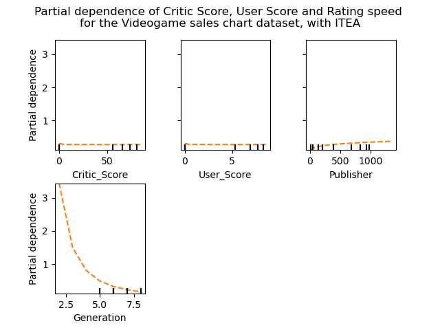

# Not linear but not nonlinear

## Let's keep things linear
\justifying

Let us frame the linear regression a little bit differently:

\begin{empheq}[box=\mybox]{align*}
f(x; \beta) = \beta \phi(x)
\end{empheq}

Now, $\phi(x) \in \mathbb{R}^d \rightarrow \mathbb{R}^{d'}$ is a function that **transforms** the original variable space to a different space.

## Let's keep things linear
\justifying

In our previous lectures we have used $\phi(x) = [1 ; x]$ effectively adding a column of $1$s in our dataset.

But we are not limited to this simple transformation.

## Let's keep things linear
\justifying

For example, we can have:

\begin{empheq}[box=\mybox]{align*}
\phi(x) &= [1 ; x] \\
\phi(x) &= [1 ; x ; x^2] \\
\phi(x) &= [1 ; x ; \sqrt{x}] \\
\phi(x) &= [1 ; x ; \log{x} ; x^2]
\end{empheq}

## Let's keep things linear
\justifying

This will add some nonlinearity to our model without losing the benefit of fitting a model linear in the parameters.

\begin{tikzpicture}
\begin{axis}[legend pos=outer north east, domain=1:50]
\addplot [very thick,red,legend entry=$2x + 4$] {2*x + 4};
\addplot [very thick,blue,legend entry=$-0.03x^2 + 2x + 4$] {-0.03*x^2 + 2*x + 4};
\addplot [very thick,green,legend entry=$2\sqrt{x^3} + 2x + 4$] {0.1*sqrt(x^3) + 2*x + 4};
\addplot [very thick,orange,legend entry=$2x + 3\ln{x} + 4$] {2*x + 3*ln(x) + 4};
\end{axis}
\end{tikzpicture}

## Let's keep things linear
\justifying

With this transformation, we now have a **hypothesis space** composed of all possible transformations:

\begin{empheq}[box=\mybox]{align*}
\mathcal{F}_\phi &= \left\{ f(\phi(x); \beta) = \beta \phi(x) \mid \beta \in \mathbb{R}^d\right\} \\
\mathcal{F} &= \left\{ f(\phi(x); \beta) = \beta \phi(x) \mid \phi \in \Phi, \beta \in \mathbb{R}^d_\phi\right\} \\
\end{empheq}

## Hypothesis Space
\justifying

\notebox{A **hypothesis space** is the set of all candidate models $f : X \rightarrow Y$ considered in the context of the machine learning algorithm. }

## Let's keep things linear
\justifying

In the previous example, we were working with one-dimensional predictor. If we have multidimensional $x$, we can apply the transformations to each one of the predictors or to a subset.

\begin{empheq}[box=\mybox]{align*}
\phi(x) &= [1 ; x] \\
\phi(x) &= [1 ; x ; x_1^2] \\
\phi(x) &= [1 ; x ; \sqrt{x_1} ; x_2^2]
\end{empheq}

Notice that a transformation applied to every predictor will add another $d$ predictors.

## Interactions
\justifying

When making quadratic, cubic, and other polynomial transformations, we often consider the interaction between variables. So, for $d = 2$:

\begin{empheq}[box=\mybox]{align*}
\phi(x) &= [1 ; x ; x^2] \\
        &= [1 ; x ; x_1^2; x_2^2; x_1 x_2]
\end{empheq}

Notice that by doing so we will have an additional $O(d^2)$ predictors for quadratic predictors and $O(d^3)$ additional predictors for cubic, etc.

## Interactions
\justifying

If we have the interaction between two predictors $x_1, x_2$ modeled as:

\begin{empheq}[box=\mybox]{align*}
f(x; \theta) = \beta_1 + \beta_2 x_1 + \beta_3 x_2 + \beta_4 x_1 x_2
\end{empheq}

The effect of $x_1$ for a fixed value of $x_2$ would be $\beta_2 + \beta_4 x_2$.

## Interactions
\justifying

The interaction compensates for the influence that one predictor may have for another.

For example, the effect of a treatment to a person may depend of the age of the person

## Let's keep things linear
\justifying

Another feature transformation is the **piecewise predictors**. These are binary predictors with a value of $1$ if $x_i$ is between a certain range, and $0$ otherwise.

\begin{empheq}[box=\mybox]{align*}
\phi(x) = [\mathbf{1}[l_1 < x \leq u_1]; \mathbf{1}[l_2 < x \leq u_3], \ldots, \mathbf{1}[l_i < x \leq u_i]]
\end{empheq}

## Piecewise Predictors
\justifying

\begin{tikzpicture}
\begin{axis}
\addplot coordinates { (1,1) (3,1) };
\addplot coordinates { (3,1) (3,3) };
\addplot coordinates { (3,3) (7,3) };
\addplot coordinates { (7,3) (7,2) };
\addplot coordinates { (7,2) (9,2) };
\end{axis}
\end{tikzpicture}

## Piecewise Predictors
\justifying

If you add many of these predictors we can overfit our data:

\begin{tikzpicture}
\begin{axis}
\addplot coordinates { (1,1) (1.1,1) };
\addplot coordinates { (1.1,1) (1.1,1.05) };
\addplot coordinates { (1.1,1.05) (1.2,1.05) };
\addplot coordinates { (1.2,1.05) (1.2,1.12) };
\addplot coordinates { (1.2,1.12) (1.3,1.12) };
\addplot coordinates { (1.3,1.12) (1.3,1.19) };
\addplot coordinates { (1.3,1.19) (1.4,1.19) };
\addplot coordinates { (1.4,1.19) (1.4,1.1) };
\addplot coordinates { (1.4,1.1) (1.5,1.1) };
\addplot coordinates { (1.5,1.1) (1.5,1.02) };
\addplot coordinates { (1.5,1.02) (1.6,1.02) };
\addplot coordinates { (1.6,1.02) (1.6,1.2) };
\addplot coordinates { (1.6,1.2) (1.7,1.2) };
\addplot coordinates { (1.7,1.2) (1.7,1) };
\addplot coordinates { (1.7,1) (2,1) };
\addplot coordinates { (2,1) (2,3) };
\addplot coordinates { (2,3) (3,3) };
\end{axis}
\end{tikzpicture}

# Examples

## Let's try some transformations {.fragile}
\justifying

```{.python frame=lines framerule=2pt linenos=true fontsize=\footnotesize baselinestretch=0.8}
df = pd.read_csv("grade.csv")
xcols = ['ETA_mean', 'hoursWork_mean',
     'numAttendence_max', 'age', 'numChildren',
     'enrollmentTime', 'isSingle']

x, y = df[xcols].values, df.grade.values
x = np.concatenate((np.ones((x.shape[0],1)),x),
           axis=1)
```

## Let's try some transformations {.fragile}
\justifying

```{.python frame=lines framerule=2pt linenos=true fontsize=\footnotesize baselinestretch=0.8}
_,axs = plt.subplots(3,3, figsize=(10,16), sharey=True)
ix = 0
for i in range(2):
    for j in range(3):
        axs[i,j].plot(df[xcols[ix]].values, df.grade.values,
            '.', color='black')
        axs[i,j].set_xlabel(xcols[ix])
        if j==0:
            axs[i,j].set_ylabel('grade')
        ix = ix+1
axs[2,0].plot(df[xcols[ix]].values, df.grade.values, '.',
          color='black')
```

## Let's try some transformations {.fragile}
\justifying

{ height=300px }

## Let's try some transformations {.fragile}
\justifying

```{.python frame=lines framerule=2pt linenos=true fontsize=\footnotesize baselinestretch=0.8}
t.subplots(3,3, figsize=(14,14), sharey=True)
ix = 0
for i, c1 in enumerate(xcols[:3]):
  for j, c2 in enumerate(xcols[3:6]):
    axs[i,j].plot(df[c1].values*df[c2].values,
         df.grade.values,
          '.', color='black')
    axs[i,j].set_xlabel(f"{c1}*{c2}")
```

## Let's try some transformations {.fragile}
\justifying

{ height=300px }

## Let's try some transformations {.fragile}
\justifying

```{.python frame=lines framerule=2pt linenos=true fontsize=\footnotesize baselinestretch=0.8}
_,axs = plt.subplots(3,4,
   figsize=(14,14), sharey=True)
ix = 0
for i, c1 in enumerate(xcols[:3]):
  for j, (fname,h) in enumerate([('sqrt',np.sqrt),
       ('cbrt', np.cbrt), ('log1p', np.log1p),
       ('exp', lambda x: np.exp(-x))]):
    axs[i,j].plot(h(df[c1].values), df.grade.values,
       '.', color='black')
    axs[i,j].set_xlabel(f"{fname}({c1})")

```

## Let's try some transformations {.fragile}
\justifying

{ height=300px }

# Examples of Advanced Machine Learning models

## Neural Networks
\justifying

Neural Networks, specifically feed-forward networks[^1], creates a regression model as a chaining of nonlinear functions (called activation) applied to the linear combination of the predictors.

\begin{empheq}[box=\mybox]{align*}
f(x; \theta) &= \theta_{13}\tanh(\theta_5 \tanh(\theta_1 x_1 + \theta_2 x_2) + \theta_6 \tan(\theta_3 x_1 + \theta_4 x_2)) \\
             &+ \theta_{14} \tanh(\theta_{11} \tanh(\theta_7 x_1 + \theta_8 x_2) + \theta_{12} \tan(\theta_9 x_1 + \theta_{10} x_2))
\end{empheq}

[^1]: Bebis, George, and Michael Georgiopoulos. "Feed-forward neural networks." Ieee Potentials 13.4 (1994): 27-31.

## Neural Networks
\justifying

The $\tanh$ function has the following shape:

\begin{tikzpicture}
\begin{axis}
\addplot [very thick,black] {tanh(x)};
\end{axis}
\end{tikzpicture}

## Neural Networks
\justifying

If we add a chain of overparameterized $\tanh$, like the previous example, we can shape the function to fit our data:

\begin{tikzpicture}
\begin{axis}
\addplot [very thick,black] {3.2*tanh(0.5*tanh(1.6*x) - 1*tanh(0.1*x))+0.2*(1.2*tanh(0.5*x) - 0.1*tanh(0.3*x))};
\end{axis}
\end{tikzpicture}

## Neural Networks
\justifying

Neural Networks often requires a large number of parameters.

This overparameterization reduces the Interpretability capabilities of our model. The effect of any of our predictors is unclear.

## Gradient Boosting
\justifying

Another regression model with high accuracy for nonlinear relationship is the **gradient boosting**[^2]. The main idea is to iteratively train **weak** models with a modified objective-function at every iteration.

This modified objective-function tries to minimize the current prediction error.

[^2]: Friedman, Jerome H. "Greedy function approximation: a gradient boosting machine." Annals of statistics (2001): 1189-1232.

## Gradient Boosting
\justifying

This technique starts with a baseline model (F_0 = $\mathcal{E}[y]$) and iteratively creates a new model based on the previous:

\begin{empheq}[box=\mybox]{align*}
F_0(x) &= \argmin_c{\mathcal{L}(y; c)} \\
F_m(x) &= F_{m-1}(x) + \argmin_{h_m \in \mathcal{H}}{\mathcal{L}(y; F_{m-1}(x) + h_m(x))}(x)
\end{empheq}

## Gradient Boosting
\justifying

Since finding $h_m$ that minimizes the objective is infeasible. Instead we specify a base weak learner (i.e., regression tree, linear model) and minimizes the gradient of the current loss function:

\begin{empheq}[box=\mybox]{align*}
F_m(x) &= F_{m-1}(x) - \gamma \nabla \mathcal{L}(y; F_{m-1}(x))
\end{empheq}

## Gradient Boosting
\justifying

Similar to Neural Networks, Gradient Boosting sacrifices the interpretability to achieve a better accuracy.

Even though there are some techniques that can measure the **feature importance** for these models, the interpretation is not as straightforward as a linear model (or even a hand-crafted nonlinear model).

These are often called **opaque model** (as oposed to a **transparent model**).

## Transparent x Opaque models
\justifying

Depending on what we want, we have **transparent** and **opaque** models:

- It is possible to inspect the decision process and the behavior of **transparent** models
- In **opaque** models, this is obscured and external tools are needed to understand its behavior

\centering
\begin{tikzpicture}
\node (rectangle) [draw, rectangle, minimum width = 3 cm, minimum
height = 3 cm, fill=yellow!10] (Y) at (4,0) {\huge ?} ;
\draw [Triangle-] (Y.west) -- ++ (-2, 0) node [pos = .5, above] {$X_i$};
\draw [-Triangle]  (Y.east) -- ++ (2, 0) node [pos = .5, above] {$y_i$};
\end{tikzpicture}

## All about prediction
\justifying

Opaque models (Deep Learning, SVM, Kernel Regression):

- Often associated with a higher predictive power (but not always true).
- If our only concern is prediction, they may be enough.


## Transparent x Opaque models

::: {.columns align=center}

:::: column

::::

:::: column
If the objective is to study associations, an opaque model may create a barrier to understand the strength of association of a predictor to the outcome.
::::
:::
## Symbolic Regression
\justifying

**Symbolic Regression** searches for a function form together with the numerical coefficients that best fits the outcome.


::: {.columns align=center}

:::: column
$$f(x, \theta) = \theta_0 x_0 + e^{x_0 x_1}$$
::::

:::: column
{ height=80% }
::::

:::

## Symbolic Regression{.fragile}
\justifying

- Genetic Programming is the most common algorithm to search for the expression
- Represents the solution as an expression tree.

::: {.columns align=center}

:::: column
$$f(x, \theta) = \theta_0 x_0 + e^{x_0 x_1}$$
::::


:::: column
\begin{forest}
    rounded/.style={circle, minimum size=20pt, font=\footnotesize, thick, edge={thick}, draw},
    chosen/.style={circle, minimum size=20pt, font=\footnotesize, thick, edge={thick}, fill=gray!40, draw}
    [{$+$}, for tree=rounded
      [{$*$}
        [{$\theta_0$}]
        [{$x_0$}]
      ]
      [{$exp$}
        [{$*$}
          [{$x_0$}]
          [{$x_1$}]
        ]
      ]
    ]
\end{forest}
::::

:::

## Genetic Programming {.fragile}
\justifying

A very simple search meta-heuristic:

```{.haskell frame=lines framerule=2pt linenos=true fontsize=\footnotesize baselinestretch=0.8}
gp gens nPop =
  p = initialPopulation nPop
  until (convergence p)
      parents   = select p
      children  = recombine parents
      children' = perturb children
      p         = reproduce p children'
```


## Symbolic Regression
\justifying

Two NP-Hard problems[^3]:

- Search for the correct function form $f(x, \theta)$.
- Find the optimal coefficients $\theta^{*}$.

[^3]: Virgolin, Marco, and Solon P. Pissis. "Symbolic Regression is NP-hard." arXiv preprint arXiv:2207.01018 (2022).

## Symbolic Regression - GP
\justifying

If we fail into one of them we may discard promising solutions.

\begin{figure}[t!]
    \centering
    \begin{tikzpicture}
    \begin{axis}[domain=-3:3,legend pos=south west]
    \addplot {cos(x)};
    \addplot {cos(0.5*x + 1)};
    \legend{$\cos(x)$,$\cos(0.5x + 1)$}
    \end{axis}
\end{tikzpicture}
    \caption{The function $\cos(\theta_1 x + \theta_2)$ may behave differently depending on the choice of $\theta$.}
    \label{fig:exampleWrongNumber}
\end{figure}


## Symbolic Regression - GP
\justifying

Pros:

- It can find the generating function of the studied phenomena.
- Automatically search for interactions, non-linearity and feature selection.

Cons:

- It can find an obscure function that also fits the studied phenomena.
- The search space can be difficult to navigate.
- Not gradient-based search, it can be slower than opaque models.

## Is it worth it?

::: {.columns align=center}

:::: column
As we can define the primitives, we can choose how *expressive* the model will be.

Consider the $\sin{(x)}$ function. GP can find the correct model if it contains this function in its primitives.
::::

:::: column

::::

:::

## Is it worth it?

::: {.columns align=center}

:::: column
$3$ layers neural network with sigmoid activation trained on the interval $x \in [-10, 10]$, took $300$ seconds and returned this model:


::::

:::: column
TIR Symbolic Regression model, took $10$ seconds and returned this model:


::::

:::

# Current State of SR

## Is SR competitive?

Benchmark[^4] of $22$ regression algorithms using $122$ benchmark problems, $15$ of them are SR algorithms.

::: {.columns align=center}

:::: column
\centering
{ height=60% }
::::

:::: column
\centering
{ height=60% }

::::

:::

[^4]: La Cava, William, et al. "Contemporary Symbolic Regression Methods and their Relative Performance." Thirty-fifth Conference on Neural Information Processing Systems Datasets and Benchmarks Track (Round 1). 2021.


## Different approaches

- Many different ideas to improve current results.
- Using nonlinear least squares or ordinary least squares to find $\theta$.
- Constraining the representation.
- Using information theory to improve recombination and perturbation.
- Incorporating multi-objective, diversity control, etc.

## Operon C++
\justifying

Operon C++[^5] is a C++ implementation of standard GP and GP with nonlinear least squares for coefficient optimization.

::: {.columns align=center}

:::: column
\centering
{ height=60% }
::::
:::: column
- Competitive runtime, good accuracy
- Supports multi-objective optimization, many hyper-parameters to adjust to your liking
- May overparameterize the model
::::
:::

[^5]: Burlacu, Bogdan, Gabriel Kronberger, and Michael Kommenda. "Operon C++ an efficient genetic programming framework for symbolic regression." Proceedings of the 2020 Genetic and Evolutionary Computation Conference Companion. 2020.

## Transformation-Interaction-Rational

Constraint the generated expressions to the form[^6]:

\begin{equation*}
f_{TIR}(\mathbf{x, w_p, w_q}) = \tikzmarknode{g}{\highlight{red}{$g$}}\left(\frac{\tikzmarknode{p}{\highlight{blue}{$p(\mathbf{x, w_p})$}}}{1 + \tikzmarknode{q}{\highlight{blue}{$q(\mathbf{x, w_q})$}}}\right)
\end{equation*}

\begin{tikzpicture}[overlay,remember picture,>=stealth,nodes={align=left,inner ysep=1pt},<-]
    % For "X"
    \path (g.north) ++ (0,1.5em) node[anchor=south east,color=red!67] (scalep){\textbf{invertible function}};
    \draw [color=red!87](g.north) |- ([xshift=-0.3ex,color=red]scalep.south west);
    % For "S"
    \path (p.east) ++ (3em,-1em) node[anchor=west,color=blue!67] (scaleb){\textbf{IT expressions}};
    \draw[<->,color=blue!57] (q.east) -- ++ (0.5,0) |- (p);
\end{tikzpicture}

\begin{equation*}
f_{IT}(\mathbf{x, w}) = w_0 + \sum_{j = 1}^{m}{\tikzmarknode{w}{\highlight{red}{$w_{j}$}} \cdot (\tikzmarknode{f}{\highlight{green}{$f_j$}} \circ \tikzmarknode{r}{\highlight{blue}{$r_j$}}) (\mathbf{x})}
\end{equation*}

\begin{tikzpicture}[overlay,remember picture,>=stealth,nodes={align=left,inner ysep=1pt},<-]
    % For "X"
    \path (w.north) ++ (0,1.5em) node[anchor=south east,color=red!67] (scalep){\textbf{linear coefficient}};
    \draw [color=red!87](w.north) |- ([xshift=-0.3ex,color=red]scalep.south west);
    % For "S"
    \path (f.south) ++ (0,-1.5em) node[anchor=north east,color=green!67] (mean){\textbf{transformation function}};
    \draw [color=green!27](f.south) |- ([xshift=-0.3ex,color=green]mean.south west);
    \path (r.south) ++ (0,-1.5em) node[anchor=north west,color=blue!67] (mean2){\textbf{interaction function}};
    \draw [color=blue!57](r.south) |- ([xshift=-0.3ex,color=blue]mean2.south east);

\end{tikzpicture}

\begin{equation*}
r_j(\mathbf{x}) = \prod_{i = 1}^{d}{x_i^{ \tikzmarknode{k}{ \highlight{red}{$k_{ij}$} }}}
\end{equation*}

\begin{tikzpicture}[overlay,remember picture,>=stealth,nodes={align=left,inner ysep=1pt},<-]
    \path (k.south) ++ (0,-1.5em) node[anchor=north east,color=red!67] (mean){\textbf{strength of interaction}};
    \draw [color=red!57](k.south) |- ([xshift=-0.3ex,color=red]mean.south west);

\end{tikzpicture}

[^6]: Fabrício Olivetti de França. 2022. Transformation-interaction-rational representation for symbolic regression. In Proceedings of the Genetic and Evolutionary Computation Conference (GECCO '22). Association for Computing Machinery, New York, NY, USA, 920–928. https://doi.org/10.1145/3512290.3528695

# What else?

## More benefits to SR

- As a middle ground between opaque and clear model, it can be interpreted
- We can make sure it conforms to our prior-knowledge
- Standard statistical tools can also be applied

## Interpreting SR models

Partial effect at the mean[^7] or the mean of the partial effects.

\centering
{ width=60% }

[^7]: Aldeia, Guilherme Seidyo Imai, and Fabrício Olivetti de França. "Interpretability in symbolic regression: a benchmark of explanatory methods using the Feynman data set." Genetic Programming and Evolvable Machines (2022): 1-41.

## Dataset: Video Game Sales

Or a PDP plot[^8] if you want to.

\centering
{ width=60% }

[^8]: Friedman, Jerome H. "Greedy function approximation: a gradient boosting machine." Annals of statistics (2001): 1189-1232.

## Dataset: Video Game Sales - Debug it!

\begin{align*}
& 0.4593106521142636 \\
& + 0.08\log(1 + \text{publisher}^3 \text{gen}^{-3}) \\
& - 0.09\log(1 + \text{critic\_score}^2 \text{user\_score}^3 \text{gen}^3 \text{PC}^3) \\
& + 0.21\log(1 + \text{user\_count}^3 \text{gen}^{-3}) \\
& -1.77\log(1 + \text{gen}) \\
\end{align*}

## Shape-constraint[^9]

{ height=80% }

[^9]: Kronberger, Gabriel, et al. "Shape-Constrained Symbolic Regression—Improving Extrapolation with Prior Knowledge." Evolutionary Computation 30.1 (2022): 75-98.

## Statistical Analysis {.fragile}

Unlike some opaque models, we can calculate the confidence interval of our parameters and predictions using standard statistical tools:

```
SSR 752.76 s^2 28.95
theta	Estimate	Std. Error.	  Lower		  Upper
0	   -1.43e+01	4.29e+00	-2.31e+01	-5.44e+00
1	    1.28e+01	2.49e+00	 7.67e+00	 1.79e+01

Corr. Matrix
[ 1.   -0.97]
[-0.97  1.  ]
```

## Prediction intervals:

{ height=80% }

## And many more!

::: {.columns align=center}

:::: column

::::
:::: column

::::
:::

## Let's test it! {.fragile}
\justifying

```{.python frame=lines framerule=2pt linenos=true fontsize=\footnotesize baselinestretch=0.8}
x = np.repeat(np.arange(-5, 5, 0.2), 15)
y = rng.normal( 0.3*x**3 - 0.2*x**2 + 0.1*x + 1, 1)
plt.plot(x, y, '.')
```

## Let's test it! {.fragile}
\justifying

{ witdh=200px }

## Baseline {.fragile}
\justifying

```{.python frame=lines framerule=2pt linenos=true fontsize=\footnotesize baselinestretch=0.8}
from sklearn.linear_model import LinearRegression

lin = LinearRegression()
lin.fit(x.reshape(-1,1), y)
print("LR: ", lin.score(x.reshape(-1,1), y))
print(f"{lin.coef_}*x")

xpoly = np.vstack([x, x**2, x**3]).T
lin.fit(xpoly,y)
print("Poly: ", lin.score(xpoly, y))
print(f"{lin.coef_}")
```

## Baseline {.fragile}
\justifying

```
LR:  0.8270
Poly:  0.9954
```

## Operon {.fragile}

```{.python frame=lines framerule=2pt linenos=true fontsize=\footnotesize baselinestretch=0.8}
from pyoperon.sklearn import SymbolicRegressor
import sympy as sym

reg = SymbolicRegressor()
reg.fit(x.reshape(-1,1),y)
res = [s['objective_values'], s['tree']))
         for s in reg.pareto_front_]

for obj, expr, mdl in res:
  print("Score: ", obj)
  print("Expr: ", reg.get_model_string(expr, 3))
  print("Simplified: ",
       sym.sympify(reg.get_model_string(expr, 3)))
```

## Operon {.fragile}

```
Score:  [-0.995512068271637]
Expr:  (1.064 + ((-0.934) * ((((0.106 * X1)
     * ((-0.008) * X1)) * (((-0.908)
     / (((1.019 * X1) - 0.168)
     * (((1.019 * X1) - 0.168) * ((1.019 * X1) - 0.168))))
     - (((1.456 * X1) - ((((1.414 * X1) - 0.486)
     * (0.106 * X1)) * ((-1.207) + (0.106 * X1))))
     / (((-0.390) + (0.232 * X1)) * ((0.232 * X1) + 0.286)))))
     + (((((1.414 * X1) * ((-2.135) * X1)) + ((-1.207)
     + (0.106 * X1))) - ((-1.915) * X1)) * (0.106 * X1)))))
Simplified:  (0.02*X1**8 - 0.03*X1**7 -
            0.01*X1**6 + 0.09*X1**5 - 0.08*X1**4
            - 0.09*X1**3 + 0.06*X1**2 - 0.e-2*X1)/(0.05*X1**5
            - 0.05*X1**4 - 0.1*X1**3 + 0.05*X1**2 - 0.e-2*X1)
```

## Operon {.fragile}

```{.python frame=lines framerule=2pt linenos=true fontsize=\footnotesize baselinestretch=0.8}
reg = SymbolicRegressor(max_length=20,
    allowed_symbols= "add,mul,variable")
```

## Operon {.fragile}

```
Score:  [-0.9954367876052856]
Expr:  (1.041 + (0.607 * ((((((0.504 * X1)
        * (0.306 * X1)) * (((-0.430) * X1)
        * ((-0.941) * X1))) + (4.204 * X1))
        * ((-0.002) * X1)) + ((0.179 * X1)
        + ((0.321 * X1) * (((2.229 * X1)
        * (0.693 * X1)) + ((-1.017) * X1)))))))
Simplified:  0.3*X1**3 - 0.2*X1**2 + 0.11*X1 + 1.04
```

## Operon {.fragile}

```{.python frame=lines framerule=2pt linenos=true fontsize=\footnotesize baselinestretch=0.8}
reg = SymbolicRegressor(objectives=['r2', 'length'])
```

## Operon {.fragile}

```
Score:  [-0.8270264863967896, 5.0]
Simplified:  4.63*X1 - 0.95

Score:  [-0.9850682020187378, 9.0]
Simplified:  0.31*X1**3 - 0.64

Score:  [-0.9953634142875671, 11.0]
Simplified:  X1**2*(0.3*X1 - 0.2) + 1.03

Score:  [-0.9954978227615356, 33.0]
Simplified:  (0.62*X1**6 - 1.85*X1**5 + 1.86*X1**4 + 1.13*X1**3
            - 4.65*X1**2 + 2.46*X1 - 0.31)/(2.07*X1**3
            - 4.81*X1**2 + 2.46*X1 - 0.3)
```

## TIR {.fragile}

```{.python frame=lines framerule=2pt linenos=true fontsize=\footnotesize baselinestretch=0.8}
from pyTIR import TIRRegressor

reg = TIRRegressor(100, 100, 0.3, 0.7, (-3, 3),
        transfunctions='Id', alg='MOO')
reg.fit(x.reshape(-1,1), y)
```

## TIR {.fragile}

```
[0.9937675615949605,20.0]
0.3*x0**3 - 0.2*x0**2 + 0.1*x0 + 1.06

[0.992757244463969,52.0]
(0.3*x0**3 - 0.15*x0**2 + 0.1*x0 + 0.99)/(0.02*x0 + 1.0)
```

## PySR {.fragile}

```{.python frame=lines framerule=2pt linenos=true fontsize=\footnotesize baselinestretch=0.8}
from pysr import PySRRegressor

reg = PySRRegressor(binary_operators=["+", "*"],
        unary_operators=[])
reg.fit(x.reshape(-1,1), y)
```

## PySR {.fragile}

```
x0
4.65*x0
4.64*x0 - 0.95
0.31*x0**3
x0**2*(0.31*x0 - 0.13)
x0**2*(0.3*x0 - 0.2) + 1.03
x0*(x0*(0.3*x0 - 0.2) - 0.89) + x0 + 1.03
```

## Terminology learned today
\justifying

- **nonlinear predictors:** transformed predictors by nonlinear functions.
- **piecewise predictors:** binary predictors describing whether $x$ is inside an interval.
- **transparent models:** models that can be readily interpreted.
- **opaque models:** models that requires adittional tools for interpretation.
- **symbolic regression:** technique that finds for a regression model trying to balance accuracy and simplicity.
- **genetic programming:** algorithm based on evolution that searches for a computer program that solves a problem.

## Further reading
\justifying

- Chapter 3 of Gabriel Kronberger, Bogdan Burlacu, Michael Kommenda, Stephan M.
Winkler, Michael Affenzeller. Symbolic Regression. To be plubished.

## Next lecture {.standout}

\begin{block}{}
  \begin{itemize}
    \item Genetic Programming
\end{itemize}

\hfill

\includegraphics[width=100pt]{figs/tobecontinued.png}
\end{block}

## Acknowledgments
