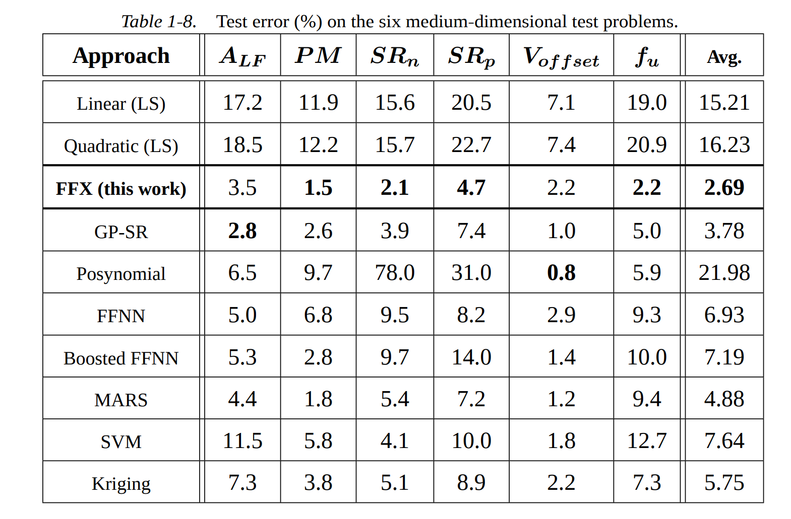
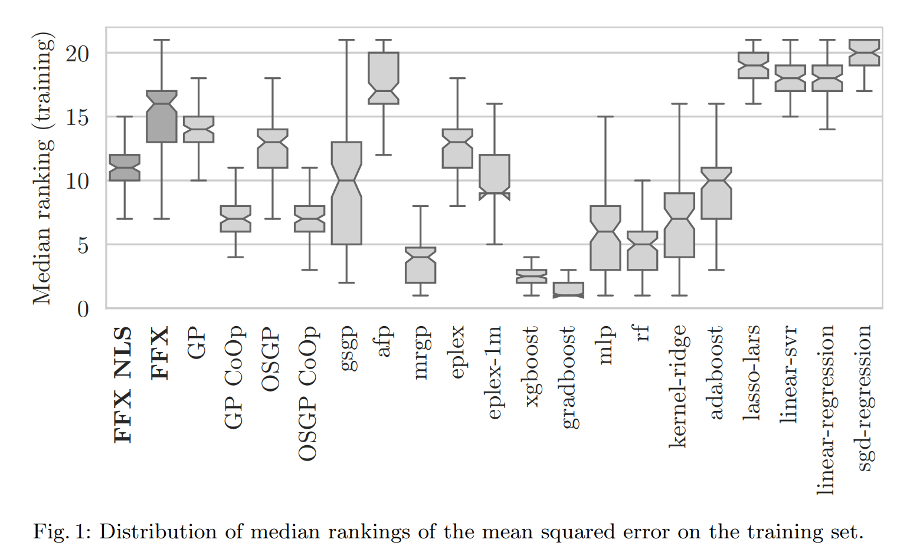
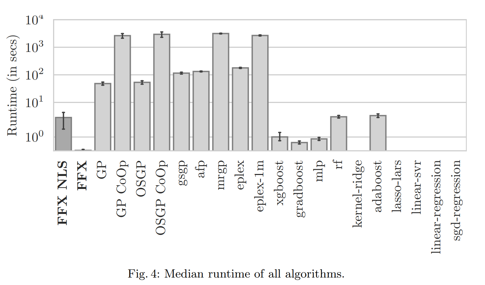
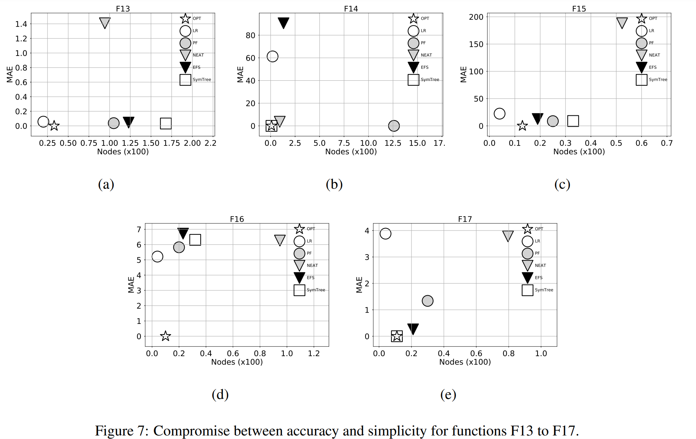
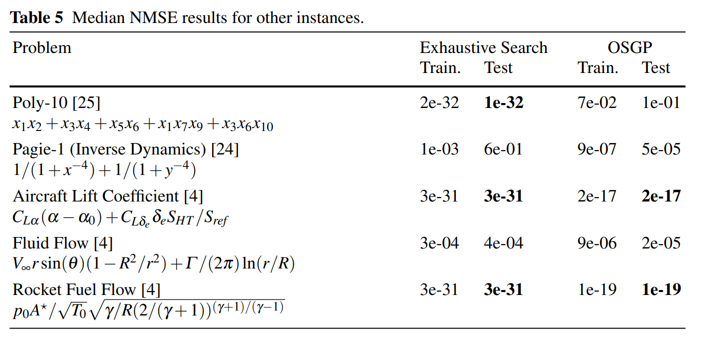
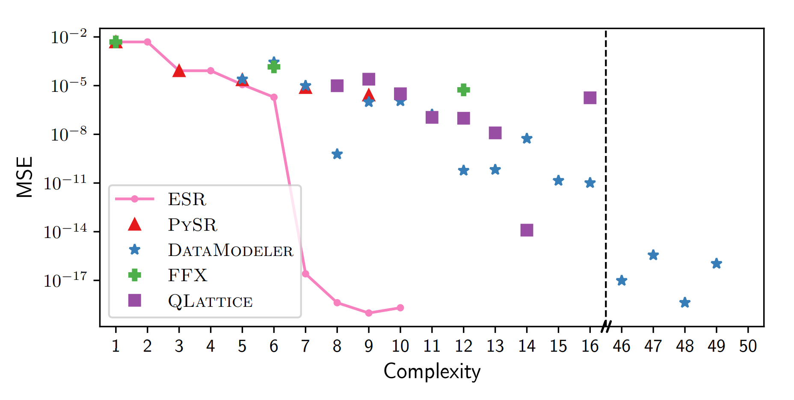
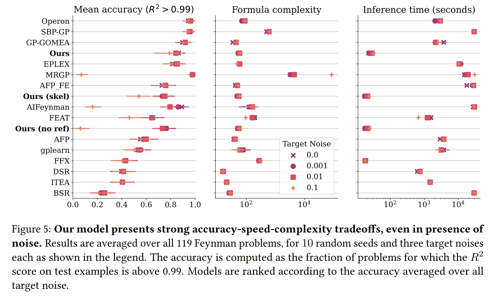

# FFX: FAST, SCALABLE, DETERMINISTIC SYMBOLIC REGRESSION TECHNOLOGY

## FFX: FAST, SCALABLE, DETERMINISTIC SYMBOLIC REGRESSION TECHNOLOGY
\justifying

- Wide adoption of a technology comes with the practical use.

- Users must be able to use it without the need to know the details.

- Symbolic Regression has many successful results but it is still not widely adopted.

## FFX: FAST, SCALABLE, DETERMINISTIC SYMBOLIC REGRESSION TECHNOLOGY
\justifying

Trent McConaghy proposed the Fast Function eXtraction (FFX)[^1] algorithm:

- Enumerates a massive set of linear and nonlinear basis functions (feature transformations)
- Use pathwise regularized ($l1$ and $l2$) learn to fit a linear combination of these basis functions
- Nondominated filter to the number of basis and validation error, returning a Pareto front of models.

[^1]: McConaghy, Trent. "FFX: Fast, scalable, deterministic symbolic regression technology." Genetic Programming Theory and Practice IX (2011): 235-260.

## FFX: FAST, SCALABLE, DETERMINISTIC SYMBOLIC REGRESSION TECHNOLOGY
\justifying

In summary, it creates $N_B$ features equivalent to a function $\Phi : \mathbb{R}^d \rightarrow \mathbb{R}^{N_B}$ that generates the model:

\begin{empheq}[box=\mybox]{align*}
f(x; \beta) &= \Phi(x) \beta
\end{empheq}

## FFX: FAST, SCALABLE, DETERMINISTIC SYMBOLIC REGRESSION TECHNOLOGY
\justifying

The linear coefficients are fitted using an *elastic net* formulation that combines $l1$ and $l2$ regularization:

\begin{empheq}[box=\mybox]{align*}
\hat{\beta} = \argmin_\beta{\| y - \Phi(x) \beta \|^2 + (1 - \rho)\lambda\|\beta\|^2 + \lambda \|\beta\|_1}
\end{empheq}

As already discusses, $\|\beta\|^2$ alleviates the issue of correlated variables making the fitting more stable while $\|\beta\|_1$ stimulates the creation of a sparse model by setting some parameters to $0$.

## Pathwise Elastic Nets
\justifying

The idea of pathwise elastic nets is to start with a very large value of $\lambda$ where the fitting will set $\beta = \mathbf{0}$.

After that, it iteratively reduces the $\lambda$ to create denser models, returning a set of different models with a tradeoff of sparsity and accuracy.

## Pathwise Elastic Nets
\justifying

Friedman[^2] proposed the **coordinate descent** algorithm that starts from the smaller $\lambda_{max}$ in which all parameters are $0$ and then it iterates in every dimension updating its parameter while holding every other parameter fixed.

[^2]: Friedman, Jerome, Trevor Hastie, and Rob Tibshirani. "Regularization paths for generalized linear models via coordinate descent." Journal of statistical software 33.1 (2010): 1.

## FFX: Step One {.fragile}
\justifying

The first part of the first step creates all the basis functions composed of the original predictors, squared predictors, square root of the predictors and the application of any function in this first set of predictors.

```{.haskell frame=lines framerule=2pt linenos=true fontsize=\footnotesize baselinestretch=0.8}
b1 = [ b | xi <- x
         , e <- [0.5, 1.0, 2.0]
         , op <- [id, abs, log, ln, ...]
         , let b = op(xi^e)
         , ok (eval b x)
     ]
```

We only keep the new predictors that can be properly evaluated (i.e., not *NaN* or *inf*).


## FFX: Step One {.fragile}
\justifying

In the second part of the first step, we use the first set of basis to generate a second set with interaction terms but allowing only the occurrence of one *non-Id* function in the interaction:

```{.haskell frame=lines framerule=2pt linenos=true fontsize=\footnotesize baselinestretch=0.8}
b2 = [ b | bi <- b1
         , bj <- b1
         , bj.op == id
         , let b = bi * bj
         , ok (eval b x)
     ]

b = union b1 b2
```

## FFX: Step One
\justifying

The final part of this first step, creates a rational function out of the current basis.

A rational regression model is described as:


\begin{empheq}[box=\mybox]{align*}
f(x; \beta, \theta) = \frac{x \beta}{1 + x \theta}
\end{empheq}

This model is often used in the context of polynomial regression and it is capable of find accurate models with a lower degree.

## FFX: Step One
\justifying

If we disregard the noise term $\epsilon$ of our regression model, we can perform an algebraic manipulation such as:

\begin{empheq}[box=\mybox]{align*}
y &= \frac{x \beta}{1 + x \theta} \\
y (1 + x \theta) &= x \beta \\
y + y x \theta &= x \beta \\
y = x \beta - y x \theta
\end{empheq}

Solving for this linear model can give a good starting point for optimizing the parameters.

## FFX: Step One {.fragile}
\justifying

In the third part of the first step, FFX adds the rational basis:

```{.haskell frame=lines framerule=2pt linenos=true fontsize=\footnotesize baselinestretch=0.8}
b3 = [ b | bi <- b
         , bi * y
     ]

b = union b b3
```

## FFX: Step Two {.fragile}
\justifying

In the next step, FFX applies the pathwise regularized learning to find a set of different linear models for different values of $\lambda$ up until a maximum number of nonzero parameters $N_{max-bases}$:

```{.haskell frame=lines framerule=2pt linenos=true fontsize=\footnotesize baselinestretch=0.8}
step-two x y b rho eps =
  lambda-max = max (transpose x * y)/(N * rho)
  lambda-vec = logspace(log10(lambda-max * eps),
                   log10(lambda-max), N-lambda)
  beta = [0 | _ [1..P]]
  betas = iterateUntil (\a -> nonzero a >= max-bases)
                    (beta, lambda-vec)
  return betas

iterateUntil p (beta, lambda-vec)
 | p beta = []
 | otherwise = lambda = head lambda-vec
               beta'  = elasicnet b y lambda rho beta
               return (beta : iterateUntil p (beta', tail lambda-vec))
```

## FFX: Step Three {.fragile}
\justifying

Finally, in step three, it creates the list of the models discarding the zero parameters and apply a nondominated sorting to return the Pareto front of the models:

```{.haskell frame=lines framerule=2pt linenos=true fontsize=\footnotesize baselinestretch=0.8}
step-three betas b =
  m = [(beta', b') | beta <- betas
                   , let ix = nonzeroIxs beta
                   , let beta' = extract ix beta
                   , let b' = extract ix b
      ]
  p1 model = length model
  p2 model = accuracy model
  return (nondominatedBy p1 p2 m)
```

Whenever it needs to select a single model, it uses the model with the lowest validation error.

## FFX

{width=350px}

## FFX: Pros and Cons
\justifying

- FFX is one of the fastest SR methods
- It returns a set of alternative models
- It has competitive accuracy (but not to the state-of-the-art)

But

- Using only linear parameters may limit the usefulness of some basis function
- It supports only two-way interaction
- It supports only unary functions

## FFX with nonlinear parameters
\justifying

Kammerer et al.[^3] extended FFX to support nonlinear parameters. It does so by introducing some changes to the original algorithm:

- The nonlinear functions introduces a scale and translation nonlinear parameter, so instead of creating $f(x_i)$ they create $f(\theta_a x_i + \theta_b)$. The only exception are $log$ and $exp$ that requires only a scale or translation parameter, respectively.
- At the first step, it just creates the function transformation basis functions, the interactions are performed at a later step.

[^3]: Kammerer, Lukas, Gabriel Kronberger, and Michael Kommenda. "Symbolic Regression with Fast Function Extraction and Nonlinear Least Squares Optimization." International Conference on Computer Aided Systems Theory. Cham: Springer Nature Switzerland, 2022.

## FFX with nonlinear parameters
\justifying

- It optimizes the parameters with Variable Projection[^4], an efficient method to optimize linear and nonlinear parameters.
- After optimization, it keeps the nonlinear parameters as constants and optimizes the linear parameter with pathwise elastic nets
- They combine the $10$ most important univariate basis functions creating pairwise interaction and repeat the optimization procedure.

[^4]: Golub, Gene, and Victor Pereyra. "Separable nonlinear least squares: the variable projection method and its applications." Inverse problems 19.2 (2003): R1.

## FFXNL



## FFXNL


## FFXNL



## FFX with nonlinear parameters
\justifying

- They achieved a significant improvement in accuracy with FFX NLS.
- The model length and runtime are almost the same.
- FFX NLS accuracy is worse than some state-of-the-art SR methods.

# A Greedy Search Tree Heuristic for Symbolic Regression

## A Greedy Search Tree Heuristic for Symbolic Regression
\justifying

Similar to FFX, de França [^5] proposed SymTree, a greedy search that creates a symbolic regression model iteratively.

[^5]: de França, Fabrício Olivetti. "A greedy search tree heuristic for symbolic regression." Information Sciences 442 (2018): 18-32.

## A Greedy Search Tree Heuristic for Symbolic Regression
\justifying

In thi work, the author defines the search space of symbolic model as those functions in the form:

\begin{equation*}
f_{IT}(x; \theta) = w_0 + \sum_{j = 1}^{m}{\tikzmarknode{w}{\highlight{red}{$\theta_{j}$}} \cdot (\tikzmarknode{f}{\highlight{green}{$f_j$}} \circ \tikzmarknode{r}{\highlight{blue}{$r_j$}}) (x)}
\end{equation*}

\begin{tikzpicture}[overlay,remember picture,>=stealth,nodes={align=left,inner ysep=1pt},<-]
    % For "X"
    \path (w.north) ++ (0,1.5em) node[anchor=south east,color=red!67] (scalep){\textbf{linear coefficient}};
    \draw [color=red!87](w.north) |- ([xshift=-0.3ex,color=red]scalep.south west);
    % For "S"
    \path (f.south) ++ (0,-1.5em) node[anchor=north east,color=green!67] (mean){\textbf{transformation function}};
    \draw [color=green!27](f.south) |- ([xshift=-0.3ex,color=green]mean.south west);
    \path (r.south) ++ (0,-1.5em) node[anchor=north west,color=blue!67] (mean2){\textbf{interaction function}};
    \draw [color=blue!57](r.south) |- ([xshift=-0.3ex,color=blue]mean2.south east);

\end{tikzpicture}

\begin{equation*}
r_j(x) = \prod_{i = 1}^{d}{x_i^{ \tikzmarknode{k}{ \highlight{red}{$k_{ij}$} }}}
\end{equation*}

\begin{tikzpicture}[overlay,remember picture,>=stealth,nodes={align=left,inner ysep=1pt},<-]
    \path (k.south) ++ (0,-1.5em) node[anchor=north east,color=red!67] (mean){\textbf{strength of interaction}};
    \draw [color=red!57](k.south) |- ([xshift=-0.3ex,color=red]mean.south west);

\end{tikzpicture}

## A Greedy Search Tree Heuristic for Symbolic Regression
\justifying

This representation is called **Interaction-Transformation** as it is a regression model defined by the composition of predictors interaction and a transformation univariate function.

Different from FFX, the interactions are not limited to $x_i x_j$ but it can be any monomial or divinding monomials involving the predictors.

On the other hand, it does not support interaction terms of the type $x_i f(x_j)$.

## A Greedy Search Tree Heuristic for Symbolic Regression {.fragile}
\justifying

The algorithm starts with a linear model $f(x; \beta) = x \beta$ and iteratively applies an expansion function to the set of current models.

```{.haskell frame=lines framerule=2pt linenos=true fontsize=\footnotesize baselinestretch=0.8}
symtree it cadidates
 | it > max-iters = best-from candidates
 | otherwise      = symtree (it+1) (map expand candidates)

symtree 0 [x]
```

## A Greedy Search Tree Heuristic for Symbolic Regression {.fragile}
\justifying

The expansion evaluates the interaction between the current terms of the expression, inverse interacions and transformations. It keeps only those individual terms that improve the accuracy.

Then it performs a greedy grouping of the terms with the objective of maximizing the accuracy.

```{.haskell frame=lines framerule=2pt linenos=true fontsize=\footnotesize baselinestretch=0.8}
expand terms =
  candidates =
    [term | t <- interaction terms
          , score(terms + t) > score(terms)] ++
    [term | t <- inverse terms
          , score(terms + t) > score(terms)] ++
    [term | t <- transformation terms
          , score(terms + t) > score(terms)]
  return (greedy terms candidates)

greedy terms [] = []
greedy terms candidates =
  e, t = greedysearch terms candidates
  return (e : greedy terms t)
```

## A Greedy Search Tree Heuristic for Symbolic Regression
\justifying

Given the expression $\sin(x_1 x_2) + x_3 + x_4^{-1}$, the interaction function will generate the terms

\begin{empheq}[box=\mybox]{align*}
x_1 x_2 x_3 \\
x_1 x_2 x_4^{-1} \\
x_3 x_4^{-1}
\end{empheq}

## A Greedy Search Tree Heuristic for Symbolic Regression
\justifying

The inverse function will create

\begin{empheq}[box=\mybox]{align*}
x_1 x_2 x_3^{-1} \\
x_1 x_2 x_4 \\
x_1^{-1} x_2^{-1} x_3 \\
x_3 x_4 \\
x_1^{-1} x_2^{-1} x_4^{-1} \\
x_3^{-1} x_4^{-1}
\end{empheq}

## A Greedy Search Tree Heuristic for Symbolic Regression
\justifying

And the transformation, for the set $\mathcal{F} = \{\sin, \log\}$ will create

\begin{empheq}[box=\mybox]{align*}
\log(x_1 x_2) \\
\sin(x_3) \\
\log(x_3) \\
\sin(x_4^{-1} \\
\log(x_4^{-1}))
\end{empheq}

## A Greedy Search Tree Heuristic for Symbolic Regression {.fragile}
\justifying

The *greedysearch* function simply finds the group of terms that improves the model and return a new model with the leftover terms.

```{.haskell frame=lines framerule=2pt linenos=true fontsize=\footnotesize baselinestretch=0.8}
greedysearch terms candidates =
  let c1 = [c | c <- candidates
              , score(terms+c) > score(terms)
           ]
      c2 = c / c1
  return (terms + c1, c2)
```

## A Greedy Search Tree Heuristic for Symbolic Regression
\justifying

In short, this procedure creates new terms for each one of the current expressions and creates new expressions as the composition of the current expression and the set of new terms that improves the score.

While FFX is a method that departs from the full model and prune it to a manageable size, SymTree starts from a simple model and insert new terms up until a certain stop criteria.

## A Greedy Search Tree Heuristic for Symbolic Regression



## A Greedy Search Tree Heuristic for Symbolic Regression


## A Greedy Search Tree Heuristic for Symbolic Regression {.fragile}
\justifying

The results showed that SymTree obtained more accurate and smaller models than most SR algorithms and it was successful in retrieving the correct expression more frequently than FFX.

On the other hand, in some high-dimensional datasets it can have a dimensionality explosion with the creation of very large expressions.

Since it is a greedy approach, it will not likely return the best possible expression.

# Symbolic Regression by Exhaustive Search

## Symbolic Regression by Exhaustive Search
\justifying

Exhaustive Search was explored in [^6] where the authors proposed a grammar that comprehends rational of polynomials with linear and nonlinear terms in the search space.

The grammar prohibits the chaining of nonlinear functions to avoid complex expressions and remove some redundant expressions. For example, the gramar can build $x_1 x_2 + x_1 x_3$ but it cannot generate $x_1 (x_2 + x_3)$.

This reduction is necessary to make the enumeration of all expressions possible.

[^6]: Kammerer, Lukas, et al. "Symbolic regression by exhaustive search: Reducing the search space using syntactical constraints and efficient semantic structure deduplication." Genetic programming theory and practice XVII (2020): 79-99.

## Symbolic Regression by Exhaustive Search {.fragile}
\justifying

```{.haskell frame=lines framerule=2pt linenos=true fontsize=\footnotesize baselinestretch=0.8}
Expr -> const * Term + Expr
     | const * Term + const
Term -> RecurringFactors * Term
     | RecurringFactors | OneTimeFactors
RecurringFactors -> VarFactor | LogFactor
                 | ExpFactor | SinFactor
```

## Symbolic Regression by Exhaustive Search {.fragile}
\justifying

```{.haskell frame=lines framerule=2pt linenos=true fontsize=\footnotesize baselinestretch=0.8}
VarFactor -> <variable>
LogFactor -> log ( SimpleExpr )
ExpFactor -> exp ( const * SimpleTerm )
SinFactor -> sin ( SimpleExpr )
```

## Symbolic Regression by Exhaustive Search {.fragile}
\justifying

```{.haskell frame=lines framerule=2pt linenos=true fontsize=\footnotesize baselinestretch=0.8}
OneTimeFactors -> InvFactor * SqrtFactor * CbrtFactor
               | InvFactor * SqrtFactor
               | InvFactor * CbrtFactor | SqrtFactor * CbrtFactor
               | InvFactor | SqrtFactor | CbrtFactor
InvFactor -> 1/ ( InvExpr )
SqrtFactor -> sqrt ( SimpleExpr )
CbrtFactor -> cbrt ( SimpleExpr )
```

## Symbolic Regression by Exhaustive Search {.fragile}
\justifying

```{.haskell frame=lines framerule=2pt linenos=true fontsize=\footnotesize baselinestretch=0.8}
SimpleExpr -> const * SimpleTerm + SimpleExpr
           | const * SimpleTerm + const
SimpleTerm -> VarFactor * SimpleTerm | VarFactor
InvExpr -> const * InvTerm + InvExpr
         | const * InvTerm + const
InvTerm -> RecurringFactors * InvTerm
         | RecurringFactors * SqrtFactor * CbrtFactor
         | RecurringFactors * SqrtFactor
         | RecurringFactors * CbrtFactor
         | SqrtFactor * CbrtFactor | RecurringFactors
         | SqrtFactor | CbrtFactor
```

## Example of expression generator {.fragile}
\justifying

We start with `Expr` and replace each nonterminal with a random production rule (here we replaced `const` with `c` and `<variable>` with `var`).

```{.haskell frame=lines framerule=2pt linenos=true fontsize=\footnotesize baselinestretch=0.8}
Expr
c * Term + Expr
c * RecurringFactors * Term + Expr
c * ExpFactor * Term + Expr
c * exp(c * SimpleExpr) * Term + Expr
c * exp(c * c * SimpleTerm + c)* Term + Expr
c * exp(c *  VarFactor + c)* Term + Expr
c * exp(c *  <var> + c)* Term + Expr
c * exp(c *  <var> + c)* OneTimeFactors + Expr
c * exp(c *  <var> + c)* InvFactor + Expr
c * exp(c *  <var> + c)* 1/(SimpleExpr) + Expr
c * exp(c *  <var> + c)* 1/(c * SimpleTerm + c) + Expr
c * exp(c *  <var> + c)* 1/(c * <var> + c) + Expr
c * exp(c *  <var> + c)* 1/(c * <var> + c) + c * <var> + c
c * exp(c * var + c) * 1/(c*var + c) + c * var + c
```

## Symbolic Regression by Exhaustive Search {.fragile}
\justifying

To iterate the search space we can use a queue or a stack data structure to store the open expressions and keep only the best finished expression found so far.

```{.haskell frame=lines framerule=2pt linenos=true fontsize=\footnotesize baselinestretch=0.8}
enumerate =
  open-exprs = singleton-queue Expr
  seen-hases = empty-set
  best-expr = const
  return (explore open-exprs seen-hashes best-expr)
```

## Symbolic Regression by Exhaustive Search {.fragile}

```{.haskell frame=lines framerule=2pt linenos=true fontsize=\footnotesize baselinestretch=0.8}
explore open-exprs seen-hashes best-expr =
  | is-empty open-exprs = best-expr
  | otherwise = let
     (expr, open-exprs') = pop open-exprs
     non-terminal = left-most expr
     new-exprs = [ e | rule <- rules non-terminal
                     , let e = apply rule expr
                     , hash e `notElem` seen-hashes
                 ]
     sentences = filter is-sentence new-exprs
     hashes = map hash new-exprs
     open = filter is-open new-exprs
     explore (open-exprs' ++ open)
         (seen-hashes ++ hashes) (replace-best best sentences)
```

## Symbolic Regression by Exhaustive Search {.fragile}
\justifying

The `hash` function for expression trees was proposed in [^7] and can be summarized as a fold right procedure on trees that applies any hash function to the child nodes and at every internal node concatenates the hash of the node with the hash of the left child and the hash of the right child.

```{.haskell frame=lines framerule=2pt linenos=true fontsize=\footnotesize baselinestretch=0.8}
hash-tree h tree = foldr (hash-with h) tree

hash-with h (Leaf Val) = h Val
hash-with h (Node l n r)
  | is-assoc n && r < l = simplify (h n ++ r ++ l)
  | otherwise  = simplify (h n ++ l ++ r)
```

The `simplify` function applies some simple algebraic rules to remove redundancy.

[^7]: Burlacu, B., Kammerer, L., Affenzeller, M., Kronberger, G.: Hash-based Tree Similarity and
Simplification in Genetic Programming for Symbolic Regression. In: Computer Aided Systems Theory, EUROCAST 2019 (2019)

## Symbolic Regression by Exhaustive Search
\justifying

The authors also proposed to replace the queue with a priority queue where the priority is established by

\begin{empheq}[box=\mybox]{align*}
\operatorname{priority}(p) = NMSE(p) - w \frac{len(p)}{len_{max}}
\end{empheq}

where $NMSE$ is the normalized mean squared error, $p$ is the fitted expression with all non-terminal tokens replaced by parameters and $len_{max}$ is the maximum allowed size for the search.

Notice that this is a pessimistic heuristic rather than optimistic, as required by a $A^*$ implementation.

## Symbolic Regression by Exhaustive Search
\justifying

Sample results from the paper:



## Symbolic Regression by Exhaustive Search
\justifying

- When we want to generate short expressions with certain constraints to the search space, the exhaustive search will return the best expression among its set of expressions
- With a guided search, it can explore the search space more efficiently, possibly discarding bad quality expressions

- It depends on nonlinear optimization that can return suboptimal results, possibly discarding some good solutions
- It can be particularly sensitive to noise

# Exhaustive Symbolic Regression

## Exhaustive Symbolic Regression
\justifying

Deaglan, et al. proposed a similar approach to enumerate the search space of symbolic models[^8] named Exhaustive Symbolic Regression (ESR) that generates the set of all parametric family of functions at a given complexity.

The complexity is measured as the number of nodes in the expression tree.

[^8]: Bartlett, Deaglan J., Harry Desmond, and Pedro G. Ferreira. "Exhaustive symbolic regression." IEEE Transactions on Evolutionary Computation (2023).

## Tree Representation {.fragile}
\justifying

They constraint the tree representation to *binary, unary, nullary* operators:

```{.haskell frame=lines framerule=2pt linenos=true fontsize=\footnotesize baselinestretch=0.8}
data Expr = Binary Expr Op Expr
          | Unary Fun Expr
          | Nullary Term

data Op = Add | Sub | Mul | Div | Pow
data Fun = Exp | Log | Square | Sqrt
data Term = Var | Param
```

## Tree Representation {.fragile}
\justifying

For convenience, they flatten the tree representation as a list representing the pre-order traversal of the nodes.

\centering
\begin{forest}
    rounded/.style={circle, minimum size=20pt, font=\footnotesize, thick, edge={thick}, draw},
    chosen/.style={circle, minimum size=20pt, font=\footnotesize, thick, edge={thick}, fill=gray!40, draw}
    [{$+$}, for tree=rounded
      [{$pow$}
        [{$log$}
            [{$x$}]
        ]
        [{$\theta_1$}]
      ]
      [{$exp$}
          [{$*$}
             [{$\theta_2$}]
             [{$x$}]
          ]
      ]
    ]
\end{forest}

```
[+, pow, log, x, theta1, exp, *, theta2, x]
```

## Generating Valid Trees {.fragile}
\justifying

In the first step they create lists of $k$ elements for a varying number of $k$ with the values $0, 1, 2$ representing the nullary, unary, and binary operators.

This makes easier to enumerate all valid expressions.

## Generating Valid Trees {.fragile}
\justifying

```{.haskell frame=lines framerule=2pt linenos=true fontsize=\footnotesize baselinestretch=0.8}
k = 1
[0]

k = 2
[1, 0]

k = 3
[2, 0, 0]

k = 4
[1,1,1,0]
[1,2,0,0]
[2,0,1,0]
[2,1,0,0]
```

After this step, the numbers can be replaced by the actual operators, spanning all the possible valid expressions of size $k$.

## Generating Valid Trees {.fragile}
\justifying

This procedure still returns some redundant expressions, and it is followed by a simplification step.

- **Tree reordering:** $[+, \theta, x]$ and $[+, x, \theta]$ should be reordered following a specified order.
- **Simplifications:** using Sympy they simplify the expressions to a standard form.
- **Parameters permutation:** $[+, \theta_0, *, \theta_1, x]$ is the same as $[+, \theta_1, *, \theta_0, x]$ .
- **Reparametrization invariance:** $[exp, \theta_0]$ becomes $[\theta_0]$.
- **Parameters combination:** $[+, \theta_0, \theta_1]$ becomes $[\theta_0]$.

## Numerical parameter optimisation
\justifying

Once we have a non-duplicated list of valid expressions of size up to $k$. The algorithm fits each one of these expressions unsing a nonlinear optimization method, maximizing a log-likelihood function.

They repeat the optimization $N_{iter}$ times to avoid reaching a bad local optima. This repetition stops if $N_{conv}$ of these iterations return a value within $0.5$ of the best solution found so far.

## Number of generated expressions


## Minimum Description Length
\justifying

After fitting all of these expressions, we need to choose one or rank them in order of their estimated quality.

They propose the calculation of a Minimum Description Length (MDL) for symbolic expressions. MDL states that the best expression is the one that can best recover the dataset using the fewest units of information possible.

We will cover how to calculate MDL in a later lecture.

## Sample Results


## Sample Results



## Exhaustive Symbolic Regression
\justifying

- This approach efficiently enumerates all valid expressions of complexity $k$
- It is capable of removing many redundant expressions from the search space
- It selects the best model with a theoretically sound criteria

But

- It is infeasible for large values of $k$ or high-dimensional datasets
- The simplification may not detect all equivalent expressions (we will talk about that later)
- MDL may not pick the correct model (we will also talk about that later)

# End-to-end symbolic regression with transformers

## End-to-end symbolic regression with transformers
\justifying

Kamienny et al. proposed an End-to-end symbolic regression with transformers[^9] (E2ET). Prior work on neural network symbolic regression required a two step approach: they first predict the correct structure using the Neural Network, and then it optimizes the parameters.

In this approach, a transformer neural network that, given the sample, it returns the full expression with the parameter values.

[^9]: Kamienny, Pierre-Alexandre, et al. "End-to-end symbolic regression with transformers." Advances in Neural Information Processing Systems 35 (2022): 10269-10281.

## End-to-end symbolic regression with transformers
\justifying

The transformer network is trained on a large number of randomly generated datasets with the known expression structure and optimal parameters.

## Functions Generation
\justifying

In the first step, they create a set of functions $f : \mathbb{R}^d \rightarrow \mathbb{R}$ to be used during the pre-training process.

- Sample $d ~ U(1, d_{max})$ as the input dimension for this function.
- Sample $b ~ U(d-1, d + b_{max})$ as the number of binary functions in the tree.
- Sample $b$ operators from $op ~ U\{+, -, \times\}$.
- Build a random binary tree as described in[^10].
- Replace each leaf of the tree with a variable $x_i$ where $i ~ U(1, d)$.


[^10]: Guillaume Lample and François Charton. ‘Deep learning for symbolic mathematics’. In: arXiv
preprint arXiv:1912.01412 (2019).

## Functions Generation
\justifying

- Sample the number of unary operators $u ~ U(0, u_{max})$.
- Sample $u$ operators from $uni ~ U\{inv, abs, sqr, sqrt, sin, cos, tan, atan, log, exp\}$.
- Insert these operators at random posiion in the tree.
- For every node representing a variable or an unary operator, apply a random affine transformation $a x_i + b$ or $a uni_i + b$, with random $a, b ~ \mathcal{D}_{aff}$.

$\mathcal{D}_{aff}$ samples the sign from $U\{-1, 1\}$, the mantissa from $U(0, 1)$, and the exponent from $U(-2, 2)$.

## Inputs Generation
\justifying

- Sample a number of clusters $k ~ U(1, k_{max})$ and $k$ weights $w_i ~ U(0,1)$ that are normalized so that $\sum_i{w_i} = 1$.
- For each cluster $i$, sample a centroid $\mu_i ~ \mathcal{N}(0, 1)^d$, a vector of variances $\sigma_i ~ \mathcal{N}(0, 1)^d$ and a distribution shape $dist_i ~ U\{\mathcal{N}, U\}$.
- For each cluster $i$, sample $\lfloor w_i N \rfloor$ input points $x ~ dist_i(\mu_i, \sigma_i)$ then apply a random rotation sampled from a Haar distribution.
- Concatenate all points and subtract them from the mean and divide by the standard deviation along each dimension.


## Tokenization
\justifying

The values of the expression are tokenized by first representing the numbers as a base-10 floating point rounded to the fourth place and encoding as $3$ tokens (sign, mantissa, exponent).

The expression is tokenized in pre-order traversal.

For example, $\cos(2.4242 x)$ is tokenized as $[cos, mul, +, 2424, E-3, x]$.

## Network Topology


## Network Topology
\justifying

The embedder receives as input $N$ points $(x, y) \in \mathbb{R}^{d+1}$ tokenized as already described (sign, mantissa, exponent) generating $3(d + 1)$ tokens for each point. The inputs are padded up to $d_{max}$ and they are fed to a $2$-layer fully-connected feed forward network with ReLU activations.

This network projects the input to a dimension $d_{emb}$.


## Network Topology
\justifying

The transformer network uses a sequence-to-sequence Transformer architeture with $16$ attention heads and an embedding dimension of $512$ (total of $86M$ parameters).

This network is trained using cross-entropy loss with Adam optimizer using $10^4$ examples as a validation set.

## Refinement
\justifying

After the network generates an expression, it further optimizes the parameters with a nonlinear optimization method using the generated values as the starting point.

## End-to-end symbolic regression with transformers
\justifying



## End-to-end symbolic regression with transformers
\justifying

- It performs quite well when compared to state-of-the-art
- The inference time (expression generation) is as fast as FFX, but with higher accuracy
- It returns low complexity expressions

But

- It is currently limited to dimensions $d < 10$
- Training cost can be expensive, but only need to be performed once

## Further reading
\justifying

- McConaghy, Trent. "FFX: Fast, scalable, deterministic symbolic regression technology." Genetic Programming Theory and Practice IX (2011): 235-260
- Kammerer, Lukas, Gabriel Kronberger, and Michael Kommenda. "Symbolic Regression with Fast Function Extraction and Nonlinear Least Squares Optimization." International Conference on Computer Aided Systems Theory. Cham: Springer Nature Switzerland, 2022.
- de França, Fabrício Olivetti. "A greedy search tree heuristic for symbolic regression." Information Sciences 442 (2018): 18-32
- Kammerer, Lukas, et al. "Symbolic regression by exhaustive search: Reducing the search space using syntactical constraints and efficient semantic structure deduplication." Genetic programming theory and practice XVII (2020): 79-99.

## Further reading
\justifying

- Burlacu, B., Kammerer, L., Affenzeller, M., Kronberger, G.: Hash-based Tree Similarity and
Simplification in Genetic Programming for Symbolic Regression. In: Computer Aided Systems Theory, EUROCAST 2019 (2019)
- Bartlett, Deaglan J., Harry Desmond, and Pedro G. Ferreira. "Exhaustive symbolic regression." IEEE Transactions on Evolutionary Computation (2023).
- Kamienny, Pierre-Alexandre, et al. "End-to-end symbolic regression with transformers." Advances in Neural Information Processing Systems 35 (2022): 10269-10281.

## Next lecture {.standout}

\begin{block}{}
  \begin{itemize}
    \item Symbolic Regression toolboxes
\end{itemize}

\hfill

\includegraphics[width=100pt]{figs/tobecontinued.png}
\end{block}

## Acknowledgments


