# SRBench: A Living Benchmark for Symbolic Regression

## SRBench: A Living Benchmark for Symbolic Regression
\justifying

For a long time, the SR community relied on toy problems and artificial datasets to benchmark new approaches.

Often, new SR algorithms were compared solely to other SR algorithms.

This eventually created some myths:

- SR will return simple expressions but less accurate than opaque models (both statements can be false :-) )
- SR is too impractical and it takes a long time to return a model
- Using SR requires complicated installation procedures and fine-tuning many hyperparameters

## SRBench: A Living Benchmark for Symbolic Regression
\justifying

SRBench[^1] was created with the objective of reporting the curren state of SR when facing traditional regression algorithms.

The three main goals were:

- Stimulate cross-pollination between SR and ML communities
- Propose a large benchmark set with varying challenges
- Standardize the SR implementations with a common framework

[^1]: La Cava, William, et al. "Contemporary symbolic regression methods and their relative performance." arXiv preprint arXiv:2107.14351 (2021).

## SRBench: A Living Benchmark for Symbolic Regression
\justifying

The lack of cross-pollination is being addressed by keeping the benchmark open-source[^2] and easily reproducible for anyone to verify the current results or add new results.

[^2]: https://github.com/cavalab/srbench/releases/tag/v2.0

## SRBench: A Living Benchmark for Symbolic Regression
\justifying

The datasets were taken from the PMLB[^3] that contains $252$ datasets for regression comprehending synthetic and real-world data with different characteristics.

[^3]: Romano, Joseph D., et al. "PMLB v1. 0: an open-source dataset collection for benchmarking machine learning methods." Bioinformatics 38.3 (2022): 878-880.

## SRBench: A Living Benchmark for Symbolic Regression
\justifying

The first set of benchmark are termed **black-box regression problems** and were taken from different public sources:

- $122$ datasets
- No known generator function, but...
- $62$ are generated from the Friedman benchmark with varying degree of noise and correlated features
- The Friedman sets have known generator function but cannot be identified by the benchmark names.

more on that later

## SRBench: A Living Benchmark for Symbolic Regression
\justifying

The second set of benchmark are termed **ground-truth regression problems** and inclued data from two sources:

- Feynman Symbolic Regression dataset: $116$ datasets
- ODE-Strogatz database: $14$ datasets
- We know the generator function for all of them

## SRBench: A Living Benchmark for Symbolic Regression
\justifying

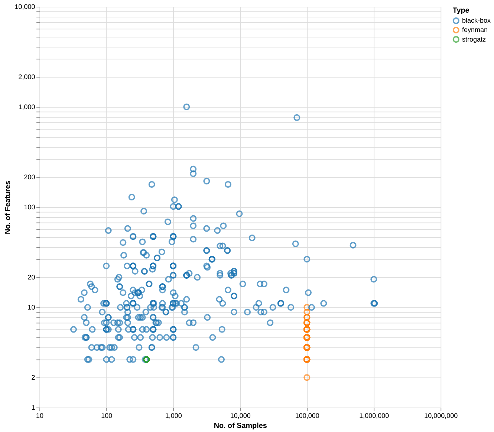{width=200px}

## SRBench: A Living Benchmark for Symbolic Regression
\justifying

To address the lack of an unified framework, the benchmark required the implementation of a common API compatible with the well known *scikit-learn*.

## SRBench: A Living Benchmark for Symbolic Regression
\justifying

Requirements for a competitor:

- scikit-learn compatible API (https://scikit-learn.org/stable/developers/develop.html)[https://scikit-learn.org/stable/developers/develop.html]
- Compatible with Python 3.7 or higher
- If your method uses a random seed, support a `random_state` attribute
- The method should have the requirements and installation script at the algorithms folder (upload through a pull request)

## SRBench: A Living Benchmark for Symbolic Regression
\justifying

The algorithm folder should have:

- `metadata.yml` describing the algorithm
- `regressor.py` a Python script with instructions on how to benchmark the method
- `LICENSE` with the license information
- `environment.yml` a conda environment file with additional requirements
- `requirements.txt` a `pypi` file with additional requirements
- `install.sh` a script that copies the source-code or package from an external source (e.g., github repo) and installs the method.


## SRBench: A Living Benchmark for Symbolic Regression {.fragile}
\justifying

Example of `install.sh`:

```{.bash frame=lines framerule=2pt fontsize=\footnotesize baselinestretch=0.8}
# remove directory if it exists
if [ -d tir ]; then
    rm -rf tir
fi

git clone https://github.com/folivetti/tir.git
cd tir
export BOOTSTRAP_HASKELL_NONINTERACTIVE=1
curl --proto '=https' --tlsv1.2 -sSf
       https://get-ghcup.haskell.org | bash
export PATH=$PATH:~/.ghcup/bin:~/.cabal/bin
cabal install --overwrite-policy=always
       --installdir=./python
cd python
pip install .
```

## SRBench: A Living Benchmark for Symbolic Regression {.fragile}
\justifying

Example of `regressor.py`:

```{.python frame=lines framerule=2pt linenos=true fontsize=\footnotesize baselinestretch=0.8}
import sys
import os
import pyTIR as tir
from itertools import product
os.environ["LD_LIBRARY_PATH"] = os.environ["CONDA_PREFIX"] + "/lib"

hyper_params = [
    {
        'transfunctions' : ('Id,Tanh,Sin,Cos,Log,Exp,Sqrt',),
        'ytransfunctions' : ('Id,Sqrt,Exp,Log,ATan,Tan,Tanh',),
        'exponents' : ((-5,5),)
    },
    {
        'transfunctions' : ('Id,Tanh,Sin,Cos,Log,Exp,Sqrt',),
        'ytransfunctions' : ('Id,Sqrt,Exp,Log,ATan,Tan,Tanh',),
        'exponents' : ((-2,2),)
    },
]
```

## SRBench: A Living Benchmark for Symbolic Regression {.fragile}
\justifying

The `regressor.py` file should contain a function `model` that returns a sympy compatible model.

```{.python frame=lines framerule=2pt linenos=true fontsize=\footnotesize baselinestretch=0.8}
# Create the pipeline for the model
eval_kwargs = {'scale_x': False, 'scale_y': False}
est = tir.TIRRegressor(npop=1000, ngens=500, pc=0.3, pm=0.7,
       exponents=(-5,5), error="R^2", alg="MOO")

def pre_train(est, X, y):
    """Adjust settings based on data before training"""
    if X.shape[0]*X.shape[1] <= 1000:
        est.penalty = 0.01

def complexity(e):
    return e.len

def model(e, X):
    new_model = e.sympy.replace("^","**")
    for i,f in reversed(list(enumerate(X.columns))):
        new_model = new_model.replace(f'x{i}',f)
    return new_model
```

## SRBench: A Living Benchmark for Symbolic Regression {.fragile}
\justifying

- You can install SRBench together with all supported algorithms using `conda` or `docker`
- You can either run the entire benchmark, or just selected algorithm or selected dataset
- You can also run for new datasets provided they are compatible with PMLB format

See: [https://cavalab.org/srbench/user-guide/](https://cavalab.org/srbench/user-guide/)


## SRBench: A Living Benchmark for Symbolic Regression {.fragile}
\justifying

Evaluated methods:

- Age-Fitness Pareto Optimization (Schmidt and Lipson 2009)
- Age-Fitness Pareto Optimization with Co-evolved Fitness Predictors (Schmidt and Lipson 2009)
- AIFeynman 2.0 (Udrescu et al. 2020)
- Bayesian Symbolic Regression (Jin et al. 2020)
- Deep Symbolic Regression (Petersen et al. 2020)
- Fast Function Extraction (McConaghy 2011)
- Feature Engineering Automation Tool (La Cava et al. 2017)

## SRBench: A Living Benchmark for Symbolic Regression {.fragile}
\justifying

Evaluated methods (cont.):

- epsilon-Lexicase Selection (La Cava et al. 2016)
- GP-based Gene-pool Optimal Mixing Evolutionary Algorithm (Virgolin et al. 2017)
- gplearn (Stephens)
- Interaction-Transformation Evolutionary Algorithm (de Franca and Aldeia, 2020)
- Multiple Regression GP (Arnaldo et al. 2014)
- Operon (Burlacu et al. 2020)
- Semantic Backpropagation GP (Virgolin et al. 2019)

## SRBench: A Living Benchmark for Symbolic Regression {.fragile}
\justifying

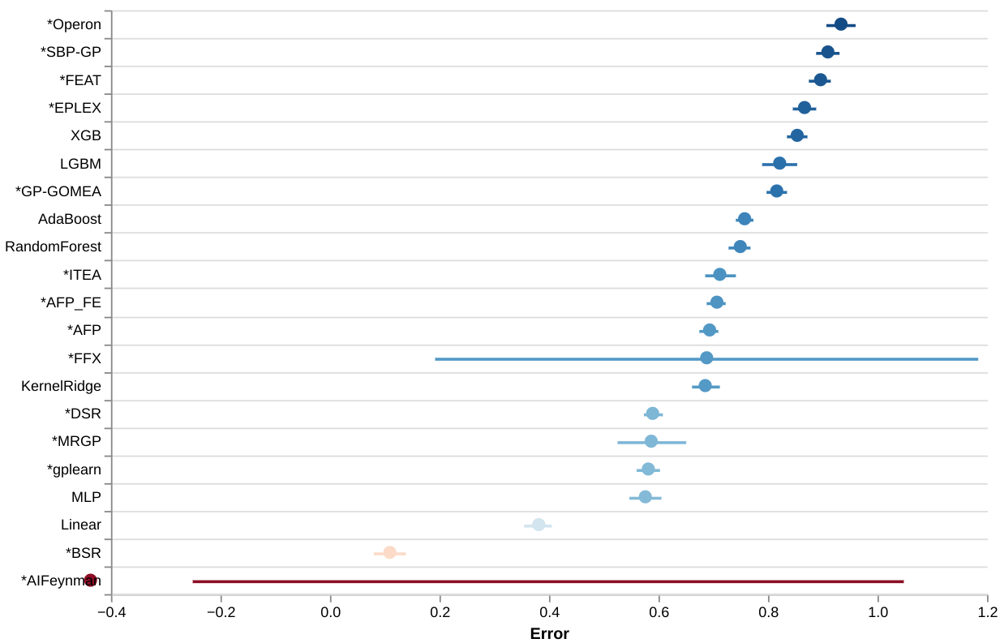

## SRBench: A Living Benchmark for Symbolic Regression {.fragile}
\justifying

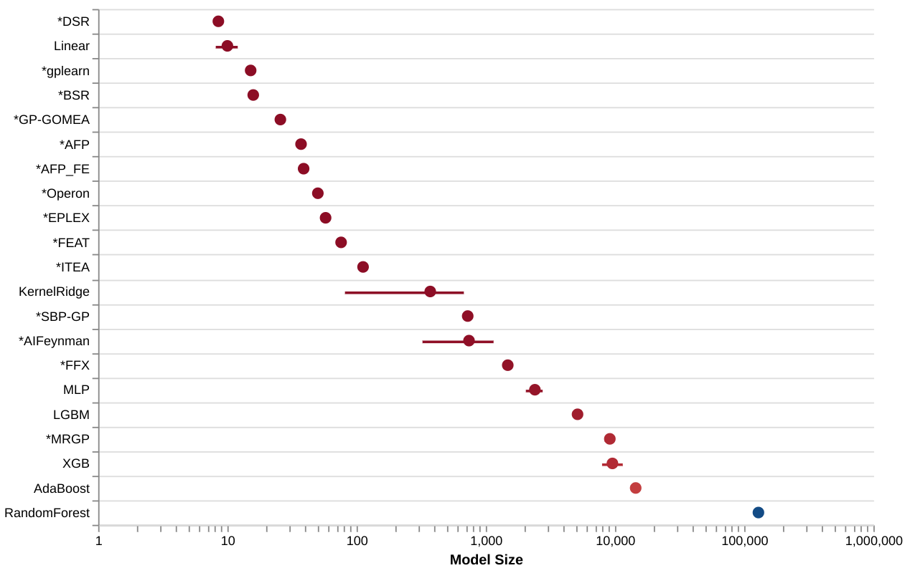

## SRBench: A Living Benchmark for Symbolic Regression {.fragile}
\justifying

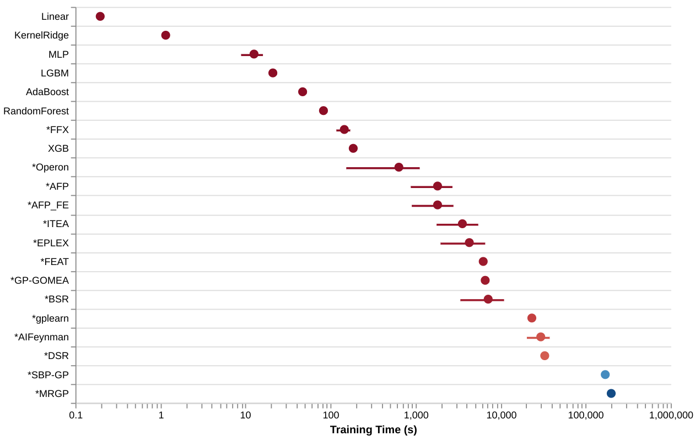

## SRBench: A Living Benchmark for Symbolic Regression {.fragile}
\justifying

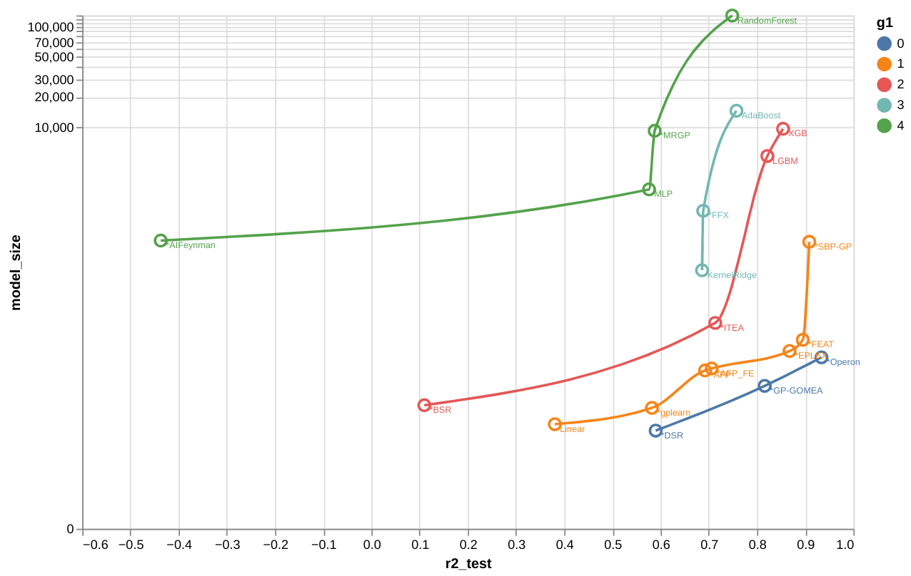

## SRBench: A Living Benchmark for Symbolic Regression {.fragile}
\justifying

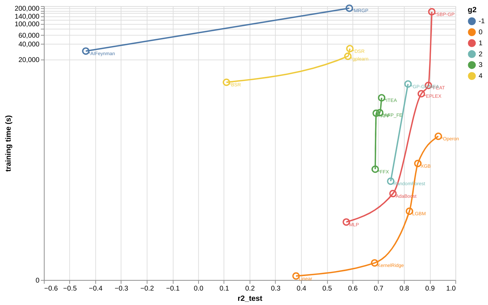

## SRBench 1st Competition
\justifying

A competition based on SRBench was hosted in GECCO 2022[^5] and it was divided into two tracks:

- synthetic track: composed of different challenges provided by artificial datasets
- real-world track: real-world data where the models were judged by an expert in the field

[^5]: https://cavalab.org/srbench/competition-2022/

## SRBench 1st Competition
\justifying

The synthetic track was composed of:

- **rediscovery of the exact expression:** where the exact expression of the generating function should be returned.
- **selection of relevant features:** the models must use only relevant features.
- **escaping local optima:** the models should not use imperfect *shortcuts* of the true expression.
- **extrapolation accuracy:** the models should behave correctly outside the training boundary.
- **sensitivity to noise:** the models should be robust against added noise.

## SRBench 1st Competition
\justifying

The real-world track was composed of time-series of case, hospitalization, and death during the covid pandemic.

This dataset was processed to become a tabular data compatible with most SR methods.

The main goal of this track was to find a model that was easy to interpret with accurate predictions.

## SRBench 1st Competition
\justifying

We got some new participants on-board:

- Bingo
- E2ET
- PS-Tree
- QLattice
- TaylorGP
- EQL
- GeneticEngine
- Operon
- PySR
- uDSR
- GP_{ZGD}
- NSGA-DCGP

## SRBench 1st Competition
\justifying

- Varying degree of difficulties by introducing noise to the target variable.
- Evaluated in two or three criteria: R^2 on a noiselees data, log of tree length, property score.
- Property score depends on the task: feature absence score and exact expression.

## SRBench 1st Competition
\justifying

- Recovery of true expression:

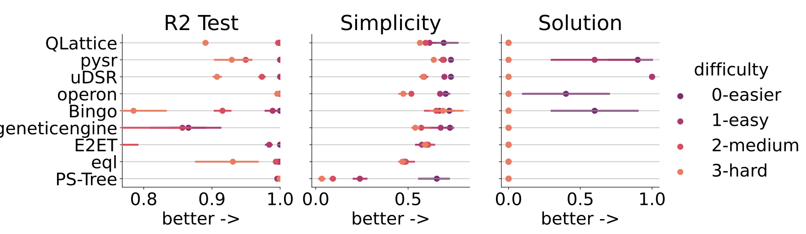

## SRBench 1st Competition
\justifying

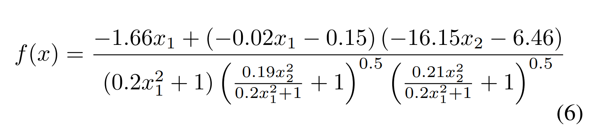

## SRBench 1st Competition
\justifying

- Feature Selection:

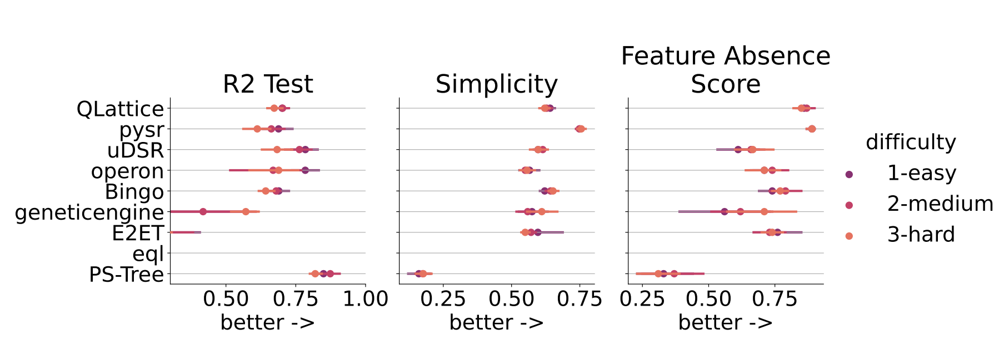

## SRBench 1st Competition
\justifying

- Local optima:

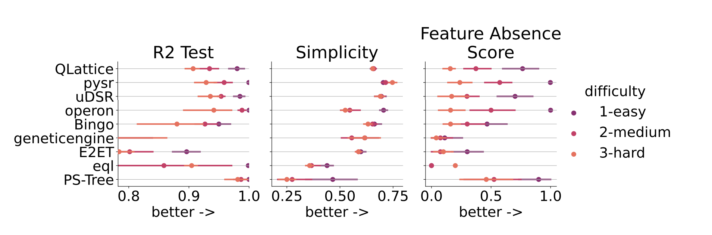

## SRBench 1st Competition
\justifying

- Extrapolation:

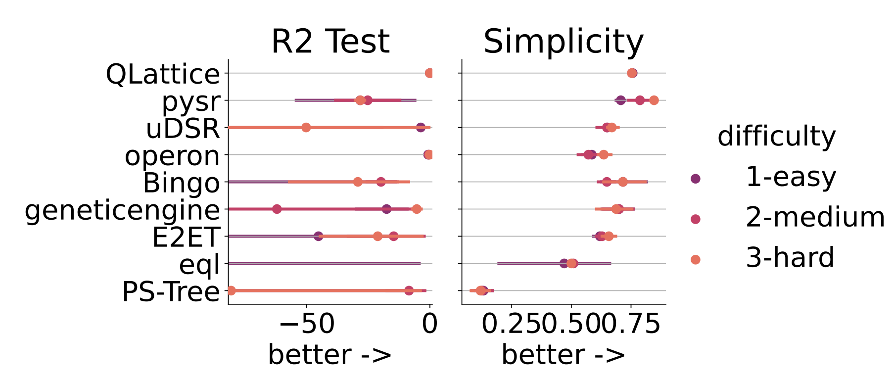

## SRBench 1st Competition
\justifying

- Extrapolation:

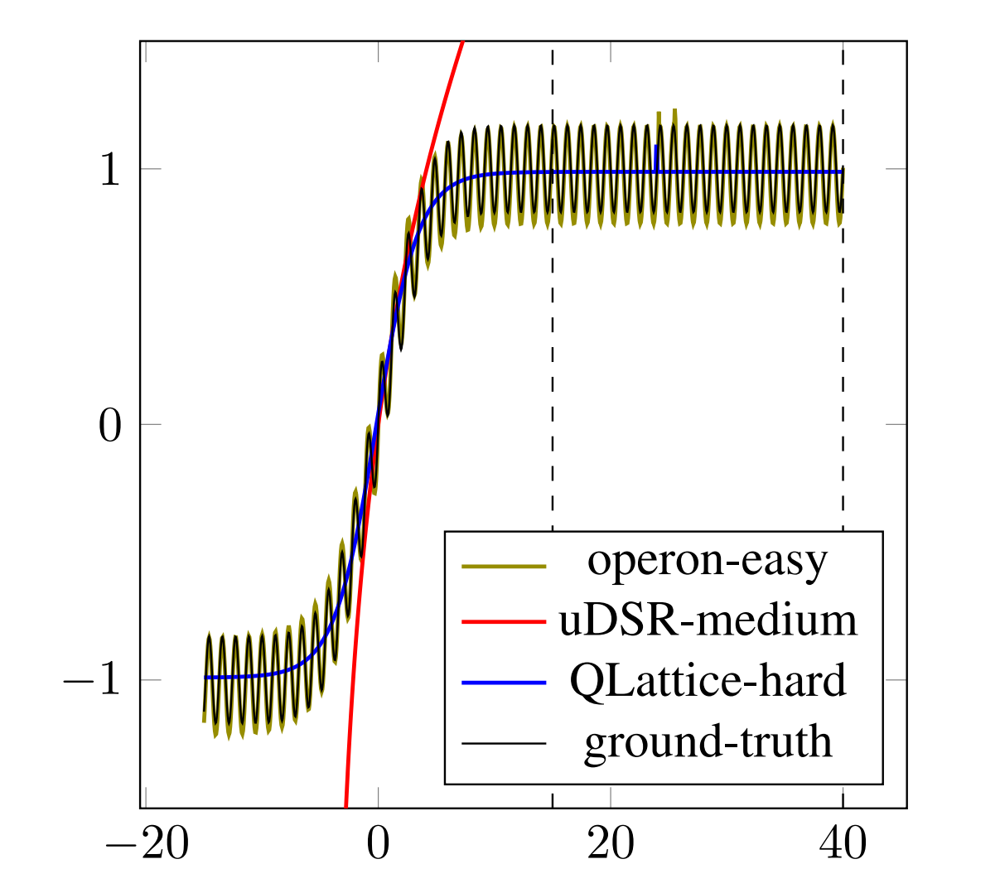{width=200px}

## SRBench 1st Competition
\justifying

- Noise:

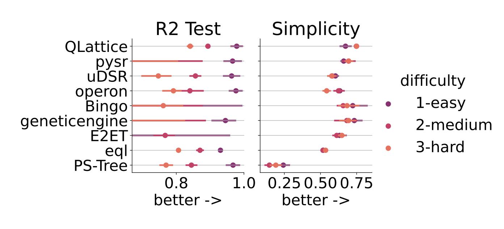

## SRBench 1st Competition
\justifying

This competition brought to light many aspects of the current state-of-the-art in SR[^4]:

- **No free lunch and the need for finetuning:** as expected there is no dominating method in this competition, each method favored one aspect of regression analysis. Besides, for many reasons, some of these methods may not have been correctly fine-tuned for the competition.

- **Simplicity measure is too simple:** using only the length hides some undesired constructs such as the chaining of nonlinear functions.

## SRBench 1st Competition
\justifying

This competition brought to light many aspects of the current state-of-the-art in SR[^4]:

- **Few repetitions x computational budget:** having a limited computational budget allowed for only a few repetitions which can increase the uncertainties of the results.

- **Interpretable:** judging whether a model is interpretable or not is too subjective and error prone.

[^4]: de Franca, F. O., et al. "Interpretable Symbolic Regression for Data Science: Analysis of the 2022 Competition." arXiv preprint arXiv:2304.01117 (2023).

## SRBench 1st Competition
\justifying

This competition brought to light many aspects of the current state-of-the-art in SR[^4]:

- Most implementations lack a post-analysis tool that provides: a set of alternative models, algebraic simplification of the expressions, uncertainty measures, visual inspection tools, general customizations.

## SRBench 2nd Competition
\justifying

A second competition was hosted in GECCO 2023[^6] where the competitors could play with a training data for a period of time and submit a single model to be evaluated.

[^6]: https://cavalab.org/srbench/competition-2023/

## SRBench 2nd Competition
\justifying

:::columns

:::: {.column width="65%"}
- SRBench Competition 2023
- https://cavalab.org/srbench/competition-2023/

::::

:::: {.column width="35%"}
- Two tracks:
  - Performance
  - Interpretability
::::

:::

## SRBench 2nd Competition
\justifying


- Github Classroom: participants can form teams and play with the datasets until the deadline
- Enjoying more freedom to perform regression analysis, can the participants succeed?
  - More about the use of the SR tools rather than comparing algorithms

\includegraphics[width=100pt]{figs/europain.png}

## SRBench 2nd Competition
\justifying

- $3$ datasets:
  - Shubert function
  - NASA dataset (black-box)
  - Vincent function

\begin{empheq}[box=\mybox]{align*}
  f_1 &= \prod_{i=1}^{n}{ \sum_{j=1}{3}{j*cos((j+1)*x_i + j)} } \\
  f_2 &= ?? \\
  f_3 &= \frac{1}{8} \sum_{i=1}^{8}{10 \log(x_i)}
\end{empheq}

## SRBench 2nd Competition (NASA dataset)
\justifying

:::columns

:::: {.column width="65%"}
- Based on 600 3-D simulations of cracks in flat
plates under loading
  - Goal: to predict the growth of cracks in thin metal layers

- A closed form expression has a profound impact on material characterization,
structural design, and failure analysis at NASA and beyond

\includegraphics[width=200pt]{figs/nasa3.png}
::::

:::: {.column width="35%"}
\includegraphics[width=120pt]{figs/nasa1.png}
::::

:::

## SRBench 2nd Competition
\justifying

:::columns

:::: {.column width="60%"}
- We added a little spice to these datasets:
  - Gaussian noise
  - Noisy and irrelevant features
  - Colinear features

::::

:::: {.column width="40%"}
\includegraphics[width=150pt]{figs/spice.jpeg}
::::

:::

## SRBench 2nd Competition
\justifying

\begin{empheq}[box=\mybox]{align*}
\operatorname{tot-score} &= \frac{6}{ \sum_{i=1}^{3}{\frac{1}{acc_i} + \frac{1}{simpl_i}} } \\
acc_i &= N - k + 1 \\
simpl_i &= N - k + 1
\end{empheq}

where N is the number of participants and $k$ is the rank w.r.t. $R^2$ or expression length.

## SRBench 2nd Competition
\justifying

:::columns

:::: {.column width="60%"}
- Montreal Bike Lane: predict the number of bikes crossing a bike lane in Montreal
  - contains additional info about the weather of any given day
- Participants must explore the dataset, apply one or more SR algorithms, and extract interesting findings

::::

:::: {.column width="40%"}
\includegraphics[width=150pt]{figs/bike.jpg}
::::

:::

## SRBench 2nd Competition
\justifying

- Level of details in the pipeline
- Readability of the model
- Interestingness of the pre and post analysis process
- Analysis of interpretation (with special points for analysis that can only be made using SR models)
- Average of organizers grading.

## SRBench 2nd Competition
\justifying

\tiny
| Team                     | Participants                                              | method                           | score    | rank | src |
|--------------------------|-----------------------------------------------------------|----------------------------------|----------|------|-----|
| [pksm ](https://github.com/ufabc-bcc/srbench-competition-2023-track-1-pksm)                    | Parshin Shojaee Kazem Meidan                              | TPSR                             | 6.307885 | 1    | N   |
| [newton-sr](https://github.com/ufabc-bcc/srbench-competition-2023-track-1-newton-sr)                | Nicolas Lassabe Paul Gersberg                             | NewTonSR++                       | 6.224784 | 2    | Y   |
| [sarma](https://github.com/ufabc-bcc/srbench-competition-2023-track-1-sarma)                    | Aleksandar Kartelj Marko Djukanovic                       | RILS                             | 6.136364 | 3    | Y   |
| [player](https://github.com/ufabc-bcc/srbench-competition-2023-track-1-player)                   | Lianjie Zhong Jinghui Zhong Dongjunlan Nikola Gligorovski | PFGP                             | 5.448649 | 4    | Y   |
| [stackgp](https://github.com/ufabc-bcc/srbench-competition-2023-track-1-stackgp)                  | Nathan Haut                                               | stackgp                          | 5.130641 | 5    | Y   |
| [university-of-wellington](https://github.com/ufabc-bcc/srbench-competition-2023-track-1-victoria-university-of-wellington ) | Hengzhe Zhang  Qi Chen  Bing Xue  Mengjie Zhang           | SR-Forest                        | 4.251969 | 6    | Y   |
| [wonderful-time](https://github.com/ufabc-bcc/srbench-competition-2023-track-1-wonderful-time)           | Hai Minh Nguyen                                           | SymMFEA                          | 3.440273 | 7    | Y   |
| [his_jsr](https://github.com/ufabc-bcc/srbench-competition-2023-track-1-his_jsr_2023)                  | Gurushant Gurushant  Jatinkumar Nakrani Rajni Maandi      | LR + gplearn                     | 3.43949  | 8    | Y   |
| [tontakt](https://github.com/ufabc-bcc/srbench-competition-2023-track-1-tontakt)                  | Andrzej Odrzywołek                                        | enumeration, PySR, rational poly | 2.855524 | 9    | Y   |
| [amir](https://github.com/ufabc-bcc/srbench-competition-2023-track-1-amir)                     | Mohammad Amirul Islam                                     | PySR                             | 1.788926 | 10   | Y   |

## SRBench 2nd Competition
\justifying

\tiny
| Team                     | Participants                                                | method    | score | rank | src |
|--------------------------|-------------------------------------------------------------|-----------|-------|------|-----|
| [university-of-wellington](https://github.com/ufabc-bcc/srbench-competition-2023-track-2-victoria-university-of-wellington) | Hengzhe Zhang  Qi Chen  Bing Xue  Mengjie Zhang             | SR-Forest | 3.25  | 1    | Y   |
| [player](https://github.com/ufabc-bcc/srbench-competition-2023-track-2-player)                   | Lianjie Zhong Jinghui Zhong Dongjunlan Nikola Gligorovski   | PFGP      | 2.83  | 2    | Y   |
| [his_jsr](https://github.com/ufabc-bcc/srbench-competition-2023-track-2-his_jsr_2023)                  | Gurushant Gurushant Jatinkumar Nakrani Rajni Maandi         | gplearn   | 2.25  | 3    | Y   |
| [c-bio-ufpr](https://github.com/ufabc-bcc/srbench-competition-2023-track-2-c-bio-ufpr)               | Adriel Macena Falcão Martins  Aurora Trinidad Ramirez Pozo  | PySR      | 1.75  | 4    | Y   |

## SRBench 2nd Competition
\justifying

- Additional freedom stimulated creativity and hybrid approaches
- Evaluation of SR under a practical point of view
- Not to be used to compare average performance of SR algorithms
- Making new datasets is still hard
- SR can generate accurate and interpretable models, this should be explored more!

# srtree-opt

## srtree-opt
\justifying

*srtree-opt*[^7] is a command line tool to parse and post-process symbolic regression models.

It was created as a support library for ITEA and TIR algorithms and changed into a CLI tool for convenience.

It currently support expressions generated by: TIR, HeuristicLab, Operon, BINGO, GP-GOMEA, PySR, SBP, and EPLEX.

[^7]: https://github.com/folivetti/srtree-opt

## srtree-opt
\justifying

It supports two modes: csv and detailed report.

- CSV report: stores the main properties and different quality measures of the parsed expression.
- Detailed report: shows the same information as the CSV report but as a prettyfied format and it shows the confidence intervals for the parameters and predictions.

It also supports to refit the parameters and simplification of the expressions using equality saturation.

## srtree-opt
\justifying

The CSV report shows:

- Expression in a standard format
- Number of nodes of the expression
- Number of parameters
- Parameters values
- Iterations to converge to local optima (if asked to optimize)

## srtree-opt
\justifying

Error and accuracy measures for the training, validation, test sets and for the original and refitted expression:

- Sum of Squared Error (SSE)
- Bayesian Information Criteria
- Akaike Information Criteria
- Minimum Description Length (and variations)
- Evidence
- Negative Log-Likelihood
- Log-Functional
- Log-Parameters
- Fisher Information Matrix

## srtree-opt
\justifying

In report mode it also shows the confidence interval for the parameters and predictions using either Laplace approximation or Profile Likelihood

## srtree-opt {.fragile}
\justifying

Available options:

```{.bash frame=lines framerule=2pt fontsize=\footnotesize baselinestretch=0.8}
  -f,--from ['tir'|'hl'|'operon'|'bingo'|'gomea'|'pysr'|'sbp'|'eplex']
                           Input expression format
  -i,--input INPUT-FILE    Input file containing expressions.
                           Empty string gets expression from stdin.
  -o,--output OUTPUT-FILE  Output file to store the stats. Empty
                           string prints expressions to stdout.
  -d,--dataset DATASET-FILENAME
                           Filename of the dataset used for optimizing
                           the parameters.
                           Empty string omits stats that make use of
                           the training data.
```

## srtree-opt  {.fragile}
\justifying

Available options (cont.):

```{.bash frame=lines framerule=2pt fontsize=\footnotesize baselinestretch=0.8}
  --test TEST              Filename of the test dataset.
  --hasheader              Uses the first row of the csv
                           file as header.
  --simplify               Apply basic simplification.
```

## srtree-opt  {.fragile}
\justifying

Available options (cont.):


```{.bash frame=lines framerule=2pt fontsize=\footnotesize baselinestretch=0.8}
  --niter NITER            Number of iterations for the
                           optimization algorithm.
                           Set 0 for no optimization.

  --distribution ['gaussian'|'bernoulli'|'poisson']
                           Minimize negative log-likelihood
                           following one of the
                           avaliable distributions.
                           The default will use least
                           squares to optimize the model.
  --sErr Serr              Estimated standard error of the data.
                           Defaults to model MSE.
  --restart                If set, it samples the initial values
                           of the parameters using a Gaussian
                           distribution N(0, 1),
                           otherwise it uses the original values of the
                           expression.
  --seed SEED              Random seed to parameter initialization.
```

## srtree-opt  {.fragile}
\justifying

Available options (cont.):

```{.bash frame=lines framerule=2pt fontsize=\footnotesize baselinestretch=0.8}
  --report                 If set, reports the analysis in
                           a user-friendly format instead of csv.
                           It will also include
                           confidence interval for the parameters and
                           predictions
  --profile                If set, it will use profile likelihood
                           to calculate CIs.
  --alpha ALPHA            Significance level for confidence intervals.
                           (default: 5.0e-2)
```

## srtree-opt
\justifying

This tool will automatically handle gzipped datasets if the last extension is `.gz`.
It will auto-detected the delimiter.

The filename can include additional information in the format:

`filename.csv:start:end:target:vars`

where `start` and `end` corresponds to the range of rows that should be
used for training, the other rows will be used for validation.

`target` is the column index or name of the target variable, and `vars` is a comma separated list of column indices or variable names to use as predictors.

## srtree-opt
\justifying

If our dataset `data.csv` has the header row with the following information:

`var1,var2,var3,target1,target2`

we can load it by passing `data.csv`, where it will use every row for training and every column as a predictor, except for the last one that will be the target.

## srtree-opt
\justifying

If we pass `data.csv:0:10:target1:var1,var3,var2`, it will use the first $10$ rows for training, the remainder for validation, the taget variable will be the column named `target1`, and `x0,x1,x2` will be `var1,var3,var2`, respectivelly.

We can also use index values such as `data.csv:0:10:3:0,2,1` and we can mix both names and indices. The values can be omitted to use the defaults.

## srtree-opt {.fragile}
\justifying

Example usage:

```{.bash frame=lines framerule=2pt fontsize=\footnotesize baselinestretch=0.8}
srtree-opt -f operon -i expression_file
   -d data.csv::99:target_noise --sErr 7.2659 --hasheader
   --niter 100 --distribution gaussian
   --restart --simplify
```

## srtree-opt {.fragile}
\justifying

Example report output:

```{.bash frame=lines framerule=2pt fontsize=\footnotesize baselinestretch=0.8}
=================== EXPR 0 ==================
(Sqrt((Abs((x3 + 0.6699816344531162)) / x1))
   - (393.7006500300653 / (x4 + (9.51898304028687 * x5))))

---------General stats:---------

Number of nodes: 15
Number of params: 3
theta = [0.6699816344531162,393.7006500300653,9.51898304028687]

----------Performance:--------

SSE (train.): 5258.3653
SSE (val.): 0.0
SSE (test): 0.0
NegLogLiklihood (train.): 1187.4301
NegLogLiklihood (val.): 0.0
NegLogLiklihood (test): 0.0
```
## srtree-opt {.fragile}
\justifying

Example report output (cont.):

```{.bash frame=lines framerule=2pt fontsize=\footnotesize baselinestretch=0.8}
------Selection criteria:-----

BIC: 2397.8578
AIC: 2382.8603
MDL: 1229.8937
MDL (freq.): 1229.663
Functional complexity: 35.9684
Parameter complexity: 6.4951

---------Uncertainties:----------

Correlation of parameters:
3x3
 1.00  0.17  -0.04
 0.17  1.00   0.97
-0.04  0.97   1.00

Std. Err.: [0.2737,137.6956,3.724]
```
## srtree-opt {.fragile}
\justifying

Example report output (cont.):

```{.bash frame=lines framerule=2pt fontsize=\footnotesize baselinestretch=0.8}
Confidence intervals:

lower <= val <= upper
0.1315 <= 0.67 <= 1.2085
122.768 <= 393.7007 <= 664.6333
2.1916 <= 9.519 <= 16.8464

Confidence intervals (predictions training):

lower <= val <= upper
2.9795 <= 3.0478 <= 3.1161
2.3457 <= 2.422 <= 2.4983
4.0335 <= 4.151 <= 4.2684
2.9836 <= 3.0796 <= 3.1755
2.5375 <= 2.6771 <= 2.8167
```

# SR Implementations Highlights

## PyOperon
\justifying

Operon[^9] is a modern C++ implementation of a GP algorithm for SR created with the objective of being performant and offering a wide range of customizations.

It uses vectorized evaluations, a cutting edge library for linear algebra, and concurrency to achive high performance and be one of the fastest SR implementations.

[^9]: Burlacu, Bogdan, Gabriel Kronberger, and Michael Kommenda. "Operon C++ an efficient genetic programming framework for symbolic regression." Proceedings of the 2020 Genetic and Evolutionary Computation Conference Companion. 2020.

## PyOperon
\justifying

PyOperon[^9] is a Python binding for the C++ implementation offering easy-to-install and easy-to-use access to Operon.

This implementation offer a scikit-learn compatible library, for easy of use, and a direct binding to the C++ implementation, offering a more customized experience.

[^8]: https://github.com/heal-research/pyoperon

## PyOperon - scikit-learn interface {.fragile}
\justifying

```{.python frame=lines framerule=2pt fontsize=\footnotesize baselinestretch=0.8}
from pyoperon.sklearn import SymbolicRegressor
reg = SymbolicRegressor(
        allowed_symbols= "add,sub,mul,div,constant,variable",
        brood_size= 10,
        comparison_factor= 0,
        crossover_internal_probability= 0.9,
        crossover_probability= 1.0,
        epsilon= 1e-05,
        female_selector= "tournament",
        generations= 1000,
        pool_size= 1000,
        population_size= 1000,
        random_state= None,
        reinserter= "keep-best",
        time_limit= 900,
        tournament_size= 3,
        uncertainty= [sErr]
        )
reg.fit(x, y)
reg.score(x,y)
res = [(s['objective_values'], s['tree'],
          s['minimum_description_length']) for s in reg.pareto_front_]
for obj, expr, mdl in res:
    print(obj, mdl, reg.get_model_string(expr, 16))
```

## PyOperon - scikit-learn interface
\justifying

Main arguments:

- `allowed_symbols`: a comma separated list of operators (add,sub,mul,div,constant,variable, aq, pow, exp, log, sin, cos, tan, tanh, sqrt, cbrt, square, dyn)
- `crossover_probability`: probability of applying crossover
- `mutation_probability`: probability of applying mutation
- `mutation:` prob. distribution of each mutation (onepoint, discretepoint, changevar, changefunc, insertsubtree, replacesubtree, removesubtree)
- `offspring_generator`: basic, offspring, brood, polygenic
- `reinserter`: keepbest, replaceworst
- `objectives`: a list of objectives (r2,c2,mse,rmse,mae)
- `optimizer`: lm, lbgs, sgd

## PyOperon - scikit-learn interface
\justifying

Main arguments (cont.):

- `optimizer_likelihood`: gaussian, poisson
- `initialization_method`: grow, ptc, btc
- `population_size`: an integer of the population size
- `generations`: the number of generations
- `max_evaluations`: maximum number of evaluations
- `model_selection_criterion`: mdl, bic, aik

## PyOperon - binding {.fragile}
\justifying

(from https://github.com/heal-research/pyoperon/blob/main/example/operon-bindings.py):

```{.python frame=lines framerule=2pt fontsize=\footnotesize baselinestretch=0.8}
import random, time, sys, os, json
import numpy as np
import pandas as pd
from scipy import stats

import pyoperon as Operon
from pmlb import fetch_data

# get some training data - see https://epistasislab.github.io/pmlb/
D = fetch_data('1027_ESL', return_X_y=False, local_cache_dir='./datasets').to_numpy()

# initialize a dataset from a numpy array
ds             = Operon.Dataset(D)

# define the training and test ranges
training_range = Operon.Range(0, ds.Rows // 2)
test_range     = Operon.Range(ds.Rows // 2, ds.Rows)
```

## PyOperon - binding {.fragile}
\justifying

```{.python frame=lines framerule=2pt fontsize=\footnotesize baselinestretch=0.8}
# define the regression target
target         = ds.Variables[-1] # take the last column in the dataset as the target

# take all other variables as inputs
inputs         = [ h for h in ds.VariableHashes if h != target.Hash ]

# initialize a rng
rng            = Operon.RomuTrio(random.randint(1, 1000000))

# initialize a problem object which encapsulates the data, input, target and training/test ranges
problem        = Operon.Problem(ds, training_range, test_range)
problem.Target = target
problem.InputHashes = inputs
```

## PyOperon - binding {.fragile}
\justifying

```{.python frame=lines framerule=2pt fontsize=\footnotesize baselinestretch=0.8}
# initialize an algorithm configuration
config = Operon.GeneticAlgorithmConfig(generations=1000,
             max_evaluations=1000000, local_iterations=0,
             population_size=1000, pool_size=1000
             p_crossover=1.0, p_mutation=0.25
             epsilon=1e-5, seed=1, time_limit=86400)

selector       = Operon.TournamentSelector(objective_index=0)
selector.TournamentSize = 5

problem.ConfigurePrimitiveSet(Operon.PrimitiveSet.Arithmetic
          | Operon.NodeType.Exp | Operon.NodeType.Log |
          Operon.NodeType.Sin | Operon.NodeType.Cos)
pset = problem.PrimitiveSet

minL, maxL     = 1, 50
maxD           = 10

btc            = Operon.BalancedTreeCreator(pset,
                  problem.InputHashes, bias=0.0)
tree_initializer = Operon.UniformLengthTreeInitializer(btc)
tree_initializer.ParameterizeDistribution(minL, maxL)
tree_initializer.MaxDepth = maxD
```

## PyOperon - binding {.fragile}
\justifying

```{.python frame=lines framerule=2pt fontsize=\footnotesize baselinestretch=0.8}
coeff_initializer = Operon.NormalCoefficientInitializer()
coeff_initializer.ParameterizeDistribution(0, 1)

mut_onepoint   = Operon.NormalOnePointMutation()
mut_changeVar  = Operon.ChangeVariableMutation(inputs)
mut_changeFunc = Operon.ChangeFunctionMutation(pset)
mut_replace    = Operon.ReplaceSubtreeMutation(btc,
                       coeff_initializer, maxD, maxL)

mutation       = Operon.MultiMutation()
mutation.Add(mut_onepoint, 1)
mutation.Add(mut_changeVar, 1)
mutation.Add(mut_changeFunc, 1)
mutation.Add(mut_replace, 1)

# define crossover
crossover_internal_probability = 0.9
crossover = Operon.SubtreeCrossover(crossover_internal_probability,
                   maxD, maxL)
```

## PyOperon - binding {.fragile}
\justifying

```{.python frame=lines framerule=2pt fontsize=\footnotesize baselinestretch=0.8}
dtable         = Operon.DispatchTable()
error_metric   = Operon.R2()
evaluator      = Operon.Evaluator(problem, dtable, error_metric, True)
evaluator.Budget = 1000 * 1000

optimizer      = Operon.LMOptimizer(dtable, problem, max_iter=10)

generator      = Operon.BasicOffspringGenerator(evaluator,
                       crossover, mutation, selector, selector)

reinserter     = Operon.ReplaceWorstReinserter(objective_index=0)
gp             = Operon.GeneticProgrammingAlgorithm(problem,
                      config, tree_initializer, coeff_initializer,
                      generator, reinserter)

gen = 0
max_ticks = 50
interval = 1 if config.Generations < max_ticks
             else int(np.round(config.Generations / max_ticks, 0))
t0 = time.time()
```

## PyOperon - binding {.fragile}
\justifying

```{.python frame=lines framerule=2pt fontsize=\footnotesize baselinestretch=0.8}
def report():
    global gen
    best = gp.BestModel
    bestfit = best.GetFitness(0)
    sys.stdout.write('\r')
    cursor = int(np.round(gen / config.Generations * max_ticks))
    for i in range(cursor):
        sys.stdout.write('\u2588')
    sys.stdout.write(' ' * (max_ticks-cursor))
    sys.stdout.write(f'{100 * gen/config.Generations:.1f}%,
                         generation {gen}/{config.Generations},
                         train quality: {-bestfit:.6f},
                         elapsed: {time.time()-t0:.2f}s')
    sys.stdout.flush()
    gen += 1

# run the algorithm
gp.Run(rng, report, threads=0)

# get the best solution and print it
best = gp.BestModel
model_string = Operon.InfixFormatter.Format(best.Genotype, ds, 6)
print(f'\n{model_string}')
```

## PySR
\justifying

PySR[^10] is a python binding for a high-performance SR implementation in Julia.

The main focus of this implementation is to enable SR as an automatic tool to discover science laws from data.

[^10]: https://github.com/MilesCranmer/PySR

## PySR
\justifying

As such, this SR tool was engineered to be high-performant, customizable, and easy to use.

It is multi-objective by default and it returns a selection of expressions with the tradeoff of accuracy and simplicity.

## PySR
\justifying

This implementation differs from traditional GP by introducing some novelties[^11]:

- It applies a simulated annealing strategy to accept or reject a mutated solution, alternating between high and low temperature (to promote either a local search or diversity).
- It envelopes the evolution into a evolve-simplify-optimize loop, where the population is evolved (through mutation and crossover) for a number of iterations and then they go through algebraic simplification (to remove some redundancies) and nonlinear optimization of the parameters.
- It introduces an adaptive parsimony control that enables the population to keep individuals of different complexity levels.

[^11]: Cranmer, Miles. "Interpretable machine learning for science with PySR and SymbolicRegression. jl." arXiv preprint arXiv:2305.01582 (2023).

## PySR
\justifying

Besides that, it provdes several additional features to help mitigate some common problems:

- Denoising the dataset using a Gaussian process to predict denoised target values.
- Specifying weights for each data point.
- Custom loss function: it is possible to pass a python or julia function to be used as a loss function.
- Custom operators: it is also possible to pass custom operators.
- Feature selection by applying a gradient boosting tree to select the $n$ most important features
- Operators constraints: we can specify functional constraints such as maximum size of the expression, maximum deph, maximum size following a certain operator, maximum nestedness of operators.

## PySR {.fragile}
\justifying

```{.python frame=lines framerule=2pt fontsize=\footnotesize baselinestretch=0.8}
from pysr import PySRRegressor

model = PySRRegressor(
    niterations=40,  # < Increase me for better results
    binary_operators=["+", "*"],
    unary_operators=[
        "cos",
        "exp",
        "sin",
        "inv(x) = 1/x",
        # ^ Custom operator (julia syntax)
    ],
    extra_sympy_mappings={"inv": lambda x: 1 / x},
    # ^ Define operator for SymPy as well
    loss="loss(prediction, target) = (prediction - target)^2",
    # ^ Custom loss function (julia syntax)
)
```

## PySR {.fragile}
\justifying

Main arguments:

- `model_selection`: how to pick the best model (accuracy, best, score)
- `binary_operators`: a list of binary operators (see the [operators page](https://astroautomata.com/PySR/operators/))
- `unary_operators`: a list of unary operators
- `niterations`: number of iterations
- `populations`: number of populations for island model
- `population_size`: size of each populaton
- `max_evals`: maximum evaluation count
- `maxsize`: maximum complexity of an equation

## PySR {.fragile}
\justifying

Main arguments (cont.):

- `constraints`: enforces maxsize for the children of operators (`pow : (-1, 1)` leave the left child unconstrained and allows only subtrees of size 1 for the right child).
- `nested_constraints`: nested constraints (`{"sin": {"cos": 0}}` means that cosine cannot be applied after sine).
- `loss`: the loss function (`LPDistLoss{P}()`, `L1DistLoss()`,
        `L2DistLoss()` (mean square), `LogitDistLoss()`,
        `HuberLoss(d)`, `L1EpsilonInsLoss(ϵ)`, `L2EpsilonInsLoss(ϵ)`,
        `PeriodicLoss(c)`, `QuantileLoss(τ)`, `ZeroOneLoss()`, `PerceptronLoss()`,
        `L1HingeLoss()`, `SmoothedL1HingeLoss(γ)`,
        `ModifiedHuberLoss()`, `L2MarginLoss()`, `ExpLoss()`,
        `SigmoidLoss()`, `DWDMarginLoss(q)`)


## TIR
\justifying

Transformation-Interaction-Rational SR[^12] extends the IT representation to support a rational of two IT expressions:

\begin{equation*}
f_{TIR}(\mathbf{x, w_p, w_q}) = \tikzmarknode{g}{\highlight{red}{$g$}}\left(\frac{\tikzmarknode{p}{\highlight{blue}{$p(\mathbf{x, w_p})$}}}{1 + \tikzmarknode{q}{\highlight{blue}{$q(\mathbf{x, w_q})$}}}\right)
\end{equation*}

\begin{tikzpicture}[overlay,remember picture,>=stealth,nodes={align=left,inner ysep=1pt},<-]
    % For "X"
    \path (g.north) ++ (0,1.5em) node[anchor=south east,color=red!67] (scalep){\textbf{invertible function}};
    \draw [color=red!87](g.north) |- ([xshift=-0.3ex,color=red]scalep.south west);
    % For "S"
    \path (p.east) ++ (3em,-1em) node[anchor=west,color=blue!67] (scaleb){\textbf{IT expressions}};
    \draw[<->,color=blue!57] (q.east) -- ++ (0.5,0) |- (p);
\end{tikzpicture}

\begin{equation*}
f_{IT}(\mathbf{x, w}) = w_0 + \sum_{j = 1}^{m}{\tikzmarknode{w}{\highlight{red}{$w_{j}$}} \cdot (\tikzmarknode{f}{\highlight{green}{$f_j$}} \circ \tikzmarknode{r}{\highlight{blue}{$r_j$}}) (\mathbf{x})}
\end{equation*}

\begin{tikzpicture}[overlay,remember picture,>=stealth,nodes={align=left,inner ysep=1pt},<-]
    % For "X"
    \path (w.north) ++ (0,1.5em) node[anchor=south east,color=red!67] (scalep){\textbf{linear coefficient}};
    \draw [color=red!87](w.north) |- ([xshift=-0.3ex,color=red]scalep.south west);
    % For "S"
    \path (f.south) ++ (0,-1.5em) node[anchor=north east,color=green!67] (mean){\textbf{transformation function}};
    \draw [color=green!27](f.south) |- ([xshift=-0.3ex,color=green]mean.south west);
    \path (r.south) ++ (0,-1.5em) node[anchor=north west,color=blue!67] (mean2){\textbf{interaction function}};
    \draw [color=blue!57](r.south) |- ([xshift=-0.3ex,color=blue]mean2.south east);

\end{tikzpicture}

\begin{equation*}
r_j(\mathbf{x}) = \prod_{i = 1}^{d}{x_i^{ \tikzmarknode{k}{ \highlight{red}{$k_{ij}$} }}}
\end{equation*}

\begin{tikzpicture}[overlay,remember picture,>=stealth,nodes={align=left,inner ysep=1pt},<-]
    \path (k.south) ++ (0,-1.5em) node[anchor=north east,color=red!67] (mean){\textbf{strength of interaction}};
    \draw [color=red!57](k.south) |- ([xshift=-0.3ex,color=red]mean.south west);

\end{tikzpicture}

[^12]: de França, Fabrício Olivetti. "Transformation-interaction-rational representation for symbolic regression." Proceedings of the Genetic and Evolutionary Computation Conference. 2022.

## TIR
\justifying

The main implementation is written in Haskell[^15] with support to a Python wrapper following the scikit-learn API.

Besides the Python wrapper it has a command line interface that requires a configuration file that specifies the main options of the algorithm

[^15]: https://github.com/folivetti/tir


## TIR {.fragile}
\justifying

The main configuration file is split into sections regarding each aspect of the algorithm:


```{.bash frame=lines framerule=2pt fontsize=\footnotesize baselinestretch=0.8}
[IO]
train = path and name of the training set
test  = path and name of the test set
log   = PartialLog "path and name of the output file"

[Mutation]
krange      = (-3, 3)
transfunctions = [Id, Sin, Cos, Tanh, SqrtAbs, Log, Exp]
ytransfunctions  = [Id, Exp, Sin]
```

## TIR {.fragile}
\justifying

The algorithm option specifies the different supported variants: GPTIR, SCTIR, MOO, FS.


```{.bash frame=lines framerule=2pt fontsize=\footnotesize baselinestretch=0.8}
[Algorithm]
npop      = 1000
ngens     = 500
algorithm = GPTIR
measures  = ["RMSE", "NMSE", "MAE", "R^2"]
task      = Regression
probmut   = 0.8
probcx    = 0.8
seed      = Nothing
```

## TIR {.fragile}
\justifying

- GPTIR: vanilla genetic programming.
- SCTIR: genetic programming with shape-constraints
- MOO[^13]: Multi-objective with the first objective being the first measure in the list of measures and the second is the model size.
- FS[^14]: Finess sharing version that returns a set of expressions that behave similarly in the training data but it behaves differently outside the predictors domain range.

[^13]: de França, Fabrício Olivetti. "Alleviating overfitting in transformation-interaction-rational symbolic regression with multi-objective optimization." Genetic Programming and Evolvable Machines 24.2 (2023): 13.
[^14]: de França, Fabrício Olivetti. "Transformation-Interaction-Rational representation for Symbolic Regression: a detailed analysis of SRBench results." ACM Transactions on Evolutionary Learning (2023).

## TIR {.fragile}
\justifying

This implementation also supports shape-constraints that constrains the generated model to specific properties.

The `penalty` argument can be `NoPenalty`, `Len Double`, or `Shape Double` to penalize the length of the model or the shape property, respectivelly. `Double` is a floating point value representing the penalization factor.

```{.bash frame=lines framerule=2pt fontsize=\footnotesize baselinestretch=0.8}
[Constraints]
penalty = NoPenalty
shapes  = []
domains = []
evaluator = Nothing
```

## TIR {.fragile}
\justifying

The argument `shapes` is a list of shape constraints involving a variable (specified by an `Int` index) and the range of the constraint:

```{.haskell frame=lines framerule=2pt fontsize=\footnotesize baselinestretch=0.8}
data Shape   = Range (Double, Double)
                -- ^ f(x) \in [a, b]
             | DiffRng Int (Double, Double)
                -- ^ d f(x) / dx \in [a, b]
             | NonIncreasing Int
                -- ^ d f(x) / dx \in [-inf, 0]
             | NonDecreasing Int
                -- ^ d f(x) / dx \in [0, inf]
             | PartialNonIncreasing Int (Double, Double)
                -- ^ d f(x) / dx \in [-inf, 0], a <= x <= b
             | PartialNonDecreasing Int (Double, Double)
                -- ^ d f(x) / dx \in [0, inf], a <= x <= b
             | Inflection Int Int
                -- ^ d^2 f(x)/dx^2 == 0
             | Convex Int Int
                -- ^ d^2 f(x)/dx^2 \in (0, Infinity)
             | Concave Int Int
                -- ^ d^2 f(x)/dx^2 \in (-Infinitiy,0)
```

## TIR {.fragile}
\justifying

The argument `domains` is just a list of tuples specifying the domain range of each variable that must be evaluated.

The final argument, `evalutor`, specifies how to evaluate the constraints:

```{.haskell frame=lines framerule=2pt fontsize=\footnotesize baselinestretch=0.8}
data Evaluator = InnerInterval
               | OuterInterval
               | Kaucher
               | Sampling Int
               | Hybrid Double
               | Bisection Int
```

## HeuristicLab
\justifying

HerusiticLab[^16] is a framework supporting a large variaty of heuristics and evolutionary algorithms for different problems.

It has an intuitive Graphical User Interface and can also be used programmaticaly as a C# library.

[^16]: https://dev.heuristiclab.com/

## HeuristicLab
\justifying

Specific to Genetic Programming it supports:

- Artificial Ant
- Lawn Mower
- Even Parity
- Multiplexer
- Robocode
- Trading
- Symbolic Classification
- Symbolic Regression
- Koza-style Symbolic Regression
- Symbolic Time-Series Prognosis
- Grammatical Evolution

## HeuristicLab
\justifying

Another outstanding fetaure is the post-processing plots and reports that
helps the practitioner to debug the model and have some insights about the data.

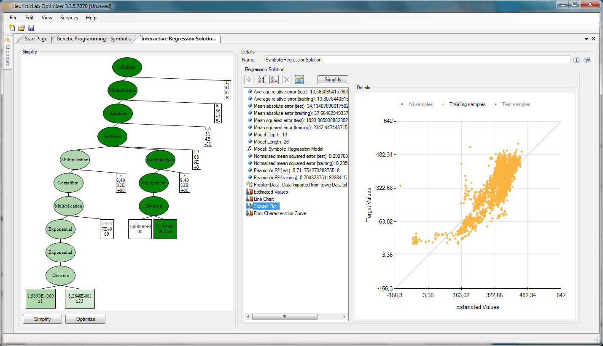

## HeuristicLab
\justifying

A brief usage introduction: [https://dev.heuristiclab.com/trac.fcgi/export/HEAD/misc/documentation/Tutorials/Algorithm%20and%20Experiment%20Design%20with%20HeuristicLab.pdf](https://dev.heuristiclab.com/trac.fcgi/export/HEAD/misc/documentation/Tutorials/Algorithm%20and%20Experiment%20Design%20with%20HeuristicLab.pdf)

## Next lecture {.standout}

\begin{block}{}
  \begin{itemize}
    \item Likelihood Functions
\end{itemize}

\hfill

\includegraphics[width=100pt]{figs/tobecontinued.png}
\end{block}

## Acknowledgments


