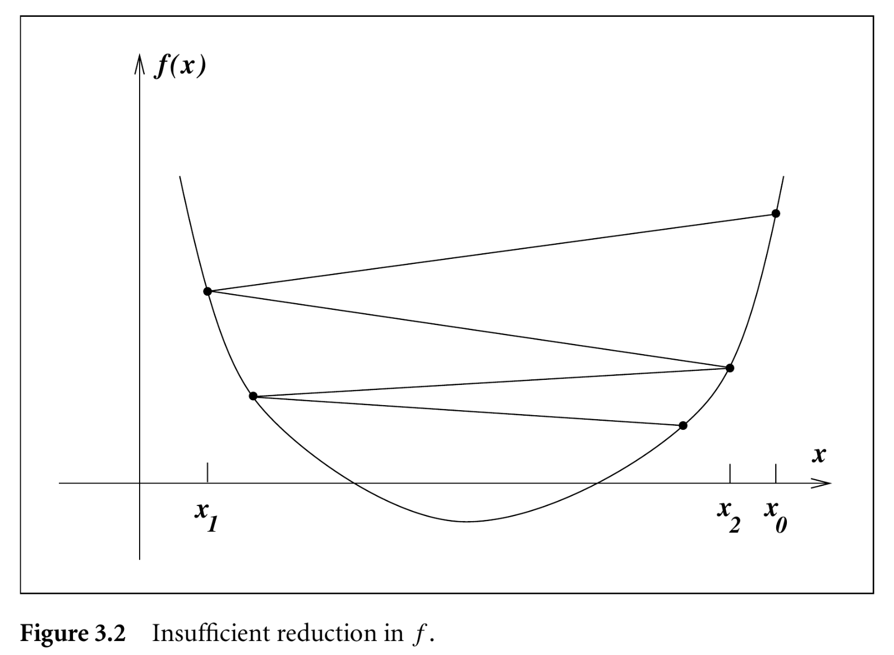
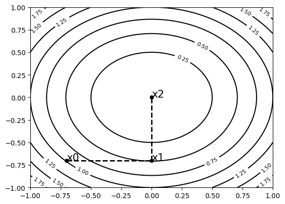
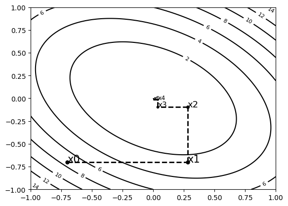

# Nonlinear Optimization

## Optimization Problems
\justifying

Optimization plays an important role in our day to day lives:

- We optimize our dialy routines so we can go to work, have leisure time, do some sports
- Companies optimize their process to minimize costs, maximize profits
- Nature optimizes their process with the goal of minimizing energy consumption

## Optimization Problems
\justifying

An optimization problem is characterized by:

- **Objective-function:** a quantitative measure of performance
- **Variables:** quantitative description of the system
- **Constraints:** a mathematical descriptions of any constraint imposed to the variables or objective-function


## Optimization Problems
\justifying

A common description of optimization problem is:

\begin{empheq}[box=\mybox]{align*}
\min_{x \in \mathbb{R}^n} f(x) \\
\text{subject to} \\
\begin{cases}
c_i(x) = 0 & i \in \mathcal{\Epsilon} \\
c_i(x) \geq 0 & i \in \mathcal{I} \\
\end{cases}
\end{empheq}

where $\mathcal{\Epsilon}, \mathcal{I}$ are equality and inequality constraints, respectively. These two sets of are enough to describe any constraint.

## Optimization Algorithms
\justifying

Most interesting optimization problems do not have a closed form solution. As such, we must rely on optimization algorithms to find, at least, a local optima. Ideally we want to apply algorithms that are:

- **Robust:** they must perform well in general.
- **Efficient:** they should not require too much compute time and memory.
- **Accurate:** they must not be affected by rounding errors or data innacuracy.

## Convexity
\justifying

\notebox{$S$ is a \emph{convex set} if for any two points $x, y \in S$ it follows that $\alpha x + (1 - \alpha)y \in S$, for $0 \leq \alpha \leq 1$.}

This means that if we connect two points in this set with a line, all of the points the line cross will belong to the set.

## Convex Function
\justifying

\notebox{$f$ is a \emph{convex function} if its domain is a convex set and, given $x, y \in S$, $f(\alpha x + (1-\alpha)y) \leq \alpha f(x) + (1 - \alpha) f(y)$ for $0 \leq \alpha \leq 1$.}

## Convex Function
\justifying

\begin{tikzpicture}
\begin{axis}[xlabel=$x$, ylabel=$f(x)$,domain=-5:5]
\addplot [very thick,cyan!50!black,name path=A] {x^2};
\addplot [very thick,cyan!50!black,dashed,name path=B] coordinates {(-2.3, 4)(3.3, 9)};
\addplot[gray!20] fill between[of=B and A];
\end{axis}
\end{tikzpicture}

## Convex Function
\justifying

Whenever the function is convex, some optimization algorithms can guarantee convergence to the global optima.

## Least Squares Problem
\justifying

So far we have mostly worked with the least squares formulation for our regression models:

\begin{empheq}[box=\mybox]{align*}
\min_{\theta \in \mathbb{R}^P} \mathcal{L}(x, y; \theta) &= \sum_{i}{(y^{(i)} - f(x^{(i)}; \theta))^2}\\
\end{empheq}

But, as we learned from last week, we will need to optimize different likelihod functions that do not fit into least squares.

## Global and Local Minima
\justifying

A solution $x^*$ is a **global minimum** if $f(x^*) \leq f(x), \text{ for all } x$.

The solution $x^*$ is a **local minimum** if there is a neighborhood $\mathcal{N}$ such that $f(x^*) \leq f(x), \text{ for } x \in \mathcal{N}$.

The concept of global and local maximum is analogous.

## Global and Local Minima
\justifying

Having many local optima poses as a challenge to optimization algorithms.

\begin{tikzpicture}
\begin{axis}[xlabel=$x$, ylabel=$f(x)$,domain=-40:40,samples=1000]
\addplot [very thick,cyan!50!black] {0.01*x^2*cos(deg(x))};
\end{axis}
\end{tikzpicture}

## Detecting Local Minima
\justifying

Let's review the Taylor Theorem assuming a continuously differentiable function $f : \mathbb{R}^n \rightarrow \mathbb{R}$ and a $p \in \mathbb{R}^n$:

\begin{empheq}[box=\mybox]{align*}
f(x + p) &= f(x) + \nabla f(x + tp)^Tp
\end{empheq}

for some $t \in (0, 1)$.

## Detecting Local Minima
\justifying

If it is twice differentiable, we have:

\begin{empheq}[box=\mybox]{align*}
\nabla f(x + p) &= \nabla f(x) + \int_{0}^{1}{\nabla^2 f(x + tp)^Tp dt} \\
f(x + p) &= f(x) + \nabla f(x)^T p + \frac{1}{2} p^T \nabla^2 f(x + tp) p
\end{empheq}

for $t \in (0, 1)$. This will help us to define necessary conditions for optimality of $x^*$.

## First-Order Necessary Conditions
\justifying

If $x^*$ is a local optima, then $\nabla f(x^*) = 0$ also called a stationary point.

## Second-Order Necessary Conditions
\justifying

If $x^*$ is a local optima, then $\nabla f(x^*) = 0$ and $\nabla^2 f(x^*)$ is positive semidefinite.

# Optimization Algorithms

## Optimization Algorithms
\justifying

There are two main strategies for nonlinear optimization algorithms:

- **Line Search:** that chooses a direction and find the step length that minimizes (or maximize) the function.
- **Trust Region:** we build a model function that approximates the function $f$ within a small neighborhood. We use this proxy model to find the local optima of that region.

# Line Search Methods

## Line Search Methods
\justifying

In Line Search methods we compute a new value for $x$ at every iteration $k$ as:

\begin{empheq}[box=\mybox]{align*}
x_{k+1} = x_k + \alpha_k p_k
\end{empheq}

where $\alpha_k$ is a positive scalar called step length and $p_k$ is the direction we are searching.

## Line Search Methods
\justifying

A common requirement is that $p^T_k \nabla f_k < 0$ implying that the function value can be reduced at this direction. If we want to maximize the objective-function we simply change the sign of $\alpha_k$.

## Line Search Methods
\justifying

The search direction $p_k$ is often written as:

\begin{empheq}[box=\mybox]{align*}
p_k = -B_k^{-1} \nabla f_k
\end{empheq}

where $B_k$ is a symmetric and non-singular matrix (square matrix with nonzero determinant).

## Line Search Methods {.fragile}
\justifying

A general line search algorithm can be described as:

```{.haskell frame=lines framerule=2pt fontsize=\footnotesize baselinestretch=0.8}
linesearch-opt b-matrix step f x k =
  | k == 0 = x
  | otherwise = let nabla = grad f x
                    b     = b-matrix f x
                    p     = -inv(b) * nabla
                    alpha = step f x p
                    x'    = x + alpha * p
                 in linesearch-opt b-matrix step f x' (k-1)
```

Besides the objective-function, we have to choose the functions `b-matrix` and `step`.

## Steepest Descent
\justifying

One choice for the $B_k$ is the identity matrix $I$. This will return the direction that leads to the steepest descent as $p_k = -\nabla f_k$.

## Newton's method
\justifying

Another choice is to set $B_k = \nabla^2 f_k$ as it will scale the gradient with a quadratic fitting of the current point neighborhood. If the neighborhood happens to be quadratic, it will converge in one step.

## Quasi-Newton's method
\justifying

Calculating the inverse of the Hessian matrix may be expensive, we iteratively update $B_k$ to approximate the inverse of the Hessian at every step.

One example is the BFGS that, given an initial $H_k = B_k^{-1}$, it updates $H_{k+1}$ as:

\begin{empheq}[box=\mybox]{align*}
\Delta x_k &= -\alpha_k H_k \nabla f_k \\
y_k &= \nabla f_{k+1} - \nabla f_k \\
H_{k+1} &= \left(I - \frac{\Delta x_k y_k^T}{y_k^T \Delta x_k}\right) H_k \left(I - \frac{y_k \Delta x_k^T}{y_k^T \Delta x_k}\right) + \frac{\Delta x_k \Delta x_k^T}{y_k^t \Delta x_k}
\end{empheq}

## Step Size
\justifying

Once we pick a direction, we have to choose $\alpha_k$ that minimizes $f(x_k + \alpha_k p_k)$.

This is reduced to an optimization problem of a single variable. Nevertheless, we do not want to spend a lot of computational time computing the best step size.

## Step Size
\justifying

Our problem can be described as a minimization problem (if we are minimizing the original function) as:

\begin{empheq}[box=\mybox]{align*}
\min_{\alpha} \phi(\alpha) &= f(x_k + \alpha p_k) \\
\text{subject to} \\
\alpha > 0
\end{empheq}

## Step Size
\justifying

The main approach for step size is an iterative process that first finds an interval of values that likely contains the step sizes of interest and an interpolation stage that picks one step size from this interval.

This algorithm requires a stop condition for the bracketing such that gives us a balance between sufficient reduction and computational cost.

## Step Size
\justifying

One trivial condition is simply $f(x_k + \alpha_k p_k) < f(x_k)$, but this can leads to an insufficient reduction:

{width=200px}

## Wolfe Conditions
\justifying

A popular set of conditions are the Wolfe Conditions that are split into sufficient decrease and curvature conditions.

## Wolfe Conditions
\justifying

The sufficient decrease condition says:

\begin{empheq}[box=\mybox]{align*}
f(x_k + \alpha p_k) &\leq f(x_k) + c_1 \alpha \nabla f_k^T p_k \\
c_1 \in (0, 1)
\end{empheq}

## Wolfe Conditions
\justifying

The value $c_1$ defines how much reduction we are willing to accept. If $c_1 = 1$ and the function was  linear within $\alpha \in (0, 1)$, it would correctly guess the amount of reduction.

\begin{tikzpicture}
\begin{axis}[xlabel=$\alpha$, ylabel=$f(x_k + \alpha p_k) - f(x_k)$,domain=0:1,samples=100,legend pos=south west]
\addplot [very thick,cyan!50!black] {(-2 + 4*x)^2 - 4};
\addplot [very thick,cyan!50!green,dashed] {- 0.1*16*x};
\addplot [very thick,cyan!50!blue,dashed] { - 0.5*16*x};
\addplot [very thick,cyan!50!red,dashed] { - 0.9*16*x};
\addplot [very thick,cyan!50!black,dashed] { - 16*x};
\legend{,$c_1=0.1$,$c_1=0.5$,$c_1=0.9$,$c_1=1.0$}
\end{axis}
\end{tikzpicture}

## Wolfe Conditions
\justifying

The value of $c_1$ is usually small, for example $c_1 = 10^{-4}$.


\begin{tikzpicture}
\begin{axis}[xlabel=$\alpha$, ylabel=$f(x_k + \alpha p_k) - f(x_k)$,domain=0:1,samples=100,legend pos=south west]
\addplot [very thick,cyan!50!black] {0.01*(21 + x*3.9197)^2*cos(deg(21 + x*3.9197)) + 2.4145};
\addplot [very thick,cyan!50!orange,dashed] {-0.0001*3.9197*3.9197*x};
\addplot [very thick,cyan!50!green,dashed] {-0.1*3.9197*3.9197*x};
\addplot [very thick,cyan!50!blue,dashed] {-0.5*3.9197*3.9197*x};
\addplot [very thick,cyan!50!red,dashed] {-0.9*3.9197*3.9197*x};
\addplot [very thick,cyan!50!black,dashed] {-3.9197*3.9197*x};
\legend{,$c_1=10^{-4}$,$c_1=0.1$,$c_1=0.5$,$c_1=0.9$,$c_1=1.0$}
\end{axis}
\end{tikzpicture}

## Wolfe Conditions
\justifying

The other condition is about the curvature:

\begin{empheq}[box=\mybox]{align*}
\nabla f(x_k + \alpha_k p_k) p_k \geq c_2 \nabla f_k^T p_k \\
c_2 \in (c_1, 1)
\end{empheq}

This ensures that the slope of $\phi(\alpha_k)$ is greater than $c_2 \nabla \phi(0)$, if the slope is a large negative value, we can significantly reduce $f$ moving along that direction.
Common values for $c_2$ is $0.9$ when using Newton or quasi-Newton directions and $0.1$ when using conjugated gradients.

## Wolfe Conditions
\justifying

Plotting $\nabla f(x_k + \alpha_k p_k) p_k - c_2 \nabla f_k^T p_k$ we have:


\begin{tikzpicture}[
  declare function = {
    f(\x) = 0.01*\x^2*cos(deg(\x));
    p(\x) = 0.01*\x^2*sin(deg(\x)) - 0.02*\x*cos(deg(\x));
  },
]
\begin{axis}[xlabel=$\alpha$, ylabel=$f(x_k + \alpha p_k) - f(x_k)$,domain=0:1,samples=100,legend pos=south west]
\addplot [very thick,cyan!50!black] {f(21 + x*p(21)) - f(21)};
\addplot [very thick,cyan!50!orange,dashed] {-0.0001*3.9197*3.9197*x};
\addplot [very thick,cyan!50!green,dashed] {-p(21 + x*p(21))*p(21) + 0.9*p(21)^2};
\addplot [very thick,cyan!50!blue,dashed] {-p(21 + x*p(21))*p(21) + 0.1*p(21)^2};
\legend{,,$c_2=0.9$,$c_2=0.1$}
\end{axis}
\end{tikzpicture}

## Backtracking algorithm {.fragile}
\justifying

The decrease condition is not always enough to ensure that the algorithm makes enough progress. But, the backtracking algorithm can help to achieve a reasonable step size:

```{.haskell frame=lines framerule=2pt fontsize=\footnotesize baselinestretch=0.8}
-- 0 < rho, c1 < 1
-- assuming f, fk, pk, gradk within scope
backtracking alpha rho c1
  | wolfe1 xk pk c1 = alpha
  | otherwise       = backtracking (rho*alpha) rho c1
```

With a reasonable choice of $\rho$, it will ensure that the returned $\alpha$ decreases the function while keeping $\alpha$ large enough. A good start value for Newton method is $\alpha = 1$.

## Backtracking algorithm {.fragile}
\justifying

The main idea of this algorithm is to start from a value that does not meet the sufficient decrease condition, and reduce $\alpha$ until it does.

## Analytical solution for quadratic functions
\justifying

If the function is quadratic described as $f(x) = \frac{1}{2} x^T Q x + b^T x + c$, we can obtain the optimal step size with:

\begin{empheq}[box=\mybox]{align*}
\alpha_k = - \frac{\nabla f_k^T p_k}{p_k^T Q p_k}
\end{empheq}

## Two-way backtracking
\justifying

The backtracking algorithm only ensures the sufficient decrease condition. In practice, this algorithm can be enough to ensure a fast convergence without much computational cost.

Still, for lage scale problems (too many parameters), the sufficient condition may be expensive to calculate.

## Two-way backtracking  {.fragile}
\justifying

An improvement to two-way backtracking[^1] comes from the observation that the step size for two subsequent iterations of the optimization algorithm will not vary too much. So, instead of starting the algorithm from an $\alpha_0$ we can start from the previous used $\alpha_{k-1}$:

```{.haskell frame=lines framerule=2pt fontsize=\footnotesize baselinestretch=0.8}
-- 0 < rho, c1 < 1
-- assuming f, fk, pk, gradk within scope
-- assuming alpha is the previously selected alpha
-- alpha0 is the initial alpha of the first backtracking call
twoway-backtracking alpha rho c1
  | wolfe1 xk pk c1 = backtracking-inc alpha rho c1
  | otherwise       = backtracking alpha rho c1

backtracking-inc alpha rho c1
  | wolfe1 xk pk c1 && alpha <= 1
       = backtracking-inc (alpha/rho) rho c1
  | otherwise = alpha
```

[^1]: Truong, T.T., Nguyen, HT. Backtracking Gradient Descent Method and Some Applications in Large Scale Optimisation. Part 2: Algorithms and Experiments. Appl Math Optim 84, 2557–2586 (2021). https://doi.org/10.1007/s00245-020-09718-8


## Interpolation methods
\justifying

Another strategy is to use interpolation to reduce the current step size until the conditions are satisfied. This has the advantage of dynamically determining the amount of reduction instead of using a fixed value.

Let us rewrite the sufficient decrease condition as:

\begin{empheq}[box=\mybox]{align*}
f(x_k + \alpha p_k) &\leq f(x_k) + c_1 \alpha \nabla f_k^T p_k \\
\phi(\alpha) &\leq \phi(0) + c_1 \alpha \phi'(0)
\end{empheq}

## Interpolation methods
\justifying

If we test an initial guess $\alpha_0$ that already satisfy the condition, we stop the search.

Otherwise, we must investigate the interval $[0, \alpha_0]$. We can use a quadratic interpolation based on the current information:

\begin{empheq}[box=\mybox]{align*}
\phi_q(\alpha) &= a \alpha^2 + b \alpha + c \\
\phi_q(0) &= \phi(0) \\
\phi'_q(0) &= \phi'(0) \\
\phi_q(\alpha_0) &= \phi(\alpha_0)
\end{empheq}

## Interpolation methods
\justifying


\begin{empheq}[box=\mybox]{align*}
\phi_q(\alpha) &= a \alpha^2 + b \alpha + c \\
\phi_q(0) &= c \\
\phi_q(0) &= c \\
c &= \phi(0)
\end{empheq}


## Interpolation methods
\justifying

\begin{empheq}[box=\mybox]{align*}
\phi_q(\alpha) &= a \alpha^2 + b \alpha + c \\
\phi'_q(0) &= \phi'(0) \\
\phi'_q(\alpha) &= 2 a \alpha + b \\
\phi'_q(0) &= b \\
b &= \phi'(0)
\end{empheq}

## Interpolation methods
\justifying

\begin{empheq}[box=\mybox]{align*}
\phi_q(\alpha) &= a \alpha^2 + b \alpha + c \\
\phi_q(\alpha_0) &= \phi(\alpha_0) \\
\phi_q(\alpha_0) &= a \alpha_0^2 + \phi'(0) \alpha_0 + \phi(0) \\
a &= \frac{\phi(\alpha_0) - phi(0) - \alpha_0\phi'(0)}{\alpha_0^2}
\end{empheq}

## Quadratic Interpolation
\justifying

\begin{empheq}[box=\mybox]{align*}
\phi_q(\alpha) &= \left(\frac{\phi(\alpha_0) - phi(0) - \alpha_0\phi'(0)}{\alpha_0^2}\right) \alpha^2 + \phi'(0) \alpha + \phi(0) \\
\end{empheq}

## Quadratic Interpolation
\justifying

The value for $\alpha_1$ is the minimizer of such function:

\begin{empheq}[box=\mybox]{align*}
\alpha_1 = -\frac{\phi'(0)\alpha_0^2}{2[\phi(\alpha_0) - \phi(0) - \phi'(0)\alpha_0]}
\end{empheq}

## Cubic Interpolation
\justifying

If the quadratic interpolation already satisfies the sufficient decrease condition, we stop the search. Otherwise we go even further with a cubic interpolation.

\begin{empheq}[box=\mybox]{align*}
\phi_c(\alpha) &= a \alpha^3 + b \alpha^2 + \alpha \phi'(0) + \phi(0) \\
\begin{bmatrix}a \\ b \end{bmatrix} &= \frac{1}{\alpha_0^2 \alpha_1^2 (\alpha_1 - \alpha_0)}\begin{bmatrix}\alpha_0^2 & -\alpha_1^2 \\ -\alpha_0^3 & \alpha_1^3 \end{bmatrix} \begin{bmatrix}\phi(\alpha_1) - \phi(0) - \phi'(0) \alpha_1 \\  \phi(\alpha_0) - \phi(0) - \phi'(0) \alpha_0\end{bmatrix}
\end{empheq}

## Cubic Interpolation
\justifying

The minimizer of the cubic interpolation is:

\begin{empheq}[box=\mybox]{align*}
\alpha_2 &= \frac{-b + \sqrt{b^2 - 3a\phi'(0)}}{3a}
\end{empheq}

We can repeat this procedure with the last two values until the condition is met.

## Cubic Interpolation
\justifying

This first version of the cubic interpolation requires only the calculation of the derivative at the point $\alpha=0$. A more precise cubic interpolation is calculated as:

\begin{empheq}[box=\mybox]{align*}
\alpha_{i+1} &= \alpha_i - (\alpha_i - \alpha_{i-1})\left[ \frac{\phi'(\alpha_i) + d_2 - d_1}{\phi'(\alpha_i) - \phi'(\alpha_{i-1}) + 2d_2} \right] \\
d_1 &= \phi'(\alpha_{i-1}) + \phi'(\alpha_i) - 3 \frac{\phi(\alpha_{i-1}) - \phi(\alpha_i)}{\alpha_{i-1} - \alpha_i} \\
d_2 &= \sqrt{d_1^2 - \phi'(\alpha_{i-1}) \phi'(\alpha_i)}
\end{empheq}

## Initial Step
\justifying

For all these line search methods, we need to specify an initial value of $\alpha_0$. For Newton and quasi-Newton methods, we should always use $\alpha_0 = 1$.

For steepest descent and conjugated gradient, the common choice is:

\begin{empheq}[box=\mybox]{align*}
\alpha_0 = \alpha_{k-1} \frac{\nabla f_{k-1}^Tp_{k-1}}{\nabla f_{k}^Tp_{k}}
\end{empheq}

So the initial guess for step $k$ of the optimization method is proportional to the last optimal step value with a first-order approximation.

## Strong Wolfe condition {.fragile}
\justifying

To ensure the strong wolfe condition (both sufficient decrease and curvature), we can follow an algorithm that works in two stages: a bracketing stage, that finds an initial bracket containing the values holding true to the condition, and a zoom stage that reduces the interval until we can decide for one value of $\alpha$.

## Strong Wolfe condition {.fragile}
\justifying

```{.haskell frame=lines framerule=2pt fontsize=\footnotesize baselinestretch=0.8}
line-search alpha_0 alpha_1 first
  | not (wolfe1 xk pk c1)
    || (phi(alpha_1) >= phi(alpha_0) && not first)
    = zoom alpha_0 alpha_1
  | wolfe2 xk pk c2 = alpha_1
  | phi'(alpha_1) >= 0 = zoom alpha_1 alpha_0
  | otherwise = line-search alpha_1 (2*alpha_i) False
```

## Strong Wolfe condition {.fragile}
\justifying

```{.haskell frame=lines framerule=2pt fontsize=\footnotesize baselinestretch=0.8}
zoom alpha_lo alpha_hi =
  alpha_j = interpolate alpha_lo alpha_hi
  if not (wolfe1 xk pk c1) || phi(alpha_j) >= phi(alpha_lo)
    then zoom alpha_lo alpha_j
    else if
      | wofe2 xk pk c2 = alpha_j
      | phi'(alpha_j)(alpha_hi - alpha_lo) >= 0
          = zoom alpha_j alpha_lo
      | otherwise = zoom alpha_j alpha_hi
```

## Comparison

- [backtracking](/courses/RegSimbolica/videos/backtrack.mp4)
- [two-way backtracking](/courses/RegSimbolica/videos/twoway-backtrack.mp4)
- [interpolate](/courses/RegSimbolica/videos/interpolate.mp4)
- [line-search](/courses/RegSimbolica/videos/linesearch.mp4)

## Comparison
\justifying

$30$ steps of steepest descent:

| Method | Generated $\alpha$ | $f(x_k)$ |
|--------|--------------------|----------|
| Backtracking | $265$ | $-4.83$ |
| Two-way | $84$ | $-1.63 |
| Interpolation | $42$ | $-35.62$ |
| Strong Wolfe | $298$ | $-35.65$ |

## Conjugated Gradient
\justifying

Suppose we want to solve a linear system:

\begin{empheq}[box=\mybox]{align*}
Ax = b
\end{empheq}

where $A$ is symmetric and positive definite.

## Symmetric Matrices
\justifying

\begin{empheq}[box=\mybox]{align*}
A &= A^T \\
A_{ij} &= A_{ji} \text{ for every } i,j
\end{empheq}

## Positive Definite
\justifying

\begin{empheq}[box=\mybox]{align*}
x^T A x > 0
\end{empheq}

for any nonzero column vector $x$.


## Positive Definite
\justifying

Necessary conditions (but not sufficient):

1. $A_{ii} > 0$ for all $i$
2. The element with the largest absolute value is in the diagonal
3. $det(A) > 0$

## Conjugated Gradient
\justifying

We can write this problem as a quadratic optimization:

\begin{empheq}[box=\mybox]{align*}
f(x) = \frac{1}{2} x^T A x - b^T x
\end{empheq}

They both share the same optima!

## Conjugated Gradient
\justifying

For this particular problem, the gradient function is the same as the residuals:

\begin{empheq}[box=\mybox]{align*}
\nabla f(x) = A x - b = r(x)
\end{empheq}

## Conjugated Directions
\justifying

Conjugated directions $\{p_0, p_1, \ldots, p_l\}$ is the set of nonzero vectors such that:

\begin{empheq}[box=\mybox]{align*}
p_i^T A p_j = 0
\end{empheq}

for every $i \neq j$.

## Conjugated Directions
\justifying

One important property of these conjugated directions is that, for an optimization problem with $x \in \mathbb{R}^n$ and the conjugated directions $\{p_0, p_1, \ldots, p_{n-1}\}$ we can generate the sequence $\{x_k\}$ for $k = [0, n-1]$ as:

\begin{empheq}[box=\mybox]{align*}
x_{k+1} &= x_k + \alpha_k p_k \\
\alpha_k &= - \frac{r_k^T p_k}{p_k^T A p_k}
\end{empheq}

And, for this specific problem, it will converge to the optimal solution.

## Conjugated Directions
\justifying

We can see that clearly for a diagonal matrix $A$ that forms an ellipsis with its axes aligned with the coordinate directions.

As such, the coordinate directions are the conjugated directions.

\centering
{ width=200px }

## Conjugated Directions
\justifying

When $A$ is not diagonal, the ellipsis is rotated and thus using the coordinate directions will not work:

\centering
{ width=250px }

## Conjugated Directions
\justifying

We can change our problem by rotating the axes such that the ellipsis is aligned to the coordinate directions.

\begin{empheq}[box=\mybox]{align*}
\hat{x} &= S^{-1} x \\
S &= [p_0 p_1 \ldots p_{n-1}]
\end{empheq}

## Conjugated Directions
\justifying

Now the quadratic optimization problem becomes:

\begin{empheq}[box=\mybox]{align*}
\hat{f}(\hat{x}) &= \frac{1}{2} \hat{x}^T (S^T A S) \hat{x} - (S^T b)^T \hat{x}
\end{empheq}

## Conjugated Directions
\justifying

Notice that following what we have seen so far, when the Hessian matrix is diagonal, each coordinate minimization determines one component of $x^*$.

So we can reach the optimal solution in $n$ steps.

## Conjugated Directions
\justifying

Also notice that:

\begin{empheq}[box=\mybox]{align*}
r_k &= A x_k - b \\
x_{k+1} &= x_k + \alpha_k p_k
A x_{k+1} - b &= A (x_k + \alpha_k p_k) - b \\
r_{k+1} &= A x_k - b + \alpha_k A p_k \\
r_{k+1} &= r_k + \alpha_k A p_k
\end{empheq}

## Conjugated Directions
\justifying

We noticed that $r_k$ is orthogonal to every search direction in the previous steps ($r_k^T p_i = 0$).

This will be useful to determine the conjugated gradient method.

## Conjugated Gradient
\justifying

The main idea of conjugated gradient method is that we depart from an initial direction $p_0$ and generate the direction $p_k$ based only on $p_{k-1}$.

In this algorithm, each direction $p_k$ is chosen as a linear combination of the steepest descent direction $-\nabla f(x_k)$ and the previous direction.

\begin{empheq}[box=\mybox]{align*}
p_k &= -r_k + \beta_k p_{k-1}
\end{empheq}

## Conjugated Gradient
\justifying

The scalar $\beta_k$ is chosen such that $p_{k-1}^T A p_k = 0$:

\begin{empheq}[box=\mybox]{align*}
p_{k-1}^T A (-r_k + \beta_k p_{k-1}) &= 0 \\
\beta_k p_{k-1}^T A p_{k-1} &= r_k^T A p_{k-1} \\
\beta_k &= \frac{r_k^T A p_{k-1}}{p_{k-1}^T A p_{k-1}}
\end{empheq}

## Conjugated Gradient {.fragile}
\justifying

```{.haskell frame=lines framerule=2pt fontsize=\footnotesize baselinestretch=0.8}
cg-basic x r p
  | r == 0 = x
  | otherwise =
      let ap = mtxmul A p
          alpha = - (dot r p) / (dot p ap)
          xk = x + alpha * p
          rk = mtxmul A xk - b
          beta = dot rk ap / (dot p ap)
          pk = - rk + beta * p
      in cg-basic xk rk pk
```

## Conjugated Gradient
\justifying

We can implement a more efficient version if we notice that:

\begin{empheq}[box=\mybox]{align*}
r_k^T p_{k-1} &= 0 \\
p_{k} &= -r_{k} + \beta_{k} p_{k-1}  \\
\alpha_{k+1} &= - \frac{r_k^T p_k}{p_k^T A p_k} \\
\alpha_{k+1} &= - \frac{r_k^T (-r_{k} + \beta_{k} p_{k-1})}{p_k^T A p_k} \\
\alpha_{k+1} &= \frac{r_k^T r_k}{p_k^T A p_k}
\end{empheq}

## Conjugated Gradient
\justifying

We can also simplify $\beta_{k+1}$ as:

\begin{empheq}[box=\mybox]{align*}
\beta_{k+1} &= \frac{r_{k+1}^T r_{k+1}}{r_k^t r_k}
\end{empheq}

## Nonlinear Conjugated Gradient {.fragile}
\justifying

We can change the original CG method to support nonlinear optimization with some small changes:

```{.haskell frame=lines framerule=2pt fontsize=\footnotesize baselinestretch=0.8}
fletcher-reeves xk gradFk pk
  | gradFk == 0 = xk
  | otherwise =
      let alpha = line-search xk pk
          xk1 = xk + alpha * pk
          gradFk1 = grad xk1
          beta = dot gradFk1 gradFk1 / dot gradFk gradFk
          pk1 = - gradFk1 + beta * pk
       in fletcher-reeves xk1 gradFk1 pk1

fletcher-reeves x0 (grad xk) -(grad xk)
```

## Nonlinear Conjugated Gradient {.fragile}
\justifying

Another variation with a different choice of $\beta$ is:

```{.haskell frame=lines framerule=2pt fontsize=\footnotesize baselinestretch=0.8}
polak-ribiere xk gradFk pk
  | gradFk == 0 = xk
  | otherwise =
      let alpha = line-search xk pk
          xk1 = xk + alpha * pk
          gradFk1 = grad xk1
          beta = dot gradFk1 (gradFk1 - gradFk) / dot gradFk gradFk
          pk1 = - gradFk1 + (max beta 0) * pk
       in polak-ribiere xk1 gradFk1 pk1

polak-ribiere x0 (grad xk) -(grad xk)
```

## BFGS
\justifying

Broyden, Fletcher, Goldfarb, and Shanno (BFGS) algorithm is a quasi-Newton method that
departs from the Newton method that uses the inverse of the Hessian to calculate the direction for the next iteration and replaces it with an approximation of the inverse Hessian, recalculated at every step.

## BFGS
\justifying

Assuming the nonlinear objective-function $f(x)$, let us call $f_k$ the evaluation at the point $x_k$.
At this same point, we can create a quadratic model.

\begin{empheq}[box=\mybox]{align*}
g_k(p) = f_k + \nabla f_k^T p + \frac{1}{2} p^T B_k p
\end{empheq}

$B_k$ is a symmetric positive definite matrix that is updated at every step.

## BFGS
\justifying

When $p = 0$, the approximation matches $f_k, \nabla f_k$ exactly.
The minimization of $p_k$ leads to:

\begin{empheq}[box=\mybox]{align*}
\nabla g_k(p) &= 0 \\
\nabla_p f_k + \nabla f_k^T \nabla_p p + \nabla_p \frac{1}{2} p^T B_k p &= 0 \\
B_k p &= -\nabla f_k \\
p_k &= -B_k^{-1} \nabla f_k
\end{empheq}

## BFGS
\justifying

With the optimized direction, we take the step:

\begin{empheq}[box=\mybox]{align*}
x_{k+1} &= x_k + \alpha_k p_k
\end{empheq}

choosing $\alpha_k$ that satisfies Wolfe conditions.

## BFGS
\justifying

The main idea of the algorithm is that, after calculating $x_{k+1}$ we calculate $B_{k+1}$ considering that we will build a new quadratic approximation:

\begin{empheq}[box=\mybox]{align*}
g_{k+1}(p) = f_{k+1} + \nabla f_{k+1}^T p + \frac{1}{2} p^T B_{k+1} p
\end{empheq}

assuming that $\nabla g_{k+1}(-\alpha_k p_k) = \nabla f_k$.

## BFGS
\justifying

\begin{empheq}[box=\mybox]{align*}
\nabla g_{k+1}(-\alpha_k p_k) &= \nabla f_k \\
\nabla f_{k+1} - \alpha_k B_{k+1} p_k &= \nabla f_k \\
B_{k+1} \alpha_k p_k &= \nabla f_{k+1} - \nabla f_k
\end{empheq}

## BFGS
\justifying

Let us denote:

\begin{empheq}[box=\mybox]{align*}
s_k &= x_{k+1} - x_k \\
y_k &= \nabla f_{k+1} - \nabla f_k \\
B_{k+1} s_k &= y_k
\end{empheq}

This is called the secant equation.

## BFGS
\justifying

With the curvature condition (second Wolfe condition):

\begin{empheq}[box=\mybox]{align*}
-p_k^T \nabla f_{k+1} &\leq -c_2 p_k^T \nabla f_k \\
p_k^T \nabla f_{k+1} &\geq c_2 p_k^T \nabla f_k \\
p_k^T(\nabla f_{k+1} - c_2 \nabla f_{k} &\geq 0 \\
(x_{k+1} - x_k)^T(\nabla f_{k+1} - c_2 \nabla f_{k} &\geq 0 \\
\end{empheq}

We require that $s_k^T y_k > 0$ so that the calculation of $B_{k+1}$ always have a solution.

## BFGS
\justifying

To determine an unique solution for $B_{k+1}$ we impose an additional condition:

\begin{empheq}[box=\mybox]{align*}
\min_{B} \| B - B_k \| \\
\text{st. } B = B^T, B s_k = y_k
\end{empheq}

## BFGS
\justifying

The solution of this optimization problem is:

\begin{empheq}[box=\mybox]{align*}
B_{k+1} = (I - \frac{y_k s_k^T}{y_k^T s_k}) B_k (I - \frac{s_k y_k^T}{y_k^T s_k}) + \frac{y_k y_k^T}{y_k^T s_k}
\end{empheq}

## BFGS
\justifying

But we want to calculate the inverse of this matrix:

\begin{empheq}[box=\mybox]{align*}
H_k = B_k^{-1}
\end{empheq}

## BFGS
\justifying

We can calculate that with:


\begin{empheq}[box=\mybox]{align*}
H_{k+1} = (I - \frac{s_k y_k^T}{y_k^T s_k}) H_k (I - \frac{y_k s_k^T}{y_k^T s_k}) + \frac{s_k s_k^T}{y_k^T s_k}
\end{empheq}

## BFGS
\justifying

The initial value $H_0$ can be calculated :

- The inverse of the true Hessian
- The inverse of the approximated Hessian using finite difference
- The identity matrix

## BFGS {.fragile}
\justifying

```{.haskell frame=lines framerule=2pt fontsize=\footnotesize baselinestretch=0.8}
-- assume * does multmtx when involving matrices
bfgs xk gradFk Hk eps
  | norm gradFk < eps = xk
  | otherwise =
      let pk = - multmtx Hk gradFk
          alpha = line-search xk pk
          xk1 = xk + alpha * pk
          gradFk1 = grad xk1
          sk = xk1 - xk
          yk = gradFk1 - gradFk
          ys = yk.T * sk
          Hk1 = (ident - sk * yk.T / ys) * Hk
              * (ident - yk * sk.T / ys)
              + (sk * sk.T) / ys
       in bfgs xk1 gradFk1 Hk1 eps

bfgs x0 (grad x0) (hess x0) eps
```

# Calculating the Gradient and Hessian of a Symbolic Model

## Differentiating Symbolic Models
\justifying

The optmization metods learned so far require the calculation of the gradient and, sometimes, the Hessian of the function we want to optimize.

In nonlinear regression, we often provide the objective-function and a function that returns the gradient.

## Differentiating Symbolic Models
\justifying

But, in Symbolic Regression we do not have the knowledge of the symbolic model *a priori*. As such we can approximate the derivatives or generate the symbolic function of the derivatives.

## Symbolic Derivatives {.fragile}
\justifying

Let us assume the following symbolic function representation:

```{.haskell frame=lines framerule=2pt fontsize=\footnotesize baselinestretch=0.8}
data SRTree val =
   Var Int     -- ^ index of the variables
 | Const Double -- ^ constant value
 | Uni Function val -- ^ univariate function
 | Bin Op val val -- ^ binary operator
```

## Symbolic Derivatives {.fragile}
\justifying

We can easily determine the derivative wrt a variable `dx` as:

```{.haskell frame=lines framerule=2pt fontsize=\footnotesize baselinestretch=0.8}
deriveBy :: Int -> SRTree -> SRTree
deriveBy dx t = case t of
  (Var ix)        -> if ix==dx then 1 else 0
  (Const _)       -> 0
  (Uni f t)       -> derivative f (eval t) * deriveBy dx t
  (Bin Add l r)   -> deriveBy dx l + deriveBy dx r
  (Bin Sub l r)   -> deriveBy dx l - deriveBy dx r
  (Bin Mul l r)   -> deriveBy dx l * eval r
                      + eval l * deriveBy dx r
  (Bin Div l r)   -> (deriveBy dx l * eval r - eval l * deriveBy dx r)
                      / eval r ** 2
  (Bin Power l r) -> eval l ** (eval r - 1)
                      * (eval r * deriveBy dx l
                          + eval l * log (eval l) * deriveBy dx r)
```

## Symbolic Derivatives {.fragile}
\justifying

In this function `derivative` is the derivative of a function `f` and `eval` evaluates a subtree.

With this algorithm, the gradient is simply the list of symbolic expressions generated as `[deriveBy dx t | dx <- [1 .. p]]`.

The Hessian matrix can be calculated as the second order derivative `[deriveBy dy (deriveBy dx t) | dx <- [1 .. p], dy <- [1 .. p]]`.

## Symbolic Derivatives {.fragile}
\justifying

The main problem with this approach is that whenever we want to calculate the gradient (or Hessian) we have to traverse the symbolic trees multiple times, which can be computationally intensive depending on the size of the expression.

## Symbolic Derivatives {.fragile}
\justifying

Also, the derivative of an expression may be larger than the original expression! Let us use this expression as an example:

\begin{empheq}[box=\mybox]{align*}
f(x) = (x_1 x_2 \sin x_3 + e^{x_1 x_2})/x_3
\end{empheq}

To evaluate this expression we need a total of $7$ operations.

## Symbolic Derivatives {.fragile}
\justifying

The partial derivatives of this expression are:

\begin{empheq}[box=\mybox]{align*}
\frac{\partial f}{\partial x_1} &= ((x_2 \sin x_3 + x_2 e^{x_1 x_2}) x_3 - (x_1 x_2 \sin x_3 + e^{x_1 x_2} 0)/x_3^2 \\
\frac{\partial f}{\partial x_2} &= ((x_1 \sin x_3 + x_1 e^{x_1 x_2}) x_3 - (x_1 x_2 \sin x_3 + e^{x_1 x_2} 0)/x_3^2 \\
\frac{\partial f}{\partial x_3} &= ((x_1 x_2 \cos x_3) x_3 - (x_1 x_2 \sin x_3 + e^{x_1 x_2}) 1)/x_3^2
\end{empheq}

In this case we have $17, 17, 13$ operations respectively, or $47$ in total.


## Symbolic Derivatives {.fragile}
\justifying

If we simplify this expression we can reduce the total evaluations to $24$:

\begin{empheq}[box=\mybox]{align*}
\frac{\partial f}{\partial x_1} &= (x_2 (\sin x_3 + e^{x_1 x_2}))/x_3 \\
\frac{\partial f}{\partial x_2} &= (x_1 (\sin x_3 + e^{x_1 x_2}))/x_3 \\
\frac{\partial f}{\partial x_3} &= ((x_1 x_2 (\cos x_3) x_3 - \sin x_3) + e^{x_1 x_2})/x_3^2
\end{empheq}

But this requires the additional step of simplification.

## Finite Difference
\justifying

A common formula for calculating an approximation of a derivative is given by the finite difference:

\begin{empheq}[box=\mybox]{align*}
\frac{\partial f}{\partial x_i}(x) \approx \frac{f(x + \epsilon e_i) - f(x)}{\epsilon}
\end{empheq}

where $e_i$ is the vector with $1$ at the $i$-th position and $0$ in every other position. As $\epsilon$ approximates $0$ it will increase the accuracy of the approximation.

## Finite Difference
\justifying

This approximation is limited by the round-off errors of the floating-point representation. We can improve the previous formula by doing:

\begin{empheq}[box=\mybox]{align*}
\frac{\partial f}{\partial x_i}(x) \approx \frac{f(x + \epsilon e_i) - f(x - \epsilon e_i)}{2\epsilon}
\end{empheq}

But now it requires two evaluations per coordinate.

## Finite Difference {.fragile}
\justifying

For our example function at the point $[1, 1, 1]$ we have:

```{.bash fontsize=\tiny baselinestretch=0.8}
True grad:  [ 3.55975281  3.55975281 -3.01945051]
		  Finite diff 1: 			 Finite diff 2
eps = 1.00e-01:  [ 3.70031294  3.70031294 -2.78399006] [ 3.56428555  3.56428555 -3.04661284]
eps = 1.00e-02:  [ 3.57338964  3.57338964 -2.99372954] [ 3.55979812  3.55979812 -3.01971941]
eps = 1.00e-03:  [ 3.56111241  3.56111241 -3.01685448] [ 3.55975327  3.55975327 -3.0194532 ]
eps = 1.00e-04:  [ 3.55988873  3.55988873 -3.01919066] [ 3.55975282  3.55975282 -3.01945053]
eps = 1.00e-05:  [ 3.5597664   3.5597664  -3.01942452] [ 3.55975281  3.55975281 -3.01945051]
eps = 1.00e-06:  [ 3.55975417  3.55975417 -3.01944791] [ 3.55975281  3.55975281 -3.01945051]
eps = 1.00e-07:  [ 3.55975295  3.55975295 -3.01945025] [ 3.55975281  3.55975281 -3.01945051]
eps = 1.00e-08:  [ 3.55975285  3.55975285 -3.01945042] [ 3.55975283  3.55975283 -3.01945049]
eps = 1.00e-09:  [ 3.55975338  3.55975338 -3.01945047] [ 3.55975294  3.55975294 -3.01945069]
eps = 1.00e-10:  [ 3.55975693  3.55975693 -3.01944691] [ 3.55975249  3.55975249 -3.01944914]
```

In this example, $\epsilon = 10^{-7}$ can already return a good approximation.
Assuming that we already have $f(x)$ evaluated, the first finite difference takes $7$ operations and the second $14$.

## Finite Difference
\justifying

The second-order derivative can be similarly approximated as:

\begin{empheq}[box=\mybox]{align*}
\nabla^2 f(x) &\approx \frac{\nabla f(x + \epsilon e_i) - \nabla f(x)}{\epsilon} \\
\nabla^2 f(x) &\approx \frac{\nabla f(x + \epsilon e_i) - \nabla f(x - \epsilon e_i)}{\epsilon^2}
\end{empheq}

## Finite Difference {.fragile}
\justifying

For our example function at the point $(1, 1, 1)$ we have:

```{.bash fontsize=\tiny baselinestretch=0.8}
True hessian:  [2.71828183 2.71828183 5.19743003]
		  Finite diff 1:		    Finite diff 2
eps = 1.00e-01:  [3.00667033 3.00667033 3.89792931] [2.72735486 2.72735486 5.4243967 ]
eps = 1.00e-02:  [2.7456239  2.7456239  5.03983754] [2.71837244 2.71837244 5.19960996]
eps = 1.00e-03:  [2.7210017  2.7210017  5.18133549] [2.71828273 2.71828273 5.19745182]
eps = 1.00e-04:  [2.7185536  2.7185536  5.19581707] [2.71828186 2.71828186 5.19743025]
eps = 1.00e-05:  [2.7182967  2.7182967  5.19727372] [2.71828338 2.71828338 5.19743359]
eps = 1.00e-06:  [2.71871414 2.71871414 5.19628784] [2.7184921  2.7184921  5.19750909]
eps = 1.00e-07:  [2.62012634 2.62012634 5.2846616 ] [2.73114864 2.73114864 5.20694599]
eps = 1.00e-08:  [ 4.4408921  4.4408921 -8.8817842] [5.55111512 5.55111512 5.55111512]
eps = 1.00e-09:  [-888.1784197  -888.1784197   444.08920985] [111.02230246 111.02230246 222.04460493]
eps = 1.00e-10:  [-44408.92098501 -44408.92098501 -44408.92098501] [22204.4604925  22204.4604925  11102.23024625]
```

In this case we can see that with a small $\epsilon$ the results can diverge.

## Automatic Differentiation
\justifying

Automatic Differentiation is a set of techniques the exploits computational representation of a function to produce the analytical values of a derivative.

These techniques have been used extensively in Deep Learning literature to improve the overall performance of gradient based optimization of large neural networks.

## Automatic Differentiation
\justifying

It is founded by to important concepts:

- Any function can be split into a sequence of simple elementary operations
- The chain rule of derivatives

## Automatic Differentiation
\justifying

There are two basic modes of operation:

- **forward mode:** we evaluate the function graph represeantion from the root nodes to the leaf
- **reverse mode:** we perform a two pass, first evaluating the forward step and then back to the roots

## Automatic Differentiation
\justifying

Let us exemplify with the expression:

\begin{empheq}[box=\mybox]{align*}
f(x) = (x_1 x_2 \sin x_3 + e^{x_1 x_2})/x_3
\end{empheq}

## Automatic Differentiation
\justifying

\begin{tikzpicture}
  % Define nodes
  \node[draw, circle] (x1) at (0,2) {$x_1$};
  \node[draw, circle] (x2) at (0,0) {$x_2$};
  \node[draw, circle] (x3) at (0,-2) {$x_3$};
  \node[draw, circle] (x4) at (2,1) {$x_4$};
  \node[draw, circle] (x5) at (2,-2) {$x_5$};
  \node[draw, circle] (x6) at (4,1) {$x_6$};
  \node[draw, circle] (x7) at (4,-2) {$x_7$};
  \node[draw, circle] (x8) at (6,-2) {$x_8$};
  \node[draw, circle] (x9) at (8,-2) {$x_9$};

  % Draw edges
  \path[-Latex] (x1) edge (x4);
  \path[-Latex] (x2) edge node[above]{$*$} (x4);
  \path[-Latex] (x3) edge node[above]{$\sin$} (x5);
  \path[-Latex] (x4) edge node[above]{$exp$} (x6);
  \path[-Latex] (x4) edge (x7);
  \path[-Latex] (x5) edge node[above]{$*$} (x7);
  \path[-Latex] (x6) edge (x8);
  \path[-Latex] (x7) edge node[above]{$+$} (x8);
  \path[-Latex] (x8) edge node[above]{$/$} (x9);
  \path[-Latex] (x3) edge[bend right=60] (x9);

\end{tikzpicture}

## Automatic Differentiation
\justifying

This computation graph is a directed acyclic graph in which the value of a node can be calculated by the operation applied to the values of its parents nodes.

The flow of the computation is from left to right, also known as **forward sweep**.

## Forward mode
\justifying

The main idea of the forward mode is to calculate the evaluation of the function and the gradient vector in a single forward sweep.

In this mode we calculate the directional derivative $\nabla f(x)^T p$ in the direction $p$.

## Forward mode
\justifying

Let us denote the directional derivative at $x_i$ as:

\begin{empheq}[box=\mybox]{align*}
D_p x_i = (\nabla x_i)^T p = \sum_{j=1}{n} \frac{\partial x_i}{\partial x_j}p_j
\end{empheq}

where $n$ is the number of variables in the objective-function and $i$ varies from $1$ to the number of intermediate computation in the problem (in our example we have $9$).

## Forward mode
\justifying

Notice from our graph that whenever we know the value of any $x_i$ we can immediately calculate the value of $D_p x_i$ using the chain rule.

## Forward mode
\justifying

For example, let's use $p = e_1$ and $x = [1, 1, 1]$:

\begin{empheq}[box=\mybox]{align*}
x_1 &= 1 \\
D_p x_1 &= 1 + 0 + 0 = 1 \\
x_2 &= 1 \\
D-p x_2 &= 0 + 0 + 0 = 0 \\
x_3 &= 1 \\
D-p x_3 &= 0 + 0 + 0 = 0
\end{empheq}

## Forward mode
\justifying

Going forward in our graph we have (since $p$ is $0$ for the components $2,3$ we will ommit this part of the calculation):

\begin{empheq}[box=\mybox]{align*}
x_4 &= x_1 x_2 \\
D_p x_4 &= \frac{\partial x_4}{x_1} = x_2 \\
x_5 &= \sin x_3 \\
D_p x_5 &= \frac{\partial x_5}{x_1} = 0 \\
x_6 &= e^{x_4} \\
D_p x_6 &= \frac{\partial x_6}{x_1} = D_p x_4 e^{x_4} = x_2 e^{x_4} \\
\end{empheq}

and so on...

## Forward mode
\justifying

If we repeat this procedure for every directional vector $e$ we obtain the full gradient vector.

Notice that this can be done in parallel during the forward sweep.

## Dual Numbers
\justifying

A popular implementation of the forward mode uses the idea of  **dual numbers** that is capable of storing the value of an expression together with the derivatives.

## Dual Numbers
\justifying

Dual Numbers were introduced in[^1] and, in the context of automatic differentiation it can be used to store the derivatives together with the evaluation of the function.

[^1]: Clifford. "Preliminary sketch of biquaternions." Proceedings of the London Mathematical Society 1.1 (1871): 381-395.

## Dual Numbers
\justifying

A dual number can be represented as:

\begin{empheq}[box=\mybox]{align*}
a + b \epsilon
\end{empheq}

where $a$ is the evaluation, $b$ is the derivative, with the property that $\epsilon^2 = 0$.

## Dual Numbers
\justifying

The dual numbers have the following properties:

\begin{empheq}[box=\mybox]{align*}
(a + b \epsilon) + (c + d \epsilon) &= (a + c) + (b + d) \epsilon \\
(a + b \epsilon) (c + d \epsilon) &= (a c) + (ad + bc) \epsilon \\
f(a + b \epsilon) &= f(a) + b f'(a) \epsilon \\
f(g(a + b \epsilon)) &= f(g(a)) + bf'(g(a))g'(a)\epsilon
\end{empheq}

## Dual Numbers
\justifying

For multivariate problems we turn $\epsilon$ into a vector holding the derivatives of each variable:

\begin{empheq}[box=\mybox]{align*}
a + b\epsilon_1 + c\epsilon_2 + d\epsilon_3
\end{empheq}

## Dual Numbers {.fragile}
\justifying

```{.haskell frame=lines framerule=2pt fontsize=\footnotesize baselinestretch=0.8}
forwardMode x tree =
  case tree of
    Var ix -> (x[ix], [if iy==ix then 1 else 0 | iy <- [1..p]])
    Const v -> (v, [0 | _ <- [1..p]])
    Uni f t -> let (v, e) = forwardMode x t
                in (f v, f' v * e)
    Bin op l r -> let (v1, e1) = forwardMode x l
                      (v2, e2) = forwardMode x r
                   in (v1 `op` v2, binDeriv op v1 e1 v2 e2)

binDeriv Add v1 e1 v2 e1 = e1 + e2
binDeriv Sub v1 e1 v2 e1 = e1 - e2
binDeriv Mul v1 e1 v2 e1 = v2*e1 + v1*e2
binDeriv Div v1 e1 v2 e1 = e1/v2 - v1*e2/v2**2
```

## Reverse Mode {.fragile}
\justifying

In reverse mode we first make a forward sweep to calculate the partial values of each node. We then create an intermediate structure in the process holding these partials in a stack-like structure.

Once we have this structure, we can do a reverse sweep accumulating and merging a vector of derivatives as we traverse to the left.

## Reverse Mode {.fragile}
\justifying


\begin{tikzpicture}
  % Define nodes
  \node[draw, circle] (x1) at (0,2) {$1$};
  \node[draw, circle] (x2) at (0,0) {$2$};
  \node[draw, circle] (x3) at (0,-2) {$\frac{\pi}{2}$};
  \node[draw, circle] (x4) at (3,1) {$2$};
  \node[draw, circle] (x5) at (3,-2) {$1$};
  \node[draw, circle] (x6) at (5,1) {$e^2$};
  \node[draw, circle] (x7) at (5,-2) {$2$};
  \node[draw, circle] (x8) at (7,-2) {$2 + e^2$};
  \node[draw, circle] (x9) at (10,-2) {$\frac{4 + 2e^2}{\pi}$};

  % Draw edges
  \path[-Latex] (x1) edge node[above,xshift=10pt]{$p(4,1)=2$} (x4);
  \path[-Latex] (x2) edge node[above]{$*$} node[below,xshift=10pt]{$p(4,2) = 1$} (x4);
  \path[-Latex] (x3) edge node[above]{$\sin$} node[below]{$p(5,3) = 0$} (x5);
  \path[-Latex] (x4) edge node[above]{$exp$} node[below,rotate=-45,yshift=5pt,xshift=25pt]{$p(6,4) = e^2$} (x6);
  \path[-Latex] (x4) edge node[auto=right]{$p(7,4)=1$} (x7);
  \path[-Latex] (x5) edge node[above]{$*$} node[auto=right,rotate=-45,yshift=5pt,xshift=25pt]{$p(7,5)=2$} (x7);
  \path[-Latex] (x6) edge node[auto=left]{$p(8,6)=1$} (x8);
  \path[-Latex] (x7) edge node[above]{$+$} node[auto=right,rotate=-45,yshift=5pt,xshift=25pt]{$p(8,7)=1$} (x8);
  \path[-Latex] (x8) edge node[auto=left,rotate=45,yshift=-5pt,xshift=28pt]{$p(9,8)=\frac{2}{\pi}$} (x9);
  \path[-Latex] (x3) edge[bend right=60] node[above]{$/$} node[below]{$(-8 - 4e^2)/\pi^2$} (x9);

\end{tikzpicture}

## Reverse Mode {.fragile}
\justifying

```{.haskell frame=lines framerule=2pt fontsize=\footnotesize baselinestretch=0.8}
data Stack x e = End x | Stack x e | Branch x e e

unstack (End x) = x
unstack (Stack x _) = x
unstack (Branch x _ _) = x
```

## Reverse Mode {.fragile}
\justifying

```{.haskell frame=lines framerule=2pt fontsize=\footnotesize baselinestretch=0.8}
forwardStep x tree =
  case tree of
    Var ix  -> End (x[ix])
    Const v -> End v
    Uni f t -> let t' = forwardStep x t
                in Stack (f (unstack t')) t'
    Bin op l r -> let l' = forwardStep x l
                      r' = forwardStep x r
                   in Branch (unstack l' `op` unstack r') l' r'
```

## Reverse Mode {.fragile}
\justifying

```{.haskell frame=lines framerule=2pt fontsize=\footnotesize baselinestretch=0.8}
-- assume a global mutable array dxs starting with 0
reverseMode x tree (dx, stack) =
  case tree of
    Var ix  -> set dxs ix (dxs[ix] + dx)
    Const v -> return
    Uni f t -> let v = unstack stack
                in reverseMode x t (dx * f' v, tail stack)
    Bin op l r -> let (l', r') = branches stack
                      (vl, vr) = unstack stack
                      (dl, dr) = binDeriv op vl vr
                   in do reverseMode x l (dx * dl, l')
                         reverseMode x r (dx * dr, r')
```

## Forward vs Reverse modes
\justifying

The choice between forward and reverse modes depend on what kind of symbolic models and likelihood functions we will have to optimize.

- For functions $f : \mathbb{R}^n \rightarrow \mathbb{R}$, reverse mode is faster.
- For functions $f : \mathbb{R}^n \rightarrow \mathbb{R}^m$, forward mode can be faster when $m$ is large.
- Reverse mode needs an intermediate structure to store the partial results.
- Reverse mode can be greatly improved if the computational graph is a tree.

## Calculating the Hessian matrix
\justifying

We can use this same procedures to calculate the hessian matrix. For forward mode we will change the calculation to the directional derivative $p^T (\nabla^2 x_i) q$ where $p, q$ are vectors from $e$.

The derivation rules are analogous so, for example, if $x_i = x_j + x_k$ the second order derivative wrt $x_1 x_2$ is:

\begin{empheq}[box=\mybox]{align*}
D_{e_1 e_2} x_i = D_{e_1 e_2} x_j + D_{e_1 e_2} x_k
\end{empheq}

## Calculating the Hessian matrix
\justifying

If $x_i = f(x_j)$ we have:

\begin{empheq}[box=\mybox]{align*}
D_{e_1 e_2} x_i = f''(x_j) D_{e_1}x_j D_{e_2} x_j + f'(x_j) D_{e_1 e_2} x_j
\end{empheq}

## Calculating the Hessian matrix
\justifying

Notice that since the Hessian is symmetric, we only need to calculate either the lower or upper triangle.

We can do a similar adaptation to reverse mode by first using forward mode to calculate the evaluation and gradient at every node and then performing the reverse step assembling the Hessian matrix.

Calculating the Hessian matrix, even with automatic differentiation, can be expensive!

## Next lecture {.standout}

\begin{block}{}
  \begin{itemize}
    \item Model Validation
\end{itemize}

\hfill

\includegraphics[width=100pt]{figs/tobecontinued.png}
\end{block}

## Acknowledgments
