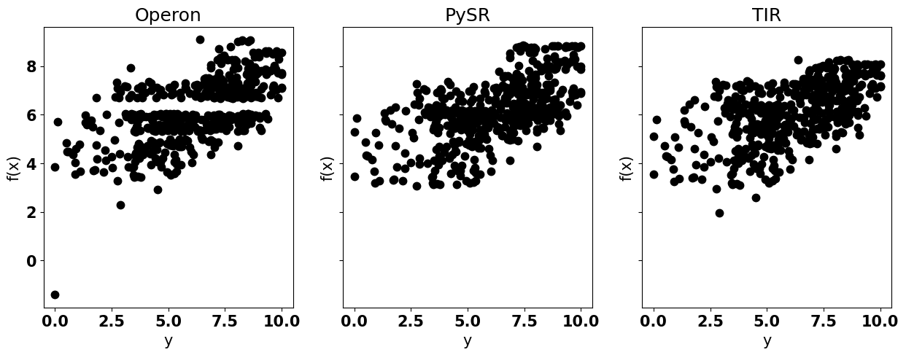
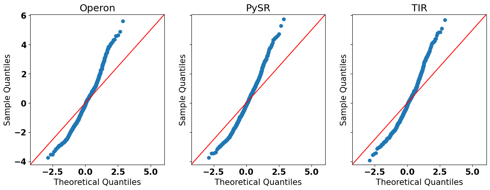
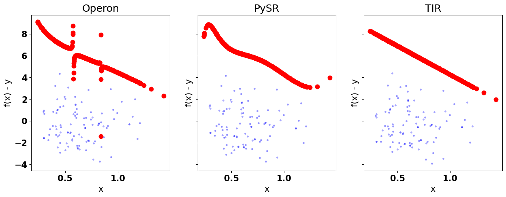

# Model Validation

## Model Validation
\justifying

As already stressed throughout this course, there are three main approaches for nonlinear regression:

- Using an overparameterized generic model (opaque model).
- Manually crafting the nonlinear model.
- Using Symbolic Regression to find a nonlinear model with as few parameters as possible.

## Model Validation
\justifying

While crafting the model using first principles, you may have some properties that you want to enforce into your model, either because of some requirements or from a prior knowledge about the behavior of the system.

In this situation, the practitioner can enforce those using their own expertise.

## Model Validation
\justifying

For example, due to EU regulations[^1], the practitioner will create a model that will allow them to debug how the output is generate in a clear manner. Also, they may want to ensure fairness in the predictions.

[^1]: (https://www.europarl.europa.eu/news/en/press-room/20240308IPR19015/artificial-intelligence-act-meps-adopt-landmark-law)[https://www.europarl.europa.eu/news/en/press-room/20240308IPR19015/artificial-intelligence-act-meps-adopt-landmark-law]

## Model Validation
\justifying

This is usually a problem for opaque models that are often hard to debug and not flexible enough to enforce some propeties of interest.

In the current literature, there are some techniques that can extract information from opaque models to have a better understanding. But this may not be enough in practice.

## Model Validation
\justifying

With the *vanilla* symbolic regression, you have the possibility of finding a model that attends to all your requirements. To increase the probability of finding the correct model, you need at least one of these:

- Noiseless data.
- Representative data.
- Luck \twemoji{four leaf clover}
- A well calibrated SR algorithm.

## Model Validation
\justifying

With the *vanilla* symbolic regression, you have the possibility of finding a model that attends to all your requirements. To increase the probability of finding the correct model, you need at least one of these:

- Noiseless data.
- Representative data.
- Luck \twemoji{four leaf clover}
- A well calibrated SR algorithm.

We can only afford the last one!

## Model Validation
\justifying

Another important motivation for model validation is that, depending on the hyper-parameters, the SR algorithm can favor large and overparameterized models that will have a high goodness-of-fit without the remaining desiderata.

## Example of desiderata
\justifying

Some example of objectives beyond the goodness-of-fit[^2] are:

- The ability to understand and explain model behavior
- Scientific plausibility of the model
- Whether the model is generalizable and capable of extrapolation
- Boundedness and safe operation under all circumstances
- Efficiency of calculating predictions or computational effort required for
training the model

[^2]: Gabriel Kronberger, Bogdan Burlacu, Michael Kommenda, Stephan M. Winkler, and Michael Affenzeller. Symbolic Regression. tbr.

## Example of desiderata
\justifying

Besides those, we may also want a model that:

- Ensures a fair inference to different classes of the sample.
- Behaves according to pre-established norms.

## Ability to understand and explain model behavior
\justifying

In the beggining of the course, it was clear that a linear model is easy to understand:

- With every unitary change in $x$ we observe a change proportional to $\beta$ in the outcome.
- Even if we have a linear model with non-linear features, they can have physical meaning. E.g., $v = s / t$, the inverse interaction of displacement and time gives us the average velocity.

## Ability to understand and explain model behavior
\justifying

When we have a nonlinear regression model, these interepretations are not as straightforward:

\begin{empheq}[box=\mybox]{align*}
f(x; \theta) = \frac{\theta_1 x}{\theta_2 + x},
\end{empheq}

The association between the input variable and the outcome is not easily understood.

## Ability to understand and explain model behavior
\justifying

We can try to understand the behavior with a plot for different values of $\theta$:

\begin{tikzpicture}
\begin{axis}[legend pos=outer north east, domain=0:5,samples=1000]
\addplot [very thick,red] {2*x/(0.25 + x)}; \addlegendentry{$\theta = [2, 0.25]$}
\addplot [very thick,blue] {5*x/(0.25 + x)}; \addlegendentry{$\theta = [5, 0.25]$}
\addplot [very thick,green] {2*x/(0.55 + x)}; \addlegendentry{$\theta = [2, 0.55]$}
\addplot [very thick,black] {5*x/(0.55 + x)}; \addlegendentry{$\theta = [5, 0.55]$}
\end{axis}
\end{tikzpicture}

## Ability to understand and explain model behavior
\justifying

::::columns
:::column
\begin{tikzpicture}
\begin{axis}[domain=0:5,samples=1000]
\addplot [very thick,red] {2*x/(0.25 + x)};
\addplot [very thick,blue] {5*x/(0.25 + x)};
\addplot [very thick,green] {2*x/(0.55 + x)};
\addplot [very thick,black] {5*x/(0.55 + x)};
\end{axis}
\end{tikzpicture}
:::
:::column
- This model has a saturation value close to $\theta_1$
- The higher the value of $\theta_2$, the slower the speed to reach the saturation
- When $x = \theta_2$, $f(x; \theta) = 0.5 \theta_1$, so it is the point where we reach about half saturation
- There is an undefined behavior at $x = -\theta_2$
::::columns

## Ability to understand and explain model behavior
\justifying

Having the context of the model can help gain additional insights. This particular model can represent the **Michaelis–Menten kinetics** that describes the reaction rate ($f(x; \theta)$) to the concentration of a substrate ($x$).

Knowing the phyisical meanings of $\theta$ will give us insight when fitting this model for different enzymes.

We can see that, once we contextualize the model and add expert knowledge, we can gain insights from nonlinear models as well, as long as their parameters are meaningful in our context (thus, minimize the number of parameters is desired).

## Ability to understand and explain model behavior
\justifying

In short, inspecting the model for the ability of understanding and explaining can be done by:

- Contextualizing the model
- Applying expert knowledge
- Plotting the behavior of the function with different parameter values


Additional tools will be given in later lectures when we talk about explainability.

## Scientific plausibility of the model
\justifying

Related to the previous desiderata, scientific plausibility refers to whether the model:

- Behaves similarly to the observed phenomena.
- Is correct w.r.t. a dimensional analysis (or whether all meta-features are dimensionless)
- Possesses a phyisical meaning
- Does not misbehave

This can be inspect through visual plots and expert knowledge.

## Whether the model is generalizable and capable of extrapolation
\justifying

The SR model is fitted on a limited data set that not necesseraly captures a

## Boundedness and safe operation under all circumstances
\justifying

## Efficiency of calculating predictions or computational effort required for training the model
\justifying

## Ensures a fair inference to different classes of the sample.
\justifying

## Behaves according to pre-established norms.
\justifying

## Visual tools
\justifying

The plots regarding the predictions and residuals can be insightful and provide a tool for model inspection.
From these plots we can understand whether the model meets our expectations and whether there is any unexpected behavior.

## Noise variance plot {.fragile}
\justifying

One example of a plot is the predicted values against the dependent variable as observed in the data.
To illustrate this and the next plots, we will fit our simulated grade dataset with PyOperon, PySR and TIR:

```{.python frame=lines framerule=2pt linenos=true fontsize=\footnotesize baselinestretch=0.8}
regs = [SymbolicRegressor(),
        TIRRegressor(100, 100, 0.3, 0.7, (-3, 3), transfunctions='Id',
           alg='MOO'),
        PySRRegressor(binary_operators=["+", "*"], unary_operators=[])
       ]
for i in range(3):
  regs[i].fit(x.reshape(-1,1),y)
```

## Noise variance plot {.fragile}
\justifying

We can check the noise variance with:

```{.python frame=lines framerule=2pt linenos=true fontsize=\footnotesize baselinestretch=0.8}
_,axs = plt.subplots(1,3, figsize=(15,5), sharey=True)
name = ['Operon', 'PySR', 'TIR']
for i in range(3):
  axs[i].plot(y, regs[i].predict(x.reshape(-1,1)), '.', color='black',
               markersize=15)
  axs[i].set_xlabel('y')
  axs[i].set_ylabel('f(x)')
  axs[i].set_title(name[i])
```

## Noise variance plot {.fragile}
\justifying



A perfect model would have all the points in the 45 degrees diagonal.

## Noise variance plot {.fragile}
\justifying


We can see from these plots that none of the models returns a satisfactory result. Also, we can see that all of them have a bias in mispredicting grades below $5$ (usually for a higher grade).

## Q-Q plot {.fragile}
\justifying

Another important plot is the quantile-quantile plot (Q-Q plot) that plots the assumed error distribution of the data matches the distribution of the residuals of the model.

To make the Q-Q plot, we calculate the residuals of our model, sort them in increasing order, and plot each point against the inverse of the cumulative density function of the assumed distribution.

## Q-Q plot {.fragile}
\justifying

(qqplot assumes normal distribution as the default)

```{.python frame=lines framerule=2pt linenos=true fontsize=\footnotesize baselinestretch=0.8}
import statsmodels.api as sm

_,axs = plt.subplots(1,3, figsize=(15,5), sharey=True)

for i in range(3):
  sm.qqplot(regs[i].predict(x.reshape(-1,1))[:,0]-y, line ='45',
             ax=axs[i])
  axs[i].set_title(name[i])

```

## Q-Q plot {.fragile}
\justifying



We can see from these plots that none of the models matches the expected distribution for the residuals.

## Residuals plot {.fragile}
\justifying

Another interesting plot is the residuals plots in which we plot a choice of $x_i$ against $f(x)$ and the residuals:

```{.python frame=lines framerule=2pt linenos=true fontsize=\footnotesize baselinestretch=0.8}
import statsmodels.api as sm

_,axs = plt.subplots(1,3, figsize=(15,5), sharey=True)

for i in range(3):
  axs[i].plot(x, regs[i].predict(x.reshape(-1,1))[:,0] - y, '.',
                 color='blue', alpha=0.3, markersize=5)
  axs[i].plot(x, regs[i].predict(x.reshape(-1,1)), '.', color='red',
              markersize=15)
  axs[i].set_xlabel('x')
  axs[i].set_ylabel('f(x) - y')
  axs[i].set_title(name[i])

```

## Residuals plot {.fragile}
\justifying



These plots show that all of these models have an error ranging from $-4$ to $4$ but mostly concentrated on neagtive residuals. This means it tends to understimate the true value.

## Residuals plot {.fragile}
\justifying


Also, we can see that Operon created a model with some discontinuities (possibily because of division) and TIR chose a linear model.

## Next lecture {.standout}

\begin{block}{}
  \begin{itemize}
    \item Model Selection
\end{itemize}

\hfill

\includegraphics[width=100pt]{figs/tobecontinued.png}
\end{block}

## Acknowledgments
