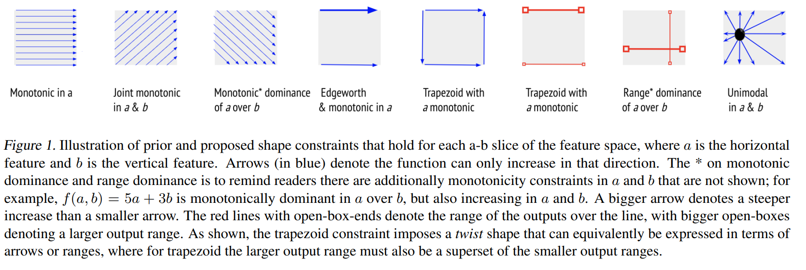

# Incorporando conhecimento prévio

## Incorporando conhecimento prévio

Em alguns casos temos alguma informação extra sobre o comportamento esperado ou desejado de nosso modelo.

Quando queremos forçar equidade e que a falta de equidade não seja capturada dos dados, podemos criar certas imposições para a função do modelo.

## Incorporando conhecimento prévio

Leis da Física como conservação de energia, leis da mecânica, ou da termodinâmica podem ser utilizadas para melhorar os modelos quando temos dados ruidosos.

## Scientific Machine Learning

- Aplicações interdisciplinares da ciência, engenharia e computação.
- Estudo de sistemas dinâmicos ou fenômenos complexos com poucos dados.
- Energia limpa, mudança climática, infraestrutura sustentável
- Poder preditivo + interpretabilidade + conhecimento de domínio de modelos físicos

## Restrição de Forma

Restrição de forma restringe a função de predição para que
tenha certas propriedades em sua forma:

\begin{equation}
\begin{aligned}
  f^{*}(x) = \argmin_{f(x) \in \mathcal{M}} L(f(x), y), \qquad x \in \mathcal{D} \subset \Omega \\
        \text{subject to shape constraints }~c_{i}(\mathcal{X}_{i}), \qquad \mathcal{X}_{i} \subseteq \Omega.
\end{aligned}
\end{equation}
com $L(f(x), y)$ a função de custo, $f(x)$ o modelo, $y$ a variável-alvo, $\mathcal{M}$ o espaço de modelos,
 $\mathcal{D}$ a base de dados, $\Omega$ é o domínio  das variáveis, e $c_i$ a $i$-ésima restrição de forma, e
 $\mathcal{X}_{i}$ o domínio da restrição.

## Restrição de Forma

\begin{table}[t]
  \centering
  \caption{Mathematical formulation of shape constraints considered in this work. All
  constraints assume a box domain $l_i \leq x_i \leq u_i$ for each
  variable $x_i$.}
  \begin{tabular}{cc}
    \toprule
    \textbf{Property} & \textbf{Mathematical formulation} \\
    \midrule
    Non-negativity & $f(x) \geq 0$ \\
    Non-positivity & $f(x) \leq 0$ \\
    Bounded image & $l \leq f(x) \leq u$ \\
    Monotonically non-decreasing & $\frac{\partial}{\partial x_i}f(x) \geq 0$ \\
    Monotonically non-increasing & $\frac{\partial}{\partial x_i}f(x) \leq 0$ \\
    Convexity & $\frac{\partial^2}{\partial x_i^2}f(x) \geq 0$ \\
    Concavity & $\frac{\partial^2}{\partial x_i^2}f(x) \leq 0$ \\
    Commutativity & $f(x,y) = f(y, x)$ \\
    Symmetry & $f(x) = f(-x)$ \\
    \bottomrule
  \end{tabular}
 \label{tab:shapeconstraints}
\end{table}

## Desafios

- Nem sempre é possível formalizar matematicamente a restrição de forma
- Quando temos uma formulação desambígua, a avaliação exata é impraticável (muitas vezes NP-difícil)

## Desafios

Considere a restrição de forma monótona não-decrescente de um modelo $f(x)$.

Para verificar tal restrição precisamos calcular a derivada parcial em função
da variável de interesse.

Em seguida, precisamos encontrar o mínimo dessa função no domínio desejado.

## Estratégias de avaliação

- **Pessimista:** *se o resultado do intervalo está dentro do domínio da restrição, então sabemos com certeza que a solução é factível, se está fora, não sabemos se é factível ou não.*
- **Otimista:** *se o resultado do intervalo está fora do domínio da restrição, temos certeza que é infactível, caso contrário, não sabemos se é factível ou infactível.*

## Aritmética Intervalar - Pessimista

A **aritmética intervalar** é utilizada para efetuar operações matemáticas na presença de incertezas e imprecisões.

Uma variável $x$ passa a conter um intervalor de valores ao invés de um único valor:

$$x = [a, b]$$

significa que $a \leq x \leq b$. Geralmente $|a - b|$ é um valor pequeno representando a incerteza.

## Aritmética Intervalar - Pessimista

Boa parte das operações e funções matemáticas são definidas dentro da aritmética intervalar. Por exemplo, a adição é definida como:

$$x + y = [a_x, b_x] + [a_y, b_y] = [a_x + a_y, b_x + b_y]$$

Isso é válido pois a adição de quaisquer outros valores $x, y$ dentro de seus respectivos intervalos necessariamente serão maiores que o intervalo inferior resultante e menores que o intervalo superior.

## Aritmética Intervalar - Pessimista

Um outro exemplo é a multiplicação:

$$x * y = [a_x, b_x] * [a_y, b_y] = $$

$$[min(a_x \cdot a_y, a_x \cdot b_y, b_x \cdot a_y, b_x \cdot b_y), max(a_x \cdot a_y, a_x \cdot b_y, b_x \cdot a_y, b_x \cdot b_y)]$$

Pois, por exemplo, $[-3, -1] * [2, 4]$ tem um mínimo em $-12$ e um máximo em $-2$.

## Aritmética Intervalar - Pessimista

Essa aritmética tem alguns problemas chamado de *problema de resolução* em que uma operação do tipo:

$$x - x$$

não apresenta o valor correto. Isso porque

$$[-1, 1] - [-1, 1] = [-1 - 1, 1 - (-1)] = [-2, 2]$$

Quando deveria resultar em zero.

## Aritmética Intervalar - Pessimista

Para funções multivariadas, a avaliação de variáveis intervalares retorna um resultado correto se:

- Existe apenas uma única ocorrência de cada variável ou
- As variáveis com múltiplas ocorrências são monótonas

## Aritmética Intervalar - Pessimista

No contexto de restrição de forma, podemos avaliar a função de predição e suas derivadas parciais substituindo as variáveis pelos intervalos correspondentes ao seu domínio.

Essa é uma estratégia pessimista pois, como tende a superestimar o intervalo real.

## Amostragem - Otimista {.fragile}

Uma forma comum de avaliar uma restrição de forma é avaliando uma amostra de valores das variáveis dentro do domínio.


```haskell
amostras(dominios, passo) = cartesian(
       [amostraVar(dominio, passo)
           for dominio <- dominios])
amostraVar((lo, hi), passo) =
       [x for x <- [lo, lo+passo .. hi]]
```

## Amostragem - Otimista

- Se a quantidade de amostras for grande o suficiente, encontraremos uma boa aproximação dos pontos
de mínimo e máximo.
- O mínimo e máximo amostrado representa um intervalo interno ao mínimo e máximo real.
- Conforme a dimensionalidade do problema aumenta, aumenta também a necessidade por amostras.

## Outras restrições de forma



- Gupta, Maya, et al. "Multidimensional shape constraints." International Conference on Machine Learning. PMLR, 2020.

## Por que restringir a forma?

{ width=80% }

## Modelos Isotônicos

Outros nomes normalmente utilizados na literatura da área de regressão são **modelos isotônicos** e **modelos que preservam a ordem**.

Os métodos mais comuns para gerar tais modelos são:

- Regressão com função degrau ou stepwise regression
- Resolver um problema de otimização convexa
- Splines isotônicas

***

> Tibshirani, Ryan J., Holger Hoefling, and Robert Tibshirani. "Nearly-isotonic regression." Technometrics 53.1 (2011): 54-61.

> Wright, Ian W., and Edward J. Wegman. "Isotonic, convex and related splines." The Annals of Statistics (1980): 1023-1035.

## Modelos Isotônicos

Os modelos isotônicos estão comumente associados ao algoritmo *Pool of Adjacent Violators*
que, para uma base de dados unidimensional, ordena os dados por ordem crescente da entrada e
os agrupa de tal forma que a mediana de cada grupo é menor ou igual a mediana do próximo grupo, reescrevendo
alguns valores da variável-alvo para atender essa restrição.

***

> Chakravarti, Nilotpal. "Isotonic median regression: a linear programming approach." Mathematics of operations research 14.2 (1989): 303-308.

## Redes Neurais

Uma outra abordagem para forçar restrição de função monótona, é restringir
os parâmetros ajustáveis do modelo.

No caso de resitrções monótonas crescentes, podemos restringir os parâmetros de uma
cada da rede neural como sendo sempre positiva e, em seguida, calcular a faixa
de valores da camada seguinte que torna a rede monótona.

Essa estratégia é pessimista pois, embora garanta a factibilidade, remove diversos
possíveis modelos do espaço de busca.

***

> Sill, Joseph. "Monotonic networks." Advances in neural information processing systems 10 (1997).

## Gradient Boosting

No XGBoost podemos restringir para modelos monótonos fazendo com que
a cada divisão os limitantes inferiores e superiores são propagados para os nós
filhos.

***

> Bartley, Christopher, Wei Liu, and Mark Reynolds. "Enhanced random forest algorithms for partially monotone ordinal classification." Proceedings of the AAAI Conference on Artificial Intelligence. Vol. 33. No. 01. 2019.

## Monotonic hint

**Monotonic hint** otimiza um modelo de regressão com um termo de penalização
proporcional ao quanto foi violado das restrições.

Os autores utilizam a própria base de treino para avaliar as violações, portanto sendo
 um método otimista.

A maior vantagem da penalização é que é fácil introduzir diferentes restrições e utilizar
diferentes modelos de regressão sem precisar de muitas alterações no algoritmo.

***

> Sill, Joseph, and Yaser Abu-Mostafa. "Monotonicity hints." Advances in neural information processing systems 9 (1996).

## Certified NN

Ajusta os coeficientes de uma Piecewise Linear Neural Network com uma formulação
de Mixed-Integer Linear Programming (MILP) para determinar a monotonicidade.

Os coeficientes são ajustados através de uma função de perda com regularização
e então o MILP é utilizado para verificar as restrições, caso a rede não seja monótona, o
fator de regularização é aumentado e a rede treinada novamente.

***

> Liu, Xingchao, et al. "Certified monotonic neural networks." Advances in Neural Information Processing Systems 33 (2020): 15427-15438.

## Polynomial Regression

A teoria de soma-dos-quadrados (*sum-of-squares* - SOS) permite incorporar
restrições de forma em Regressão Polinomial.

A ideia é que um polinômio é não-negativo se puder ser representado como
uma soma de polinômios ao quadrado.

***

> Parrilo, Pablo A. Structured semidefinite programs and semialgebraic geometry methods in robustness and optimization. California Institute of Technology, 2000.

## Polynomial Regression

Alguns autores utilizam Programação semidefinida para encontrar representações
SOS.

Essa abordagem permite encontrar uma solução de forma eficiente. Porém a complexidade
aumenta rapidamente com a dimensão do problema e o grau do polinômio.

***

> Papp, Dávid, and Sercan Yildiz. "Sum-of-squares optimization without semidefinite programming." SIAM Journal on Optimization 29.1 (2019): 822-851.

## Splines

Cubic smoothing splines é um modelo de regressão com restrições de continuidade
nos nós. Vimos esse modelo quando falamos de GAM!

Duas formas de introduzir restrições de forma:

- Proibir coeficientes negativos
- Formular como um problema de Programação Cônica de Segunda-ordem

Porém, só funciona para problemas unidimensionais.

***

> Ramsay, James O. "Monotone regression splines in action." Statistical science (1988): 425-441.

> Papp, Dávid, and Farid Alizadeh. "Shape-constrained estimation using nonnegative splines." Journal of Computational and graphical Statistics 23.1 (2014): 211-231.

## Lattice Regression

Em *Lattice Regression* criamos uma grade de dimensão $M_1 \times M_2
\times \ldots M_D$ (geralmente $D=2$) projetando o espaço de entrada.

Cada dimensão da grade é composta de $M_i$ pontos armazenados em uma
tabela hash.

O valor de predição de um certo ponto é estimado interpolando os valores
armazenados nessa tabela nos pontos que envolvem essa amostra.

## Lattice Regression

A restrição de monotonicidade é garantida forçando que a interpolação de pontos
adjacentes respeitem a restrição desejada.

Foi formulado como um problema de otimização convexa com restrições de desigualdade
linear.

É pessimista pois restringe os modelos porém garante a restrição.

***

> Gupta, Maya, et al. "Monotonic calibrated interpolated look-up tables." The Journal of Machine Learning Research 17.1 (2016): 3790-3836.

## Kernel Regression

Os autores propuseram uma forma de determinar pontos de dados sintéticos para
determinados kernels que são suficientes para avaliar a monotonicidade.

Com isso, eles aplicaram um Second-order Cone Programming para encontrar um modelo
que respeita as restrições.

Embora não tenham comentado, é esperado que a quantidade de pontos sintéticos aumentem
exponencialmente com a dimensão do problema.

***

> Aubin-Frankowski, Pierre-Cyril, and Zoltán Szabó. "Hard shape-constrained kernel machines." Advances in Neural Information Processing Systems 33 (2020): 384-395.

## Genetic Programming

*Counterexample-driven GP* usa um SAT-solver para verificar se cada modelo
candidato é factível em relação a restrições de simetria procurando por
contra-exemplos da restrição desejada.

***

> Błądek, Iwo, and Krzysztof Krawiec. "Solving symbolic regression problems with formal constraints." Proceedings of the Genetic and Evolutionary Computation Conference. 2019.

## Genetic Programming

Outra forma de adaptação da programação genética é o uso de aritmética intervalar
para avaliar as restrições. Essas restrições podem ser incorporadas no algoritmo através de:

- Descarte de soluções infactíveis
- Penalização
- Feasible-Infeasible Two Population
- Otimização Multi-objetiva

***

> Kronberger, Gabriel, et al. "Shape-Constrained Symbolic Regression—Improving Extrapolation with Prior Knowledge." Evolutionary computation 30.1 (2022): 75-98.

## Next lecture {.standout}

\begin{block}{}
  \begin{itemize}
    \item Interpretability and Explanation
\end{itemize}

\hfill

\includegraphics[width=100pt]{figs/tobecontinued.png}
\end{block}

## Acknowledgments
