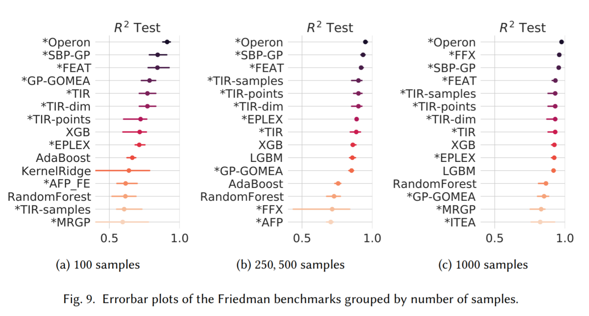
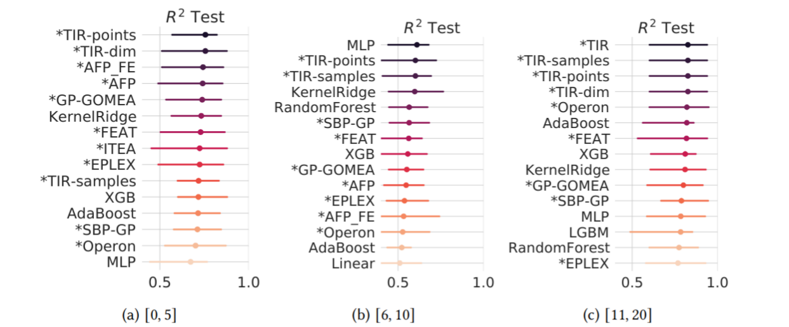
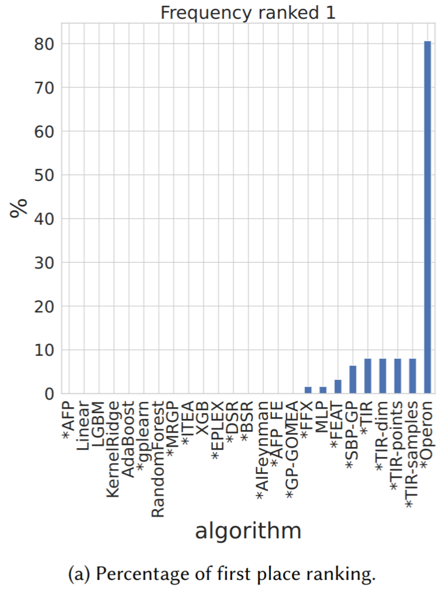
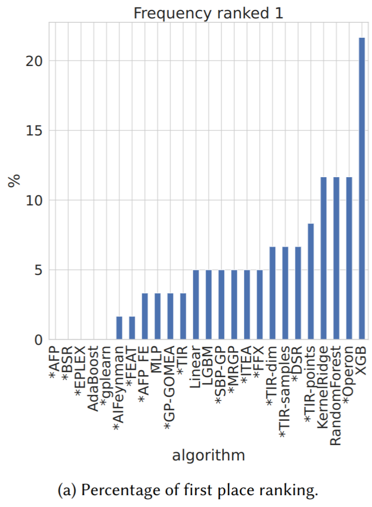
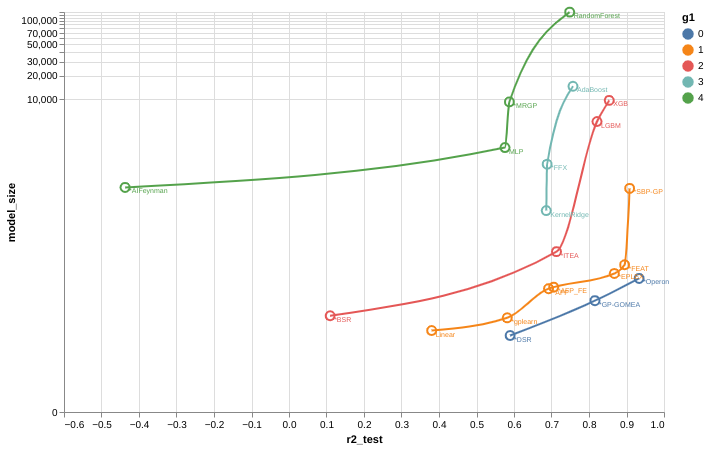

# Genetic Programming for Symbolic Regression

## A small introduction
\justifying

\notebox{Symbolic regression (SR) is an approach to machine learning (ML) in which both the parameters
and structure of an analytical model are optimized.}
-- *Contemporary Symbolic Regression Methods and their Relative Performance, William La Cava et al.*

\notebox{Symbolic regression (SR) is a type of regression analysis that searches the space of mathematical expressions to find the model that best fits a given dataset, both in terms of accuracy and simplicity.}
-- *Wikipedia*

## A small introduction
\justifying

It is an important tool for regression analysis as it can deliver a high accuracy while
keeping the possibility of statistical inference.

We can observe a growing interest in SR from other fields, but we are still far
from the widespread adoption that we see with different regression models.

## A small introduction
\justifying

- How did we get where we are right now?
- How can we show our value to other communities?
- How can we prevent a bad first impression?
- How can we join forces to increase our popularity?

# Benchmarking

## In the last episodes of GP
\justifying

In 2012, the paper Genetic Programming Needs Better Benchmarks[^1] started a discussion about a lack of standards in GP benchmarks:

\notebox{We argue that such
benchmarks do little to move the field forward, and in fact
may hold it back as they reward techniques that are effective
at rapidly solving trivial problems rather than performing as
well as possible on hard ones}

[^1]: McDermott, James, et al. "Genetic programming needs better benchmarks." Proceedings of the 14th annual conference on Genetic and evolutionary computation. 2012.

## In the last episodes of GP
\justifying

They aimed at the following criteria:

- Tunably difficult
- Varied
- Relevant
- Fast
- Acommodating to Implementors
- Easy to Interpret and Compare
- Representation Independent
- Current

## In the last episodes of GP
\justifying

10 years later, in[^2] the authors analysed what has changed so far and what still required some work.
Among other things, the authors expressed some concerns about:

- Goodhart's law
- Difficulty in comparing reformulated problems (e.g., Copilot x GP)
- Mass benchmarking does not reflect real-world scenario

[^2]: McDermott, James, et al. "Genetic programming benchmarks: looking back and looking forward." ACM SIGEVOlution 15.3 (2022): 1-19.

## Synthetic problems as unit tests
\justifying

They argue that synthetic problems can be used as unit tests to verify correctness of new approaches:

- Verify whether it can solve easy problems
- Ensure that the solution is contained in the search space
- Test the influence of noise or number of samples or dimensionality in the capabilities of reaching a good solution

Having a controlled environment is helpful when studying all the aspects of the algorithm,
but real-world datasets are still required to measure the expected performance compared to other algorithms.

## Real-world problems
\justifying

Real-world problems should be selected avoiding the endpoints of being too easy or too hard where all methods equally succeed or fail.
Finding the sweetspot is not easy...
These endpoints could be used as a baseline or to measure progress / milestones.

Another issue is whether to pre-process the data or leave that to GP? Both are valid benchmarks, as argued by the authors.

## SRBench
\justifying

SRBench[^3][^4] is a milestone in GP benchmarking for SR as it established a standard for comparison of old and new algorithms.
Apart from the large selection of datasets, it brings:

- A standard API in Python based on scikit-learn, but the participants are free to use any language as the backend
- A standard benchmark procedure with $k$-folds using a fixed set of seeds, ensure reproducibility, fairness in comparison,
  and can be updated incrementally (except for runtime comparison)
- In a short time it is already well adopted in many comparisons

[^3]: La Cava, William, et al. "Contemporary Symbolic Regression Methods and their Relative Performance." Thirty-fifth Conference on Neural Information Processing Systems Datasets and Benchmarks Track. 2021.
[^4]: https://cavalab.org/srbench/

## SRBench
\justifying

This benchmark can be split in two parts[^5], almost half of it is composed of variations of Friedman datasets.
A few instances of this class of problem shows some difference between algorithms.

[^5]: De França, Fabrício Olivetti. "Transformation-interaction-rational representation for symbolic regression: a detailed analysis of srbench results." ACM Transactions on Evolutionary Learning 3.2 (2023): 1-19.

## SRBench
\justifying

In "non-Friedman" datasets there's barely any difference. So the final ranks are determined by a subset of the Friedman sets.

## SRBench
\justifying

How we present results is also important, possibly there's no **best** visualization. Maybe instead of a grand champion,
we can look at the minimal set that gets the best results.

{width=200px} {width=200px}

## SRBench
\justifying

Or the set of best compromises between accuracy and model size, or accuracy and runtime.

## Competitions
\justifying

Following SRBench, we hosted two competitions with a smaller set of synthetic benchmarks and real-world datasets.
The main goal was to investigate the capabilities of SR algorithms to:

- Retrieve the exact generating function
- Select relevant features
- Avoid deceptive (noisy) shortcuts
- Behave correctly when extrapolating
- Be robust against noise

## Lessons to be learned
\justifying

Having analysed just a small set of algorithms on a small number of datasets:

- There are many fine details that becomes obscure during analysis chiefly
  since we *demand* a single solution from the algorithms, how to choose a model can be very important
- We cannot agree on an interpretability measure. Interpretability depends on context and it also depends
  on supporting tools. For example, a large model may be more interpretable if there are less adjustable parameters.
- Artificially increasing difficulty is not that simple

## Lessons to be learned
\justifying

- Checking whether we reach the exact solution is an unsolved problem, also, should we really care for that?
- Extrapolating without additional information is shot in the dark; from many possible models that fit the data,
  how should we know what lies beyond?
- Noise and feature selection are still a challenge for SR.

[^6]: de França, Fabrício Olivetti, et al. "Interpretable symbolic regression for data science: Analysis of the 2022 competition." arXiv preprint arXiv:2304.01117 (2023).

## Different and refreshing ideas
\justifying

A byproduct of SRBench and corresponding competitions were the many different ideas proposed by the participants:

- Different representations inspired by nonlinear regression literature (interactions, rational of polynomials, continued fraction, piecewise regression).
- Use of nonlinear optimization to fit the parameters.
- Island model to promote diversity
- Popularization of multi-objective GP
- Bayesian model selection
- Use of local search for the combinatorial part of the problem
- Ensembles
- Deep Learning / Transformers

## SRBench 3.0
\justifying

We are currently organizing a new edition of SRBench with a better selection of datasets,
different tracks, and better analysis of the results.

We need your help! If you want to get involved or want to share some thoughts:

**folivetti@ufabc.edu.br**

Open an issue / discussion at https://github.com/cavalab/srbench/

# Accuracy is not all you need

## I beat you by 0.001!
\justifying

As we seen in the previous slides, many current SR algorithms show a comparable performance.

We can safely say that, for tabular data, we are competitive with opaque models.

If everything is the same, what reasons would we have to choose SR instead of XGBoost, MLP, or anything else?

## Beyond accuracy
\justifying

SR offers a lot more than a simple predictive model, we should start exploring and *packaging*
additional features with our main algorithm:

- Interpretability
- Confidence and prediction intervals
- Statistical tools in general
- Use of prior knowledge
- Model simplification

## Interpretability
\justifying

The elephant in the room! There is no consensus, there will never be!

Interpretability and explainability is context dependent. We won't have a step-by-step procedure
that will work to explain every SR model[^8].

Instead, we should work together with colleagues from other fields to help them[^7]
generate symbolic models that are accurate, useful, and interpretable...for them!

This requires a long and manual work.

[^7]: Russeil, Etienne, et al. "Multi-View Symbolic Regression." arXiv preprint arXiv:2402.04298 (2024).
[^8]: Nadizar, Giorgia, et al. "An analysis of the ingredients for learning interpretable symbolic regression models with human-in-the-loop and genetic programming." ACM Transactions on Evolutionary Learning 4.1 (2024): 1-30.

