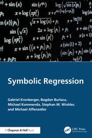

# Prologue

## Please allow me to introduce myself


Hi, my name is Fabricio!

{width=100px} {width=200px} {width=100px}

I'm a professor of CS at UFABC in metropolitan region of São Paulo, Brazil.

## Please allow me to introduce myself
\justifying

- Working since $2004$ with evolutionary and natural computing
  * combinatorial problems
  * numerical optimization
  * dynamic and uncertain environments
  * clustering
  * hydroelectric power and reservoir optimization
  * multilabel classification
  * recommender systems
  * social network analysis
  * intelligent agents
  * natural language processing
  * symbolic regression (since 2018)
  * program synthesis (since 2022)

## Please allow me to introduce myself
\justifying

My first experience with Genetic Programming for Symbolic Regression was trying to find an interpretable recommender system:

```
6.379515826309025e-3 + -0.00*id(x_1^-4.0 * x_2^3.0 * x_3^1.0
) + -0.00*id(x_1^-4.0 * x_2^3.0 * x_3^2.0) + -0.01*id(x_1^-4.0
* x_2^3.0 * x_3^3.0) + -0.02*id(x_1^-4.0 * x_2^3.0 * x_3^4.0)
+ 0.01*cos(x_1^-3.0 * x_2^-1.0) + 0.01*cos(x_1^-3.0)
+ 0.01*cos(x_1^-3.0 * x_3^1.0) + 0.01*cos(x_1^-3.0 * x_2^1.0)
+ 0.01*cos(x_1^-2.0 * x_2^-2.0) + -0.06*log(x_1^-2.0 * x_2^-2.0)
+ 0.01*cos(x_1^-2.0 * x_2^-1.0) + 0.01*cos(x_1^-2.0 * x_2^-1.0 * x_3^1.0)
+ 0.01*cos(x_1^-2.0) + 0.01*cos(x_1^-2.0 * x_3^1.0) + 0.01*cos(x_1^-2.0
* x_3^2.0) + 0.01*cos(x_1^-2.0 * x_2^1.0) + 0.01*cos(x_1^-2.0 * x_2^1.0
* x_3^1.0) + -0.00*id(x_1^-2.0 * x_2^2.0) …
```

## My fault!
\justifying

- I took the path of least resistance: `pip install gplearn`
- Used default hyperparameters
- Interpretability denied!

## Don't take offense at my innuendo
\justifying

- This talk will go through some of my personal criticisms and complaints.
- I want to draw the attention to some things we have to do to be acknowledged outside our community
- I'll share my view as someone with little experience in the field

In short...

## It's t-t-t-t-t-t-time....

It's time to get cereal!


## Agenda
\justifying

- Interpretability
- Usability
- Additional Features
- Awareness

# The holy grail of interpretable models

## If it's broken, let's fix it
\justifying

- That experience prompted me to propose an *improvement* to SR.
- Constrained representation: observing many equations from physics follows a very simple pattern.
- Interaction-Transformation Evolutionary Algorithm: weighted sum of nonlinear transformed features.
- Transformation-Interaction-Rational: extended to rational of polynomials.
- Other interesting representation: continued fraction, functional analysis, etc.

## Okayish
\justifying

- Competitive results
- Smaller expressions, easier to interpret
- Reviewer \# 2: "Hold your horses! Can you really interpret that?!"

\begin{empheq}[box=\mybox]{align*}
tan(1.52 - 0.20 \cdot tanh(\frac{1}{x_1 \cdot x_0}))
\end{empheq}

Can I?

## What is interpretability anyway?
\justifying

- A simple search for "symbolic regression interpretable" in Scholar retrieves $44$k results.
- Looking at the top-5 by citation/year[^1]:
  1. Size ~ Interpretability
  2. Found a linear model
  3. Size by default, but customizable (more on this later!)
  4. Size
  5. Description length

[^1]: https://colab.research.google.com/github/WittmannF/sort-google-scholar/blob/master/examples/run_sortgs_on_colab.ipynb

## What is interpretability anyway?
\justifying

Some sentences about interpretability:

- "by virtue of its simplicity, may be easy to interpret"
- "typically measured as sparsity or model size, is but a proxy for model interpretability; a simple model may still be un-interpretable, or simply wrong"
- "...resulting expression can be readily interpreted..."
- "...our method produces closed-form mathematical formulas that have excellent interpretability..."
- "We argue that the best definition for a “simple” expression is the one that is most interpretable by the user."


## How we do it...
\justifying

- Frequency analysis of selected features and nonterminals.
- Feature importance (LIME, SHAP, etc.)
- Partial dependence plot, partial effect (average or at the mean)

## The meaning of life, the universe and everything else

We wish for a single number that explains everything!


## A different view
\justifying

In[^3] we argue that interpretability comes from having a model that:

- Has few free parameters.
- Fits different data from the same phenomena.
- The parameters have meaning.

[^3]: Etienne Russeil, Fabrício Olivetti de França, Konstantin Malanchev, Bogdan
Burlacu, Emille E. O. Ishida, Marion Leroux, Clément Michelin, Guillaume
Moinard, and Emmanuel Gangler. 2024. Multiview Symbolic Regression.
In Genetic and Evolutionary Computation Conference (GECCO ’24), July 14–
18, 2024, Melbourne, VIC, Australia. ACM, New York, NY, USA, 10 pages. https://doi.org/10.1145/3638529.3654087

## Quick example
\justifying

- Absorption of light (log of transmittance) ~ concentration of dissolved substance
- Assumed to be linear up to a certain point and then it becomes a plateau
- We used $4$ substances with different $\epsilon$ and fixed optical path (1 cm), we measured the relationship of the absorption with the concentration.

## Beer's law
\justifying

We have found the following relation:

::::::{.columns}
:::{.column width="50%"}
\begin{empheq}[box=\mybox]{align*}
f(x; \mu, \epsilon) &= \log\left( \frac{1}{\mu + exp(-\epsilon x)} \right)
\end{empheq}
:::
:::{.column width="50%"}
{width=200px}
:::
::::::

- When $\mu = 0$ it reverts to the current Beer's law, where $\epsilon$ turns out to be the value of extinction coefficient.
- We can rewritte the algebraic expression and see that $\mu = e^{py} - e^{-\epsilon px}$, where $(px, py)$ is the point that the absorption starts to plateau.

## Takeaways
\justifying

- To interpret a model, we need context!
- The symbolic model is the start of the investigation process, not the end.
- We need human in the loop[^4].

[^4]: Giorgia Nadizar, Luigi Rovito, Andrea De Lorenzo, Eric Medvet, and Marco Virgolin. 2024. An Analysis of the Ingredients for Learning Interpretable Symbolic Regression Models with Human-in-the-loop and Genetic Programming. ACM Trans. Evol. Learn. Optim. 4, 1, Article 5 (March 2024), 30 pages. https://doi.org/10.1145/3643688

# Consumer relations

## Can I has implementation?
\justifying

When I started, the SR ecosystem was fragmented:

- C implementations that didn't allow to customize without changing the code.
- Java that required a certain long gone JRE version.
- MATLAB ($$).
- C++ with broken dependencies (it works! \scriptsize if you are using Debian 3 on an Intel 486 machine... \normalsize)
- DEAP (but you had to implement the main operators).
- gplearn.
- This one is simple, just type `build` (oh...it's in Haskell...).

## SRBench to the rescue!
\justifying

SRBench[^5] [^6] is a milestone in GP benchmarking for SR as it established a standard for comparison of old and new algorithms.
Apart from the large selection of datasets, it brings:

- A standard API in Python based on scikit-learn, but the participants are free to use any language as the backend.
- In a short time it is already well adopted in many comparisons (1st in rank by cite/year when searching for "symbolic regression").

[^5]: La Cava, William, et al. "Contemporary Symbolic Regression Methods and their Relative Performance." Thirty-fifth Conference on Neural Information Processing Systems Datasets and Benchmarks Track. 2021.
[^6]: https://cavalab.org/srbench/

## SRBench to the rescue!
\justifying

This improved quality of life by a lot, but we still got some issues:

- Managing a single `conda` environment creates lots of conflicts.
- No clear instructions on how to test on different datasets.

## Intermission
\justifying

We are currently organizing a new edition of SRBench with a better selection of datasets,
different tracks, and better analysis of the results.

We need your help! If you want to get involved or want to share some thoughts:

**folivetti@ufabc.edu.br**

Open an issue / discussion at https://github.com/cavalab/srbench/

## Ecosystem \small ecosystem \footnotesize ecosystem
\justifying

We need more!

- Ecosystem of support libraries that allows us to build new algrithms with easy:
  * Tree data structure
  * Evaluation, autodiff
  * Parsing
  * Fitness calculation
  * Statistics about the model
  * Simplification
- We need it in different programming languages.
- As a new idea comes up, we need to be able to implement it and validate it fast!

## Supporting tools - SRTree-Opt
\justifying

:::::::::::::: {.columns}
::: {.column width="60%"}
Support library and CLI for handling SR expressions:

- Parse different expression formats
- Refit parameters supporting different distributions (Gaussian, Poisson, and Bernoulli)
- Simplify expressions with equality saturation
- Calculate confidence interval of parameters and predictions
- Display stats about the model
- It is fast!
- It's in Haskell!

:::
::: {.column width="40%"}

[https://github.com/folivetti/srtree-opt](https://github.com/folivetti/srtree-opt)
:::
::::::::::::::

## Reliance on defaults
\justifying

We've built some beliefs throughout the history of GP that were tested on certain settings:

- Rule-of-the-thumb for parameters.
- Importance of certain operators.
- Theoretical aspects such as bloat, neutrality, etc.

We need to challenge these findings and keep checking if anything changed with the new approaches.

## Takeaways
\justifying

- We need to put more effort into building a good end user experience, from installation to the use.
- Having an optimized ecosystem can make things easier for everybody, this is a joint effort!
- We don't need to stick to a programming language.

# What else can SR do?

## SR does whatever an SR can!
\justifying

SRBench showed that current state-of-the-art in GP-SR can compete with opaque methods wrt accuracy.

If they are the same, what else can SR do that those methods cannot?

## Confidence intervals and statistical tools
\justifying

SR is nonlinear regression! What we do with nonlinear regression is mostly valid for SR[^7]:

- Profile likelihood[^9]: allows us to calculate confidence intervals and identifiability of the parameters.
- Graphical summaries.
- Curvature measures.
- Statistical tests.

This is related to interpretability!

[^7]: Bates, D. M. "Nonlinear Regression Analysis and Its Applications." John Wiley and Sons: New York google schola 2 (1988): 379-416.
[^9]: de Franca, Fabricio Olivetti, and Gabriel Kronberger. "Prediction Intervals and Confidence Regions for Symbolic Regression Models based on Likelihood Profiles." arXiv preprint arXiv:2209.06454 (2022).

## Prior knowledge
\justifying

With GP-SR we can bias the search towards any side-objective.
We can enjoy additional degree-of-freedom to integrate prior knowledge[^11] [^12], limiting
the search space or penalizing non-conformant solutions. We can request for models that:

- Have a bounded co-domain (for a bounded domain)
- Is monotonic
- Is Symmetric
- many more...

[^11]: Kronberger, Gabriel, et al. "Shape-constrained symbolic regression—improving extrapolation with prior knowledge." Evolutionary computation 30.1 (2022): 75-98.
[^12]: Kubalík, Jiří, Erik Derner, and Robert Babuška. "Symbolic regression driven by training data and prior knowledge." Proceedings of the 2020 Genetic and Evolutionary Computation Conference. 2020.

## Model simplification
\justifying

We don't need to commit with the models that are given. It's possible to perform algebraic manipulation
to accomodate for our needs:

- Reduce overparametrization.
- Simplify the expression.
- Rewrite a parameter to express a different meaning.
- Remove subexpressions that doesn't contribute much to accuracy.

## Model simplification
\justifying

An interesting approach is Equality Saturation[^13] [^14], it allows to rewrite the expression into a more convenient
form as the context ask for.

We can also infer general and local equivalence rules from our data [^15].

[^13]: Willsey, Max, et al. "Egg: Fast and extensible equality saturation." Proceedings of the ACM on Programming Languages 5.POPL (2021): 1-29.
[^14]: de Franca, Fabricio Olivetti, and Gabriel Kronberger. "Reducing Overparameterization of Symbolic Regression Models with Equality Saturation." Proceedings of the Genetic and Evolutionary Computation Conference. 2023.
[^15]: Aldeia, Guilherme Seidyo Imai, Fabricio Olivetti de Franca, and William G. La Cava. "Inexact Simplification of Symbolic Regression Expressions with Locality-sensitive Hashing." arXiv preprint arXiv:2404.05898 (2024).

# Closing Remarks! Let us preach!

## Grad course experience
\justifying

From February till May of 2024, I teached a 12 weeks graduate course on Symbolic Regression.
It covered the essential of nonlinear regression analysis, statistics,
symbolic regression and genetic programming, and related topics.

The audience was mixed: from CS students to humanities, so a good support of easy-to-use tools was important.

## Students impression
\justifying

In summary, the students were very interested about the possibilities of creating a nonlinear regression model.
By the end of the course they got a draft paper for interesting applications:

- Non-intrusive blood pressure measurement
- Understanding what influences students grade on an online course
- Understanding what attracts tourists

## Students impression
\justifying

They did have some difficulties, tho:

- No MS-Windows support!! (MS-Windows users installed HeuristicLabs)
- Not always easy to install even on Linux
- Too many hyper-parameters to finetune, none of them worked well with defaults
- Lack of documentation
- Lack of customization

## Slides
\justifying

:::::::::::::: {.columns}
::: {.column width="40%"}
The slides for that course are freely available and every collaboration is welcome!

The SR algorithms part is lacking! Write some lecture notes about your own algorithm!
:::
::: {.column width="60%"}


[https://github.com/folivetti/symreg-course](https://github.com/folivetti/symreg-course)
:::
::::::::::::::

## COIL
\justifying

:::::::::::::: {.columns}
::: {.column width="50%"}
Universidade Federal do ABC participates of the Collaborative Online International Learning (COIL).
We can apply to create an online course about SR!
:::
::: {.column width="50%"}


[https://collab-edu.com/hub/coil](https://collab-edu.com/hub/coil)
:::
::::::::::::::

## Book
\justifying

:::::::::::::: {.columns}
::: {.column width="50%"}
There's a new book on Symbolic Regression hitting the shelves soon. This book offers a more practical approach aimed at data scientists.
:::
::: {.column width="50%"}

{height=200px}

:::
::::::::::::::

\tiny [https://www.routledge.com/Symbolic-Regression/Kronberger-Burlacu-Kommenda-Winkler-Affenzeller/p/book/9781138054813](https://www.routledge.com/Symbolic-Regression/Kronberger-Burlacu-Kommenda-Winkler-Affenzeller/p/book/9781138054813)

## We need to grow our community
\justifying

It's time to make people aware of SR:

- Collaborate in real-world application
- Grow our ecosystem of supporting libraries
- Offer good end user experience
- Incorporate tools beyond prediction
- Write more books
- Teach and advertise
- Stimulate your students to create awesome repositories and tutorials

## Thank you! {.standout}

You can download these slides in PDF format from:

[https://folivetti.github.io/files/talk.pdf](https://folivetti.github.io/files/talk.pdf)

{width=200px}
